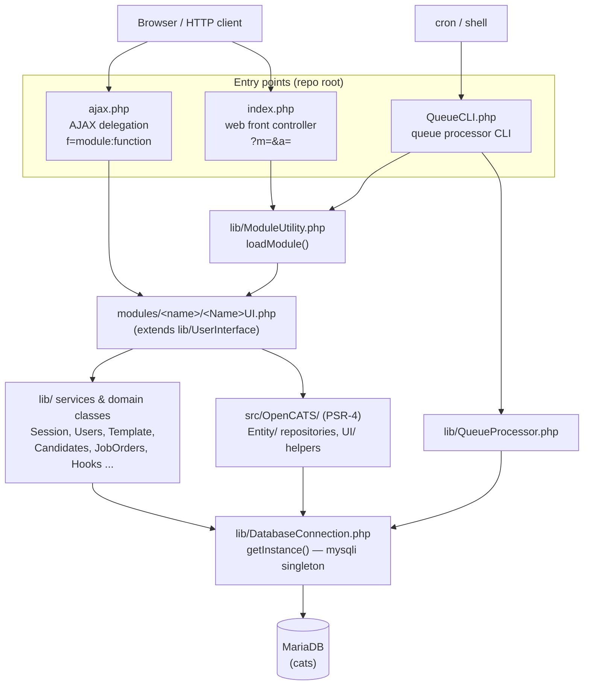

# 01 — Repository Overview

## What OpenCATS is

OpenCATS is described in its own metadata as a "Free and open source candidate/applicant tracking system for recruiters." (composer.json:3). The README expands this: "OpenCATS is a Free and Open Source Candidate/Applicant Tracking System designed for Recruiters to manage recruiting process from job posting, candidate application, through to candidate selection and submission." (README.md:5). The Composer package name is `opencats/opencats` of type `project` (composer.json:2,4).

The codebase is a continuation of "CATS". Every top-level PHP entry file carries a header identifying the lineage: the file banner reads "The Original Code is 'CATS Standard Edition'." and "The Initial Developer of the Original Code is Cognizo Technologies, Inc. Portions created by the Initial Developer are Copyright (C) 2005 - 2007 ... by Cognizo Technologies, Inc." (index.php:24-29; identical text in ajax.php:21-26 and QueueCLI.php:19-24). The legacy SVN `$Id$` keywords are still embedded — e.g. `$Id: index.php 3807 2007-12-05 01:47:41Z will $` (index.php:37) and `$Id: config.php 3826 2007-12-10 06:03:18Z will $` (config.php:27) — confirming the 2007-era origin. The product is still self-branded "CATS" internally; `index.php` is captioned "Index (Delegation Module)" (index.php:4).

The current version is **0.9.7.4**, hardcoded as `define('CATS_VERSION', '0.9.7.4');` (constants.php:45). The same string appears in the file banners, e.g. "CATS Version: 0.9.7.4" (index.php:6, ajax.php:6).

## Tech stack & versions

Runtime platform is **PHP `^7.4`** (composer.json:6). There are exactly four runtime Composer dependencies (composer.json:7-10), with the following constraints and the versions actually pinned in `composer.lock`:

| Package | Constraint (composer.json) | Locked version (composer.lock) | Role |
| --- | --- | --- | --- |
| `ckeditor/ckeditor` | `^4.25.1` (line 7) | `4.25.1` (composer.lock:10-11) | Rich-text WYSIWYG editor |
| `neutron/sphinxsearch-api` | `^2.0.8` (line 8) | `2.0.8.1` (composer.lock:58-59) | Sphinx full-text search client |
| `phpmailer/phpmailer` | `^7.0.2` (line 9) | `v7.1.1` (composer.lock:104-105) | Outbound e-mail (SMTP/sendmail/mail) |
| `setasign/fpdf` | `^1.8.6` (line 10) | `1.8.6` (composer.lock:186-187) | PDF generation |

Dev dependencies (composer.json:12-19) are a Behat + Mink + PHPUnit test stack: `behat/behat ^3.15.0`, `behat/mink ^1.13.0`, `friends-of-behat/mink-extension ^2.7.5`, `behat/mink-browserkit-driver ^2.3.0`, `behat/mink-selenium2-driver ^1.7.0`, and `phpunit/phpunit ^9.6.34`.

The application autoloads only one namespace via Composer PSR-4: `"OpenCATS\\": "src/OpenCATS/"` (composer.json:21-23).

### Docker images & PHP build

The dev stack (docker/docker-compose.yml) wires four images: web `prooph/nginx:www` (lines 3-4), a PHP-FPM container built from `docker/php/Dockerfile` (lines 11-15), database `mariadb` (line 28), and `phpmyadmin/phpmyadmin` (line 42). The test stack additionally pins `mariadb:10.7` for both the functional DB and a separate `integrationtestdb`, plus a `mlespiau/standalone-chrome:2.53.1-cd2.23` Selenium node (docker/docker-compose-test.yml:29,51,68).

The PHP image is `FROM php:7.4-fpm-alpine` (docker/php/Dockerfile:1). It installs:
- Runtime tools via apk: `antiword`, `coreutils`, `html2text`, `libltdl`, `poppler-utils` (provides `pdftotext`), `wget` (lines 4-10) — these back the resume text-extraction pipeline configured in `config.php`.
- Build deps incl. `freetype-dev`, `libjpeg-turbo-dev`, `libmcrypt-dev`, `libpng-dev`, `libxml2-dev`, `libzip-dev`, `openldap-dev` (lines 13-23).
- `unrtf 0.21.10` compiled from source (lines 26-33).
- PHP extensions: `mcrypt-1.0.9` via PECL (line 36), then `gd` (configured with freetype/jpeg), `mysqli`, `gd`, `soap`, `zip`, `ldap` via `docker-php-ext-install` (lines 37-38).
- Composer (lines 41-44) and `dockerize v0.2.0` (lines 45-47).

The extension list maps directly to runtime features: `mysqli` (DB layer — `index.php` aborts if `mysqli_connect` is missing, index.php:89-92), `soap` (the WSDL services in `wsdl/`), `ldap` (the `ldap`/`sql+ldap` auth modes from config.php:48), `gd` (image/captcha rendering), and `zip`.

## Top-level directory map

| Path | Role (as observed) |
| --- | --- |
| `ajax/` | Standalone AJAX handlers, included by `ajax.php` as `ajax/<f>.php` when no module prefix is given (ajax.php:124) |
| `attachments/` | Stored uploaded files (resumes, company/job attachments) on disk |
| `careers/` | Public career-portal front-end assets/entry (`careers/index.php`); main public surface |
| `config/` | Auxiliary config; contains `config/sphinx` for Sphinx indexer settings |
| `db/` | SQL: canonical schema `db/cats_schema.sql`, test data `cats_testdata.bak`, and historical `upgrade-*.sql` migration scripts |
| `docker/` | Compose files (`docker-compose.yml`, `docker-compose-test.yml`) and the PHP `Dockerfile` |
| `images/` | Static image assets |
| `js/` | Client-side JavaScript |
| `lib/` | Procedural/OO business logic, data access, and framework services — 78 files (`ls lib | wc -l` = 78), the bulk of the application |
| `modules/` | Per-module UI controllers + templates; 21 modules incl. `home`, `candidates`, `joborders`, `companies`, `contacts`, `calendar`, `reports`, `settings`, `careers`, `rss`, `xml`, `install`, `queue` (see `$coreModules`, constants.php:30-41) |
| `optional-updates/` | Optional add-on packs; currently `latest-sphinx-search` |
| `reports/` | Report output area (contains an `index.html` placeholder) |
| `rss/` | RSS feed assets for job-order syndication |
| `scripts/` | Maintenance/dev shell + PHP scripts (`makeBackup.php`, `sphinx_reindex.sh`, `newversion.sh`, `countcode.sh`, etc.) |
| `src/` | Modern PSR-4 code under `src/OpenCATS/` (`Entity/`, `UI/`, `Tests/`) |
| `temp/` | Web-server-writable scratch dir (`CATS_TEMP_DIR` default `./temp`, config.php:87) |
| `test/` | Test fixtures/config/data consumed by Behat + integration suites |
| `upload/` | Upload staging area |
| `wsdl/` | SOAP service definitions: `keyCheck.wsdl`, `parse.wsdl`, `status.wsdl` |
| `xml/` | XML feed front-end (`xml/index.php`) for job-order export |

Root files:

| File | Role |
| --- | --- |
| `index.php` | Web front controller / module dispatcher (index.php:4, "Delegation Module") |
| `ajax.php` | AJAX delegation entry point, dispatches on `f=<function>` (ajax.php:4, 124,134) |
| `QueueCLI.php` | Cron-invoked CLI processor for the async task queue (QueueCLI.php:3-4,27-29) |
| `config.php` | Installation configuration: DB creds, auth mode, mailer, Sphinx, paths, feature flags (config.php) |
| `constants.php` | Version + global `define()` constants (access levels, data-item types, etc.) (constants.php:45 onward) |
| `installwizard.php` | Install wizard bootstrap |
| `installtest.php` | Install-time environment/requirements test |

(Other root files present but outside the requested map: `CHANGELOG.MD`, `CLAUDE.md`, `LICENSE.md`, `Security.MD`, `README.md`, `README-testing.md`, `phpunit.xml.dist`, `robots.txt`, `rebuild_old_docs.php`, and the CSS files `main.css`, `ie.css`, `not-ie.css`, `careersPage.css`, `Error.tpl`.)

## The `lib/` vs `modules/` vs `src/` split

The application is layered across three trees:

- **`modules/<name>/`** — per-module UI controllers plus their templates and module-specific AJAX. A request for module `m=candidates` is dispatched by `ModuleUtility::loadModule($moduleName)` (lib/ModuleUtility.php:51). Module-scoped AJAX uses the `module:function` form, resolved to `modules/<module>/ajax/<function>.php` (ajax.php:129-134). Concrete modules include `candidates`, `joborders`, `companies`, `contacts`, `calendar`, `settings` (directory listing of `modules/`).

- **`lib/`** — the procedural/OO core: business logic, data access, and framework services across **78** files. Data access goes through the mysqli singleton `DatabaseConnection::getInstance()` (lib/DatabaseConnection.php:53). The entry-point include chains pull these in explicitly (no autoloader): e.g. `lib/CATSUtility.php`, `lib/DatabaseConnection.php`, `lib/Template.php`, `lib/Users.php`, `lib/Session.php`, `lib/UserInterface.php`, `lib/ModuleUtility.php`, `lib/Hooks.php` (index.php:60-70). Module UI controllers extend `UserInterface` from `lib/UserInterface.php`.

- **`src/OpenCATS/`** — the thin modern PSR-4 layer, the only namespace Composer autoloads (`"OpenCATS\\": "src/OpenCATS/"`, composer.json:21-23). It contains `Entity/`, `UI/`, and `Tests/` (directory listing). `Entity/` uses a repository pattern — e.g. `JobOrder.php` + `JobOrderRepository.php` + `JobOrderRepositoryException.php`, and the same triad for `Company` (`ls src/OpenCATS/Entity`). `UI/` holds newer UI helpers such as `QuickActionMenu.php` and `CandidateQuickActionMenu.php` (`find src/OpenCATS/UI`).

## Entry points

**`index.php` — web front controller.** It `include_once('./config.php')` first (index.php:42), gates on the install wizard (index.php:44-48), sets the memory limit and timezone, then includes the core lib chain `constants.php` → `CommonErrors` → `CATSUtility` → `DatabaseConnection` → `Template` → `Users` → `MRU` → `Hooks` → `Session` → `UserInterface` → `ModuleUtility` → `TemplateUtility` (index.php:59-70). It names and starts the session (index.php:74-75), ensures a `CATSSession` object exists in `$_SESSION['CATS']` (index.php:95-98), enforces a CSRF token on authenticated POSTs (index.php:145-163), and finally dispatches via `ModuleUtility::loadModule(...)` — `careers`, `rss`, `xml`, `login`, `home`, or the requested `$_GET['m']` (index.php:169-276). The documented URL form is `/index.php?m=candidates&a=edit&candidateID=55` (index.php:32-35).

**`ajax.php` — AJAX delegation.** It includes `config.php`, `constants.php`, `lib/DatabaseConnection.php`, `lib/Session.php`, `lib/AJAXInterface.php`, `lib/CATSUtility.php` (ajax.php:38-43). It only starts a session on POST (ajax.php:50-54), validates CSRF for logged-in POSTs (ajax.php:56-79), and requires a non-empty `f` parameter (ajax.php:81-93). The `f` value is sanitized and resolved to a file: bare `f` → `ajax/<f>.php`; `f=module:function` → `modules/<module>/ajax/<function>.php` (ajax.php:120-135). While the installer is active (no `INSTALL_BLOCK`), only `install:*` AJAX is allowed (ajax.php:95-118). Output is buffered and passed through the `AJAX_HOOK` hook unless `nobuffer` is set (ajax.php:153-178).

**`QueueCLI.php` — cron CLI.** Headed "Asynchroneous Queue Processor ... command line interface version of the QueueProcessor. This file should be called by cron, bash script, whatever (not the website)" (QueueCLI.php:3-4,27-29). It `chdir`s to its own directory (QueueCLI.php:34-36), includes `config.php`, `constants.php`, and roughly the same lib chain as `index.php` plus `lib/QueueProcessor.php` and `modules/queue/constants.php` (QueueCLI.php:38-52), starts a session, registers module tasks via `ModuleUtility::registerModuleTasks()` (QueueCLI.php:64), runs `QueueProcessor::startNextTask()` (QueueCLI.php:69), touches `QUEUE_STATUS_FILE`, periodically cleans errored/old queues (QueueCLI.php:72-87), and prints a status (`SUCCESS`/`FAILURE`/`NO TASKS`/`ERROR`).

## Running it

The dev stack starts all four services with one command (per CLAUDE.md:38, `cd docker/ && docker compose up --build`):

- **nginx** (`prooph/nginx:www`) — host ports **80** and **443** (docker/docker-compose.yml:4-7).
- **mariadb** — host port **3306**, env `MYSQL_DATABASE=cats`, user/pass `dev`/`dev`, root pass `root`; seeded from `../test/data` and persisted to `./persist/mysql` (docker/docker-compose.yml:28-38).
- **phpMyAdmin** — host port **8080** → container 80, linked to the DB as `db` (docker/docker-compose.yml:42-49).
- **php** (PHP-FPM, built locally) and a **busybox** `opencatsdata` volume container sharing the repo at `/var/www/public` (docker/docker-compose.yml:11-24).

On first boot the app runs the install wizard: `index.php` shows `modules/install/notinstalled.php` and dies unless an `INSTALL_BLOCK` file exists (or a maintenance POST is in flight) — `if (!file_exists('INSTALL_BLOCK') && !isset($_POST['performMaintenence']))` (index.php:44-48). So `config.php` (DB creds + feature flags) plus the presence of `INSTALL_BLOCK` together gate the installer. For full operational/setup detail see doc 16.

## Architecture diagram

## Source evidence (files+lines read)

- `composer.json` (full): name/description/type (2-4); php `^7.4` (6); 4 runtime deps (7-10); dev deps (12-19); PSR-4 autoload (21-23).
- `composer.lock`: locked versions — ckeditor `4.25.1` (10-11), neutron/sphinxsearch-api `2.0.8.1` (58-59), phpmailer `v7.1.1` (104-105), setasign/fpdf `1.8.6` (186-187).
- `README.md` (full): product description (5).
- `docker/docker-compose.yml` (full): services/ports/env (3-49).
- `docker/docker-compose-test.yml` (full): mariadb:10.7 (29,51), integrationtestdb 3307 (53), selenium image (68).
- `docker/php/Dockerfile` (full): base image (1), apk runtime tools (4-10), build deps (13-23), unrtf (26-33), PHP extensions (36-38), composer/dockerize (41-47).
- `index.php` (full): banner/lineage (4,6,24-29), `$Id$` (37), config include (42), install gate (44-48), lib include chain (59-70), session (74-75,95-98), CSRF (145-163), dispatch (169-276).
- `ajax.php` (full): banner (4-26), `$Id$` (34), include chain (38-43), session/CSRF (50-79), `f` required (81-93), installer gate (95-118), file resolution (120-135), buffering/hook (153-178).
- `QueueCLI.php` (full): banner/purpose (3-4,19-29), chdir (34-36), include chain (38-52), task registration/run (64-87).
- `constants.php` (1-120): banner (19-24), `$coreModules` (30-41), `CATS_VERSION` (45), access-level + data-item defines (56-82).
- `config.php` (full): banner/`$Id$` (27), DB defines (40-43), `AUTH_MODE` (48), parser/Sphinx/temp/mailer/LDAP defines and feature flags.
- `lib/ModuleUtility.php`: `loadModule($moduleName)` (51).
- `lib/DatabaseConnection.php`: `getInstance()` (53).
- Directory listings: repo root (`ls`), `src/OpenCATS/` (`Entity`, `UI`, `Tests`), `lib` count = 78, `modules` = 21 dirs, plus `db/`, `wsdl/`, `scripts/`, `optional-updates/`, `config/`, `careers/`, `xml/`, `reports/` contents.
- `CLAUDE.md` (full) — used only as a map to verify against code.

## Unverified / open questions

- **`lib/` file count vs CLAUDE.md framing.** The task brief said "74 files"; the actual `ls lib | wc -l` is **78**. Code/listing wins: 78. (The discrepancy may be a brief-vs-repo drift, or a difference in counting subdirectories/non-`.php` files; not independently reconciled.)
- **Directory roles for `attachments/`, `upload/`, `temp/`, `images/`, `reports/`** are inferred from names and the `CATS_TEMP_DIR`/upload conventions, not from reading writes into each; only `temp/` is confirmed via `config.php:87`. `reports/` contains only an `index.html` placeholder, so its runtime use was not directly observed here.
- **`config/sphinx`, `optional-updates/latest-sphinx-search`** roles are inferred from names + the Sphinx config defines (config.php:94-100); their internal contents were not read.
- **phpmailer constraint vs lock.** composer.json requires `^7.0.2` but the lock pins `v7.1.1`; both satisfy the caret range — noted only to flag that the locked minor differs from the constraint's stated patch.
- **Test/run commands** in the "Running it" section reference doc 16 and CLAUDE.md:38; the exact `docker compose` invocation was taken from CLAUDE.md (a map), not re-executed.
- The `prooph/nginx:www` image's internal nginx→php-fpm wiring (fastcgi config, docroot) was not inspected; only the compose-level port/volume mapping is confirmed.
