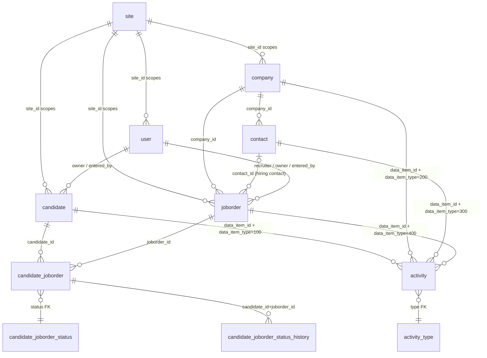

# 02 — Glossary & Domain Model

> Scope: this document defines the domain vocabulary **as it actually exists in this OpenCATS codebase** (legacy PHP 7.4 ATS). Every term is tied to the class, table, and/or constant that implements it. No generic ATS theory. Constant values are quoted from `constants.php`; table/column names are quoted from `db/cats_schema.sql`.

---

## Domain model diagram

The conceptual core: a **Candidate** is linked to a **Job Order** through a **Pipeline** row (`candidate_joborder`), which carries a `status`. A Job Order belongs to a **Company** and (optionally) names a **Contact** at that company. **Activity** rows attach to any "data item" (candidate/company/contact/job order) and may reference a job order. Nearly every row carries a `site_id` for multi-tenant scoping.

Drawn from: `candidate` (cats_schema.sql:161), `joborder` (cats_schema.sql:784), `candidate_joborder` (cats_schema.sql:231), `candidate_joborder_status` (cats_schema.sql:257), `candidate_joborder_status_history` (cats_schema.sql:283), `company` (cats_schema.sql:453), `contact` (cats_schema.sql:507), `activity` (cats_schema.sql:35), `site` (cats_schema.sql:977), `user` (cats_schema.sql:1054).

Note the polymorphic association pattern: `activity`, `attachment`, `extra_field`, `saved_list_entry`, `mru`, `history`, and `calendar_event` all reference a target by the pair `(data_item_id, data_item_type)` rather than a typed foreign key (`activity` at cats_schema.sql:37-38; `attachment` at cats_schema.sql:86-87; `extra_field` at cats_schema.sql:653,658). `data_item_type` holds a `DATA_ITEM_*` value.

---

## Glossary

### Access Level / ACL
A user's permission tier, stored as the integer `user.access_level` (cats_schema.sql:1060, default `100`). The nine `ACCESS_LEVEL_*` constants (constants.php:74-82) are:

| Constant | Value |
|---|---|
| `ACCESS_LEVEL_DELETED` | `-100` |
| `ACCESS_LEVEL_DISABLED` | `0` |
| `ACCESS_LEVEL_READ` | `100` |
| `ACCESS_LEVEL_EDIT` | `200` |
| `ACCESS_LEVEL_DELETE` | `300` |
| `ACCESS_LEVEL_DEMO` | `350` |
| `ACCESS_LEVEL_SA` | `400` |
| `ACCESS_LEVEL_MULTI_SA` | `450` |
| `ACCESS_LEVEL_ROOT` | `500` |

The `access_level` table (cats_schema.sql:16) stores human descriptions but only seeds six rows (`0,100,200,300,400,500`) — it does not include the `-100`, `350`, `450` variants (cats_schema.sql:26-31). A separate `ACL` class (lib/ACL.php:12) provides `getAccessLevel($securedObjectName, $userCategories, $defaultAccessLevel)` (lib/ACL.php:52) keyed off the user's `categories` column (cats_schema.sql:1066); it is dormant by default — `ACL_SETUP` is commented out (lib/ACL.php:24-46), so `getAccessLevel` returns the supplied default (lib/ACL.php:54-57).

### Activity + Activity Type
An **Activity** is a logged interaction/note about a data item, stored in `activity` (cats_schema.sql:35) and managed by `ActivityEntries` (lib/ActivityEntries.php:63, constructed with `$siteID` at line 69). It records the target via `data_item_id` + `data_item_type` (cats_schema.sql:37-38), an optional `joborder_id` (line 39), `entered_by`, `notes`, and `type`. `ActivityEntries::add($dataItemID, $dataItemType, $activityType, ...)` inserts the row and bumps the target's modified date (lib/ActivityEntries.php:88,158). **Activity Type** is the `type` column, an FK to `activity_type` (cats_schema.sql:64) whose seeded values are: `100 Not reached`, `200 Email`, `300 Meeting`, `400 Other`, `500 Call (Talked)`, `600 Call (LVM)`, `700 Call (Missed)`, `800 Status Change` (cats_schema.sql:73-80).

### Attachment
A file (resume, document, or profile image) linked to a data item, stored in `attachment` (cats_schema.sql:84). It associates via `data_item_id`/`data_item_type` (cats_schema.sql:86-87), keeps both `original_filename` and `stored_filename` (lines 90-91), a `resume` flag and `profile_image` flag (lines 93,97), extracted `text` for search, and `md5_sum`/`md5_sum_text` for duplicate detection (lines 99,101). Managed by `lib/Attachments.php`.

### Candidate
A job seeker. Stored in `candidate` (cats_schema.sql:161) and managed by the `Candidates` class (lib/Candidates.php:46), constructed with a `$siteID` (lib/Candidates.php:54-58). Key columns: `first_name`/`last_name`, `email1`/`email2`, `key_skills`, `current_employer`, `source`, `is_hot` (cats_schema.sql:189), `is_active` (line 196), and EEO fields (`eeo_ethnic_type_id`, `eeo_veteran_type_id`, `eeo_gender`, lines 190-193). Each candidate carries extra fields via `new ExtraFields($siteID, DATA_ITEM_CANDIDATE)` (lib/Candidates.php:58). The corresponding `DATA_ITEM_CANDIDATE` value is `100`.

### Career Portal
A public-facing job board / application site for a tenant. Driven by the `career_portal_template` table (cats_schema.sql:405; seeded with the "Blank Page" and "CATS 2.0" template sets, lines 415-436) and per-site overrides in `career_portal_template_site` (cats_schema.sql:440), with logic in `CareerPortal` (lib/CareerPortal.php). Career-portal settings are a settings category — `SETTINGS_CAREER_PORTAL` = `4` (constants.php:71). The `joborder.public` flag (cats_schema.sql:808) controls whether a job is exposed on the portal.

### Company (internal "client" naming)
A hiring organization. Stored in `company` (cats_schema.sql:453) and managed by `lib/Companies.php`. Columns include `name`, `key_technologies`, `is_hot`, and `default_company` (cats_schema.sql:475). One seed row exists: `company_id=1` "Internal Postings" with `default_company=1` (cats_schema.sql:489). Although the UI/table call it "company", much of the **code and schema still uses the legacy term "client"**: e.g. `contact` has index `IDX_client_id` on `company_id` (cats_schema.sql:538); `joborder` has index `IDX_client_id` on `company_id` (cats_schema.sql:817) and column `client_job_id` (line 792); email templates use `%JBODCLIENT%`, `%CLNTNAME%`, and an `EMAIL_TEMPLATE_OWNERSHIPASSIGNCLIENT` template (cats_schema.sql:632). The `DATA_ITEM_COMPANY` value is `200`.

### Contact
A person at a Company (hiring manager, billing contact, etc.). Stored in `contact` (cats_schema.sql:507), always tied to a `company_id` (line 509) and managed by `lib/Contacts.php`. Has `title`, `reports_to` (line 533), and a `left_company` flag (line 530). A job order may name one contact via `joborder.contact_id` (cats_schema.sql:787); a company may name a `billing_contact` (cats_schema.sql:456). The `DATA_ITEM_CONTACT` value is `300`.

### Data Item / DATA_ITEM_*
The system's generic "kind of record" tag, used for the polymorphic `(data_item_id, data_item_type)` association pattern across `activity`, `attachment`, `extra_field`, `saved_list_entry`, `mru`, etc. All nine flags (constants.php:57-65):

| Constant | Value |
|---|---|
| `DATA_ITEM_CANDIDATE` | `100` |
| `DATA_ITEM_COMPANY` | `200` |
| `DATA_ITEM_CONTACT` | `300` |
| `DATA_ITEM_JOBORDER` | `400` |
| `DATA_ITEM_BULKRESUME` | `500` |
| `DATA_ITEM_USER` | `600` |
| `DATA_ITEM_LIST` | `700` |
| `DATA_ITEM_PIPELINE` | `800` |
| `DATA_ITEM_DUPLICATE` | `900` |

Only the first four are seeded into the descriptive `data_item_type` table (`100 Candidate`, `200 Company`, `300 Contact`, `400 Job Order`; cats_schema.sql:558-561).

### Extra Field
A site-configurable custom field attached to a data-item type. Per-field values live in `extra_field` (cats_schema.sql:651, associating via `data_item_id`/`data_item_type`), and the field definitions live in `extra_field_settings` (cats_schema.sql:668) with `extra_field_type` and `position`. Managed by the `ExtraFields` class, constructed as `new ExtraFields($siteID, $dataItemType)` (lib/ExtraFields.php:39,45). The six field-type constants (constants.php:133-138): `EXTRA_FIELD_TEXT`=`1`, `EXTRA_FIELD_TEXTAREA`=`2`, `EXTRA_FIELD_CHECKBOX`=`3`, `EXTRA_FIELD_DATE`=`4`, `EXTRA_FIELD_DROPDOWN`=`5`, `EXTRA_FIELD_RADIO`=`6` — used in the rendering switch in lib/ExtraFields.php:558-628.

### Hook
A named extension point evaluated as PHP source at runtime. `Hooks::get($hookName)` (lib/Hooks.php:52) returns the concatenated hook strings registered in `$_SESSION['hooks']`, or the no-op `'return true;'` when none exist (lib/Hooks.php:54-57). Hooks are invoked inline via `eval()`, e.g. `if (!eval(Hooks::get('PIPELINES_ADD_SQL'))) return;` in `Pipelines::add` (lib/Pipelines.php:95). The class is non-instantiable (private constructor, lib/Hooks.php:40-42).

### Job Order
An open requisition/position to fill. Stored in `joborder` (cats_schema.sql:784) and managed by `JobOrders` (lib/JobOrders.php:56), constructed with `$siteID` (lib/JobOrders.php:64-68). Belongs to a `company_id`, optionally a `contact_id`, and has a `recruiter` and `owner` (cats_schema.sql:786-790). Columns include free-text `status` (default `'Active'`, cats_schema.sql:800), `type` (default `'C'`, line 796), `openings`/`openings_available`, `is_hot`, `public`, and `questionnaire_id` (line 812). Has extra fields via `new ExtraFields($siteID, DATA_ITEM_JOBORDER)` (lib/JobOrders.php:68). The `DATA_ITEM_JOBORDER` value is `400`. Note `joborder.status` (a varchar) is distinct from pipeline status (an int — see Pipeline Status).

### Module
A functional area of the app, each a subdirectory under `modules/`. The core set and their numeric IDs are defined in `$coreModules` (constants.php:30-41): `home`=1, `activity`=2, `joborders`=3, `candidates`=4, `companies`=5, `contacts`=6, `lists`=7, `calendar`=8, `reports`=9, `settings`=10. The `module_schema` table (cats_schema.sql:833) tracks installed modules and their migration `version`, seeded with 23 entries including `activity`, `candidates`, `careers`, `joborders`, `lists`, `reports`, `settings`, `xml`, etc. (cats_schema.sql:842-864). Module-data array offsets are defined at constants.php:181-184.

### MRU (Most Recently Used)
A per-user navigation history list. Stored in `mru` (cats_schema.sql:868), keyed by `(user_id, site_id)` (index at line 877), storing `data_item_type`, a display `data_item_text`, and a target `url` for each recently viewed item. Managed by `lib/MRU.php`.

### Pipeline (candidate_joborder)
The join entity that places a Candidate into a Job Order's consideration funnel. Stored in `candidate_joborder` (cats_schema.sql:231) and managed by `Pipelines` (lib/Pipelines.php:41), constructed with `$siteID` (lib/Pipelines.php:47-51). Each row links one `candidate_id` to one `joborder_id` and carries `status`, `date_submitted`, `rating_value`, and `added_by` (cats_schema.sql:233-241). `Pipelines::add($candidateID, $jobOrderID, $userID)` enforces uniqueness per `(candidate, joborder, site)` before inserting (lib/Pipelines.php:61-90). The `DATA_ITEM_PIPELINE` value is `800`.

### Pipeline Status / candidate_joborder_status
The funnel stage of a pipeline entry: the integer `candidate_joborder.status` (cats_schema.sql:236), FK to the `candidate_joborder_status` lookup table (cats_schema.sql:257). The `PIPELINE_STATUS_*` constants (constants.php:119-130):

| Constant | Value | `candidate_joborder_status.short_description` |
|---|---|---|
| `PIPELINE_STATUS_NOSTATUS` | `0` | No Status |
| `PIPELINE_STATUS_NOCONTACT` | `100` | No Contact |
| `PIPELINE_STATUS_CONTACTED` | `200` | Contacted |
| `PIPELINE_STATUS_CANDIDATE_REPLIED` | `250` | Candidate Responded |
| `PIPELINE_STATUS_QUALIFYING` | `300` | Qualifying |
| `PIPELINE_STATUS_SUBMITTED` | `400` | Submitted |
| `PIPELINE_STATUS_INTERVIEWING` | `500` | Interviewing |
| `PIPELINE_STATUS_OFFERED` | `600` | Offered |
| `PIPELINE_STATUS_NOTINCONSIDERATION` | `650` | Not in Consideration |
| `PIPELINE_STATUS_CLIENTDECLINED` | `700` | Client Declined |
| `PIPELINE_STATUS_PLACED` | `800` | Placed |

Constant values match the table's seeded `candidate_joborder_status_id` rows (cats_schema.sql:269-279). The table also carries `triggers_email` and `can_be_scheduled` flags (line 261); rows `300/400/500/600/800` have `triggers_email=1`. Status changes are recorded by `Pipelines::setStatus(...)` (lib/Pipelines.php:295), which writes a row to `candidate_joborder_status_history` capturing `status_from` and `status_to` (cats_schema.sql:283, INSERT at lib/Pipelines.php:432-438) and typically logs a `800 Status Change` activity. A leftover/duplicate lookup table `candidate_jobordrer_status_type` (sic — note the misspelling) also exists but ships empty (cats_schema.sql:304).

### Questionnaire
A set of screening questions attached to a Career Portal application flow. Stored in `career_portal_questionnaire` (cats_schema.sql:339) with questions in `career_portal_questionnaire_question` (cats_schema.sql:388), submitted answers in `career_portal_questionnaire_answer` (cats_schema.sql:352), and `career_portal_questionnaire_history` (cats_schema.sql:372). A job order references one via `joborder.questionnaire_id` (cats_schema.sql:812). Managed by `Questionnaire` (lib/Questionnaire.php).

### Saved List / Hotlist (STATIC / DYNAMIC)
A user-curated or query-defined collection of data items, commonly called a "hotlist" in the UI. The list header is `saved_list` (cats_schema.sql:903) and members are `saved_list_entry` rows (cats_schema.sql:925), each associated via `(data_item_id, data_item_type)`. Managed by `SavedLists` (lib/SavedLists.php:38). A list is **STATIC** (an explicit set of entries) or **DYNAMIC** (defined by stored search `parameters`) per the `saved_list.is_dynamic` flag (cats_schema.sql:908). `SavedLists::getAll($dataItemType, $listType)` (lib/SavedLists.php:94) filters by the three `*_LISTS` constants (constants.php:152-154): `ALL_LISTS`=`0`, `STATIC_LISTS`=`1` (adds `is_dynamic = false`, lib/SavedLists.php:108-110), `DYNAMIC_LISTS`=`2` (adds `is_dynamic = true`, lib/SavedLists.php:113-115). The list data-item type itself is `DATA_ITEM_LIST` = `700`. (Distinct from the per-record "hot" flag `is_hot` on candidate/company/contact/joborder.)

### Saved Search
A persisted search query that can power a dynamic list or quick re-run. Stored in `saved_search` (cats_schema.sql:943), keyed by `user_id` + `site_id`, storing `data_item_text`, the search `url`, `is_custom`, and `data_item_type` (lines 944-951). Managed by `lib/SavedSearches.php`.

### Settings categories (SETTINGS_*)
Configuration values for a site, stored as `setting`/`value` pairs in `settings` (cats_schema.sql:959), tagged with a `settings_type` category. The four `SETTINGS_*` constants (constants.php:67-71): `SETTINGS_MAILER`=`1`, `SETTINGS_CALENDAR`=`2`, `SETTINGS_EEO`=`3`, `SETTINGS_CAREER_PORTAL`=`4`. Seed rows include `fromAddress` and `configured` flags for sites `1` and `180` under `settings_type=1` (cats_schema.sql:970-973).

### Site / siteID (multi-tenancy)
A tenant/account boundary. Stored in `site` (cats_schema.sql:977) and managed by `Site` (lib/Site.php:38, constructed with `$siteID` at line 44). Almost every domain table carries a `site_id` column, and every domain manager class takes `$siteID` in its constructor and assigns it to `$this->_siteID`, threading it into queries — e.g. `Candidates` (lib/Candidates.php:54-56), `JobOrders` (lib/JobOrders.php:64-67), `Pipelines` (lib/Pipelines.php:47-49) where `$this->_siteID` is used directly in the WHERE clause (lib/Pipelines.php:76). Reserved site `180` is the CATS administrative site — `define('CATS_ADMIN_SITE', 180)` (constants.php:187) — seeded as `'CATS_ADMIN'`/`unix_name='catsadmin'` (cats_schema.sql:1010); the demo/default tenant is site `1` `'example.com'` (cats_schema.sql:1009). The `site` row also holds tenant-wide preferences: `time_zone`, `time_format_24`, `date_format_ddmmyy`, `is_hr_mode`, `user_licenses` (cats_schema.sql:981-994).

### Tag
A free-form label, currently applied to candidates. Defined in `tag` (cats_schema.sql:1040) with `tag_parent_id`, `title`, `description`, and `site_id`; candidate associations live in `candidate_tag` (cats_schema.sql:329) linking `candidate_id` to `tag_id`. Managed by `lib/Tags.php`. (Only the candidate join table exists in the schema; there is no company/contact/joborder tag join table.)

### Template
Two distinct meanings in this codebase, both literally named "template":
1. **`Template` class** (lib/Template.php:38) — the view/presentation helper providing HTML/attr/URL/JS escaping (`escapeHtml`, `escapeAttr`, `escapeUrl`, lib/Template.php:65-153) and `assign()` (line 166) for rendering module pages.
2. **Email templates** — reusable, variable-substituting message bodies in `email_template` (cats_schema.sql:614), seeded with notifications such as `EMAIL_TEMPLATE_STATUSCHANGE`, `EMAIL_TEMPLATE_OWNERSHIPASSIGNCANDIDATE`, and `EMAIL_TEMPLATE_CANDIDATEAPPLY` (cats_schema.sql:628-634), each using `%...%` substitution tokens like `%CANDFULLNAME%`, `%JBODTITLE%`, `%JBODCLIENT%`. Managed by `lib/EmailTemplates.php`.

There are also **Career Portal templates** (`career_portal_template`) — see Career Portal.

### User
A login account within a site. Stored in `user` (cats_schema.sql:1054) and managed by `lib/Users.php`. Carries `user_name`, `email`, `password` (md5 by default, see seed at cats_schema.sql:1092), `access_level` (default `100`), `site_id`, and per-user prefs like `pipeline_entries_per_page` (default `15`) and `column_preferences` (cats_schema.sql:1068-1069). Seed users: `admin` (`access_level=500`, site 1, password `md5('cats')`, cats_schema.sql:1092) and the non-loginable `cats@rootadmin` automation user on site 180 (line 1093). The default admin password is `define('DEFAULT_ADMIN_PASSWORD', 'cats')` (constants.php:178). A user is referenced from domain records via `entered_by`, `owner`, and (job orders) `recruiter`. The `DATA_ITEM_USER` value is `600`.

---

## Source evidence

- `constants.php` (full file read): `$coreModules` (30-41), `DATA_ITEM_*` (57-65), `SETTINGS_*` (67-71), `ACCESS_LEVEL_*` (74-82), `TIME_PERIOD_*` (107-117), `PIPELINE_STATUS_*` (119-130), `EXTRA_FIELD_*` (133-138), `*_LISTS` (152-154), `CATS_ADMIN_SITE` (187), `DEFAULT_ADMIN_PASSWORD` (178), module offsets (181-184).
- `db/cats_schema.sql`: `access_level` (16, seed 26-31), `activity` (35), `activity_type` (64, seed 73-80), `attachment` (84), `candidate` (161), `candidate_joborder` (231), `candidate_joborder_status` (257, seed 269-279), `candidate_joborder_status_history` (283), `candidate_jobordrer_status_type` (304), `candidate_tag` (329), `career_portal_questionnaire` (339), `career_portal_template` (405, seed 415-436), `company` (453, seed 489), `contact` (507), `data_item_type` (549, seed 558-561), `email_template` (614, seed 628-634), `extra_field` (651), `extra_field_settings` (668), `joborder` (784), `module_schema` (833, seed 842-864), `mru` (868), `saved_list` (903), `saved_list_entry` (925), `saved_search` (943), `settings` (959, seed 970-973), `site` (977, seed 1009-1010), `tag` (1040), `user` (1054, seed 1092-1093).
- `lib/Candidates.php`: class (46), constructor `$siteID`/`_siteID`/`ExtraFields(...,DATA_ITEM_CANDIDATE)` (54-58).
- `lib/JobOrders.php`: class (56), constructor (64-68), `update` company/client naming (163,182-183,210), `client_job_id` join (394-396,463).
- `lib/Pipelines.php`: class (41), constructor (47-51), `add` with uniqueness check + `Hooks::get('PIPELINES_ADD_SQL')` eval (61-95), `setStatus` (295), status-history INSERT (432-438).
- `lib/ActivityEntries.php`: class (63), constructor (69), `add($dataItemID,$dataItemType,$activityType,...)` (88-158).
- `lib/Site.php`: class (38), constructor (44-47).
- `lib/ACL.php`: class (12), commented-out `ACL_SETUP` (24-46), `getAccessLevel` (52-60).
- `lib/Hooks.php`: class (38), private ctor (40-42), `get` (52-67).
- `lib/SavedLists.php`: class (38), `getAll` + STATIC/DYNAMIC filtering (94-115), comment block citing the constants (86-88).
- `lib/ExtraFields.php`: class (39), constructor `($siteID, $dataItemType)` (45), `EXTRA_FIELD_*` render switch (558-628).
- `lib/Template.php`: class (38), escaping/`assign` helpers (65-179).

---

## Unverified / open questions

- **`access_level` table vs. constants mismatch.** The `access_level` table seeds only six rows (0,100,200,300,400,500); `ACCESS_LEVEL_DELETED` (-100), `ACCESS_LEVEL_DEMO` (350), and `ACCESS_LEVEL_MULTI_SA` (450) have no descriptive rows. How (and whether) 350/450/-100 are exercised at runtime was not traced.
- **ACL class activation.** `ACL_SETUP` is commented out, so `ACL::getAccessLevel` always returns the default. Whether any deployment/config actually defines `ACL_SETUP` was not confirmed.
- **`candidate_jobordrer_status_type` table** (misspelled) is empty and appears to be a legacy/duplicate of `candidate_joborder_status`. Its consumers (if any) were not searched.
- **`joborder.status`** is a free-text varchar (default `'Active'`); the full set of allowed string values is not enumerated in a constant — only the int pipeline statuses are. The canonical string list was not located.
- **Tags** only have a `candidate_tag` join table; whether tagging extends to other data-item types was not verified beyond the schema.
- **`TIME_PERIOD_*`** constants (constants.php:107-117) exist for reporting but were not tied to a specific class in this pass.
- Exact `Pipelines::setStatus` side-effects (email triggering via `triggers_email`, calendar scheduling) were confirmed to write status history and reference `PIPELINE_STATUS_SUBMITTED` (lib/Pipelines.php:708) but the full email/notification path was not fully traced.
