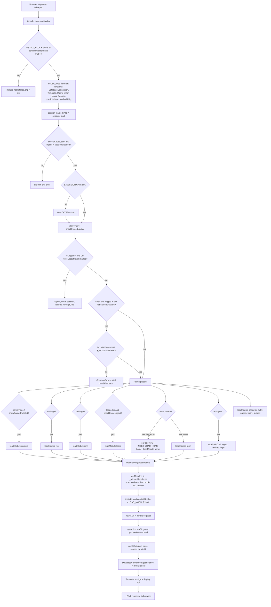

# 03 — Architecture Overview

OpenCATS is a legacy PHP 7.4 ATS built around a single front controller (`index.php`)
that dispatches to per-module `*UI` controllers. There is no modern router; routing is
done by hand from `$_GET['m']` and a small set of global flags. This document traces a
real request through the actual code, citing every claim.

All citations are `file:line` ranges from files opened while writing this doc. Where the
committed `CLAUDE.md` disagrees with the code, the code wins and the discrepancy is noted.

---

## Request lifecycle

### 1. `index.php` bootstrap

The front controller's first act is to load `config.php`, then gate on installation
state. If neither the `INSTALL_BLOCK` sentinel file exists nor a maintenance POST is in
flight, it hands off to the installer and dies (index.php:42-48):

```php
include_once('./config.php');

if (!file_exists('INSTALL_BLOCK') && !isset($_POST['performMaintenence']))
{
    include(LEGACY_ROOT . '/modules/install/notinstalled.php');
    die();
}
```

It then sets a 64M memory limit and the default timezone (index.php:51-57), and runs an
explicit, order-dependent `include_once` chain — there is no autoloader for `lib/`
(index.php:59-70). The comments record the dependency order:

```php
include_once(LEGACY_ROOT . '/constants.php');
include_once(LEGACY_ROOT . '/lib/CommonErrors.php');
include_once(LEGACY_ROOT . '/lib/CATSUtility.php');
include_once(LEGACY_ROOT . '/lib/DatabaseConnection.php');
include_once(LEGACY_ROOT . '/lib/Template.php');
include_once(LEGACY_ROOT . '/lib/Users.php');
include_once(LEGACY_ROOT . '/lib/MRU.php');
include_once(LEGACY_ROOT . '/lib/Hooks.php');
include_once(LEGACY_ROOT . '/lib/Session.php'); /* Depends: MRU, Users, DatabaseConnection. */
include_once(LEGACY_ROOT . '/lib/UserInterface.php'); /* Depends: Template, Session. */
include_once(LEGACY_ROOT . '/lib/ModuleUtility.php'); /* Depends: UserInterface */
include_once(LEGACY_ROOT . '/lib/TemplateUtility.php'); /* Depends: ModuleUtility, Hooks */
```

The session is given a CATS-specific name and started (index.php:73-75):

```php
@session_name(CATS_SESSION_NAME);
session_start();
```

`CATS_SESSION_NAME` is `'CATS'` (config.php:148). Anti-cache headers are emitted
(index.php:78-79). Two hard environment checks follow:

- **`session.auto_start` must be off** — because objects (the `CATSSession`) cannot be
  stored in an auto-started session. If `session.auto_start` is neither `'0'` nor `'Off'`,
  the request dies with `'CATS Error: session.auto_start must be set to 0 in php.ini.'`
  (index.php:81-86).
- **mysqli + sessions must be loaded** — if `mysqli_connect` or `session_start` are
  missing, it dies with an extension error (index.php:88-92).

### 2. `CATSSession` construction, timer, forced-update, force-logout

If `$_SESSION['CATS']` is unset or empty, a fresh `CATSSession` is created and stored in
the session (index.php:94-98):

```php
if (!isset($_SESSION['CATS']) || empty($_SESSION['CATS']))
{
    $_SESSION['CATS'] = new CATSSession();
}
```

`CATSSession` has no explicit constructor; it is a plain property bag whose fields default
to a logged-out state — `$_siteID = -1`, `$_userID = -1`, `$_accessLevel = -1`,
`$_isLoggedIn = false`, `$_storedBuild = -1`, etc. (Session.php:42-88). Including
`Session.php` also pulls in `lib/ACL.php` (Session.php:33).

Next the controller starts the response timer, which records `microtime()` for the footer
execution-time display (index.php:101; `startTimer()` at Session.php:1085-1088).

Then `checkForcedUpdate()` runs (index.php:103-106). It compares the cached build number
against the current one; if they differ (and the stored build is not the sentinel `-1`),
it calls `forceUpdate()`, which unsets `$_SESSION['modules']` so the module/hook cache is
rebuilt on the next access (Session.php:130-159):

```php
public function checkForcedUpdate()
{
   $build = CATSUtility::getBuild();
   if ($this->_storedBuild != -1 && $this->_storedBuild != $build)
   {
       $this->forceUpdate();
   }
   $this->_storedBuild = $build;
}
```

Finally, if the session is already logged in, the controller re-checks the user's
access level and a `forceLogout` flag straight from the database via
`Users::getForceLogoutData()` (index.php:111-143). The inline comment flags this as slow.
If the DB now reports `forceLogout == 1` or a changed access level, it updates the real
access level; and if the account is now `ACCESS_LEVEL_DISABLED` or `forceLogout` is set, it
logs the user out, unsets `$_SESSION['CATS']` and `$_SESSION['modules']`, and redirects to
`m=login` (preserving the site's `unixName` unless it is the local `demo` account):

```php
if ($_SESSION['CATS']->isLoggedIn())
{
    $users = new Users($_SESSION['CATS']->getSiteID());
    $forceLogoutData = $users->getForceLogoutData($_SESSION['CATS']->getUserID());
    if (!empty($forceLogoutData) && ($forceLogoutData['forceLogout'] == 1 ||
        $_SESSION['CATS']->getRealAccessLevel() != $forceLogoutData['accessLevel']))
    {
        $_SESSION['CATS']->setRealAccessLevel($forceLogoutData['accessLevel']);
        if ($forceLogoutData['accessLevel'] == ACCESS_LEVEL_DISABLED ||
            $forceLogoutData['forceLogout'] == 1)
        {
            ...
            $_SESSION['CATS']->logout();
            unset($_SESSION['CATS']);
            unset($_SESSION['modules']);
            ...
            CATSUtility::transferRelativeURI($URI);
            die();
        }
    }
}
```

`isLoggedIn()` simply returns the stored `$_isLoggedIn` boolean — no DB access
(Session.php:244-247). `setRealAccessLevel()` also lowers the effective `$_accessLevel`
if the real level is lower (Session.php:422-430).

### 3. CSRF enforcement on POST

CSRF is enforced only on authenticated, non-public POSTs (index.php:145-163):

```php
if (isset($_SERVER['REQUEST_METHOD']) && $_SERVER['REQUEST_METHOD'] === 'POST' &&
    $_SESSION['CATS']->isLoggedIn() &&
    (!isset($careerPage) || !$careerPage) &&
    (!isset($_GET['showCareerPortal']) || $_GET['showCareerPortal'] != '1') &&
    (!isset($rssPage) || !$rssPage) &&
    (!isset($xmlPage) || !$xmlPage))
{
    $token = null;
    if (isset($_POST['csrfToken']))
    {
        $token = $_POST['csrfToken'];
    }
    if (!$_SESSION['CATS']->isCSRFTokenValid($token))
    {
        CommonErrors::fatal(COMMONERROR_BADFIELDS, null, 'Invalid request.');
    }
}
```

The check is skipped entirely for the public career portal (`$careerPage` /
`showCareerPortal=1`), RSS (`$rssPage`), and XML (`$xmlPage`) entry points, and for
anonymous (not-logged-in) POSTs. The token is read from `$_POST['csrfToken']` and
validated against the session token.

CSRF token methods live on `CATSSession`, backed by the generic
`storeValueByName`/`retrieveValueByName` store under the key `'csrfToken'`:

```php
public function getCSRFToken()           // Session.php:1226-1236 — lazily generates if missing
public function rotateCSRFToken()        // Session.php:1243-1250 — bin2hex(random_bytes(32))
public function isCSRFTokenValid($token) // Session.php:1258-1268 — hash_equals() comparison
```

`isCSRFTokenValid()` returns false unless both the stored token and the supplied token are
non-empty strings, then compares them with the constant-time `hash_equals()`
(Session.php:1258-1268). `rotateCSRFToken()` generates 32 random bytes hex-encoded
(Session.php:1243-1250).

### 4. Routing

After CSRF, the controller selects a module through a single `if/else if` ladder. The
public entry-point flags are checked first (index.php:165-181):

```php
if (((isset($careerPage) && $careerPage) ||
    (isset($_GET['showCareerPortal']) && $_GET['showCareerPortal'] == '1')))
{
    ModuleUtility::loadModule('careers');
}
else if (isset($rssPage) && $rssPage)
{
    ModuleUtility::loadModule('rss');
}
else if (isset($xmlPage) && $xmlPage)
{
    ModuleUtility::loadModule('xml');
}
```

These globals are **not** set inside `index.php`. They come from thin wrapper entry points
that set the flag, `chdir('..')` into the app root, and then include the real front
controller via `CATSUtility::getIndexName()`. For example (careers/index.php:34-39):

```php
$careerPage = true;
chdir('..');
include_once('config.php') ;
include_once(LEGACY_ROOT . '/lib/CATSUtility.php');
include_once(CATSUtility::getIndexName());
```

The same pattern exists in `rss/index.php:34` (`$rssPage = true;`) and `xml/index.php:34`
(`$xmlPage = true;`).

Next, a logged-in user whose request targets an auth-requiring module (or no module) is
re-validated against single-session force-logout; if it fires, they are routed to `login`
(index.php:183-190):

```php
else if ($_SESSION['CATS']->isLoggedIn() &&
    (!isset($_GET['m']) || ModuleUtility::moduleRequiresAuthentication($_GET['m'])) &&
    $_SESSION['CATS']->checkForceLogout())
{
    ModuleUtility::loadModule('login');
}
```

`checkForceLogout()` returns true when single-session mode is enabled and this session's
cookie no longer matches the one stored in the DB for the user (i.e. a newer login
elsewhere), or when the logged-in script/directory changed; demo/read-only/root accounts
and site 200 are exempted (Session.php:172-235).

If no module is specified, the default branch sends logged-in users to `home` (after a
page-view log and the `INDEX_LOAD_HOME` hook) and everyone else to `login`
(index.php:192-207):

```php
else if (!isset($_GET['m']) || empty($_GET['m']))
{
    if ($_SESSION['CATS']->isLoggedIn())
    {
        $_SESSION['CATS']->logPageView();
        if (!eval(Hooks::get('INDEX_LOAD_HOME'))) return;
        ModuleUtility::loadModule('home');
    }
    else
    {
        ModuleUtility::loadModule('login');
    }
}
```

Otherwise a module was named in `$_GET['m']` (index.php:208-277). **Logout** is handled
inline rather than as a real module: it requires POST (else a `COMMONERROR_BADFIELDS`
fatal), then logs out, unsets `$_SESSION['CATS']` and `$_SESSION['modules']`, and redirects
to `m=login` carrying the site `unixName` and any `message`/`messageSuccess`
(index.php:210-258). For all other modules the decision is:

```php
else if (!ModuleUtility::moduleRequiresAuthentication($_GET['m']))
{
    ModuleUtility::loadModule($_GET['m']);          // public module → load directly
}
else if (!$_SESSION['CATS']->isLoggedIn())
{
    ModuleUtility::loadModule('login');             // auth required, not logged in → login
}
else
{
    $_SESSION['CATS']->logPageView();               // authed → log page view, load module
    ModuleUtility::loadModule($_GET['m']);
}
```

`logPageView()` no-ops when not logged in; otherwise it updates the user's last-refresh
timestamp via `Users::updateLastRefresh()` (Session.php:642-654).

### 5. `ModuleUtility::loadModule` — discovery, hooks, dispatch

`ModuleUtility` is a non-instantiable static utility (private constructor,
ModuleUtility.php:40-42). The public entry is:

```php
public static function loadModule($moduleName)   // ModuleUtility.php:51-80
```

It fetches the module registry, errors out with `COMMONERROR_INVALIDMODULE` for unknown
names, includes the module's UI class file, fires the `LOAD_MODULE` hook, then instantiates
and dispatches (ModuleUtility.php:51-80):

```php
$modules = self::getModules();
...
$moduleClass = $modules[$moduleName][0];
include_once(LEGACY_ROOT . '/modules/' . $moduleName . '/' . $moduleClass . '.php');
if (!eval(Hooks::get('LOAD_MODULE'))) return;
$module = new $moduleClass();
$module->handleRequest();
```

`getModules()` returns `$_SESSION['modules']`, lazily building it via
`_refreshModuleList()` when absent (ModuleUtility.php:147-165):

```php
public static function getModules()
{
    if (!isset($_SESSION['modules']) || empty($_SESSION['modules']))
    {
        $modules = self::_refreshModuleList();
        $_SESSION['modules'] = $modules;
    }
    if (empty($_SESSION['modules']))
    {
        self::_fatal('No modules found.');
    }
    return $_SESSION['modules'];
}
```

`_refreshModuleList()` (ModuleUtility.php:193-312) is the discovery engine:

1. **Cache fast-path.** If `modules.cache` exists, no maintenance POST is in flight, and
   `CACHE_MODULES` is true, it `unserialize()`s the file, restores `$_SESSION['hooks']`
   from it, and returns the cached module map (ModuleUtility.php:207-214). Note
   `CACHE_MODULES` defaults to **false** (config.php:245), so by default this path is
   skipped and modules are rescanned every time the session map is empty.
2. **Directory scan.** It opens `MODULES_PATH` (`'./modules/'`, config.php:144), collecting
   every subdirectory not starting with `.` (ModuleUtility.php:220-238).
3. **Advisory lock.** It takes a 120-second DB advisory lock named `CATSUpdateLock` around
   the scan (ModuleUtility.php:241-242, released at :287).
4. **Per-module load.** For each module dir it finds the file ending in `UI.php`,
   `include_once`s it, instantiates the UI class, and records a 5-element tuple keyed by
   module name (ModuleUtility.php:251-282):

   ```php
   $module = new $moduleClass();
   $modules[$moduleName] = array(
       $moduleClass,
       $module->getModuleTabText(),
       $module->getSubTabsExternal(),
       $module->getSettingsEntries(),
       $module->getSettingsUserCategories()
   );
   $moduleHooks = $module->getHooks();
   foreach ($moduleHooks as $name => $data)
   {
       $hooks[$name][] = $data;
   }
   self::processModuleSchema($moduleName, $module->getSchema());
   ```

   So tuple index `[0]` is the class name (used by `loadModule`), and index `[2]` the
   external sub-tabs (used by `UserInterface::getThisSubTabsExternal`). Each module also
   contributes its hooks into a `$hooks` array and its schema migrations into the DB via
   `processModuleSchema()`.
5. **Hooks into session.** `$_SESSION['hooks'] = $hooks;` (ModuleUtility.php:295). This is
   the registration step that makes `Hooks::get()` work later in the request.
6. **Sort + verify + cache.** Modules are sorted (`_sortModules`, core-first), core modules
   are verified present (`_checkCoreModules`), and — only if `CACHE_MODULES` —
   the `{modules, hooks}` object is serialized to `modules.cache`
   (ModuleUtility.php:297-311).

`moduleRequiresAuthentication($moduleName)` (ModuleUtility.php:109-140) drives the routing
auth decisions in step 4. It returns `true` for unknown modules, otherwise includes the
module class, instantiates it, and returns `$module->requiresAuthentication()` — defaulting
to `true` if the method is absent.

### 6. `UserInterface::handleRequest` dispatch + ACL guard

Every module controller extends `UserInterface` (UserInterface.php:38). The base
constructor creates the controller's `Template` and snapshots the current user/site from
the session (UserInterface.php:54-67):

```php
public function __construct()
{
    $this->_template = new Template();
    if (isset($_SESSION['CATS']) && !empty($_SESSION['CATS']))
    {
        $this->_userID = $_SESSION['CATS']->getUserID();
        $this->_siteID = $_SESSION['CATS']->getSiteID();
    }
}
```

`UserInterface` defines no `handleRequest()` itself — each subclass implements it. The
action comes from `getAction()`, which returns `$_GET['a']` or `''`
(UserInterface.php:193-201):

```php
protected function getAction()
{
    if (isset($_GET['a']) && !empty($_GET['a']))
    {
        return $_GET['a'];
    }
    return '';
}
```

A representative controller is `CandidatesUI` (extends `UserInterface`,
modules/candidates/CandidatesUI.php:53). Its constructor sets module metadata
(`_authenticationRequired = true`, `_moduleDirectory`/`_moduleName = 'candidates'`,
sub-tabs) then calls `parent::__construct()` (CandidatesUI.php:66-78). Its `handleRequest()`
fires a per-module hook and `switch`es on the action; **every case repeats the same ACL
guard pattern** before doing work (CandidatesUI.php:81-126):

```php
public function handleRequest()
{
    if (!eval(Hooks::get('CANDIDATES_HANDLE_REQUEST'))) return;
    $action = $this->getAction();
    switch ($action)
    {
        case 'show':
            if ($this->getUserAccessLevel('candidates.show') < ACCESS_LEVEL_READ)
            {
                CommonErrors::fatal(COMMONERROR_PERMISSION, $this, 'Invalid user level for action.');
            }
            $this->show();
            break;
        case 'add':
            if ($this->getUserAccessLevel('candidates.add') < ACCESS_LEVEL_EDIT)
            {
                CommonErrors::fatal(COMMONERROR_PERMISSION, $this, 'Invalid user level for action.');
            }
            if ($this->isPostBack()) { $this->onAdd(); } else { $this->add(); }
            break;
        ...
    }
}
```

`getUserAccessLevel($securedObjectName)` is the ACL guard helper — it delegates straight to
the session (UserInterface.php:429-432):

```php
protected function getUserAccessLevel($securedObjectName)
{
    return $_SESSION['CATS']->getAccessLevel($securedObjectName);
}
```

`CATSSession::getAccessLevel()` in turn defers to the ACL layer, combining the secured
object name, the user's categories, and the stored access level
(Session.php:404-407):

```php
public function getAccessLevel($securedObjectName)
{
    return ACL::getAccessLevel($securedObjectName, $this->getUserCategories(), $this->_accessLevel);
}
```

The access-level constants compared against are defined in `constants.php`:
`ACCESS_LEVEL_DELETED=-100`, `DISABLED=0`, `READ=100`, `EDIT=200`, `DELETE=300`,
`DEMO=350`, `SA=400`, `MULTI_SA=450`, `ROOT=500` (constants.php:74-82). (CLAUDE.md:59 lists
these but omits `DELETED=-100` and `MULTI_SA=450`, and labels `SA=400` as "super admin"
while code distinguishes `SA` from `MULTI_SA`/`ROOT` — code wins.)

The base class also offers shared input helpers used inside actions: `isPostBack()`
(`$_POST['postback']`, UserInterface.php:209-217), `isGetBack()` (UserInterface.php:225-233),
`isRequiredIDValid()`/`isOptionalIDValid()` (numeric-ID validation,
UserInterface.php:318-347), `isChecked()` (UserInterface.php:356-365),
`getTrimmedInput()`/`getSanitisedInput()` (UserInterface.php:374-395), and the
`fatal()`/`fatalModal()` error renderers (UserInterface.php:242-306).

### 6b. Template rendering

Controllers render by assigning variables onto a `Template` and calling `display()`.
`Template` is a thin PHP-as-template engine (lib/Template.php:38). The two core methods:

```php
public function assign($propertyName, $propertyValue)   // Template.php:166-169
{
    $this->$propertyName = $propertyValue;
}

public function display($template)                       // Template.php:200-231
{
    $file = realpath('./' . $template);
    if (!$file) { echo 'Template error: ...'; return; }
    $this->_templateFile = $file;
    unset($file, $template);
    ob_start();
    include($this->_templateFile);
    $html = ob_get_clean();
    if (strpos($html, '<!-- NOSPACEFILTER -->') === false && strpos($html, 'textarea') === false)
    {
        $html = preg_replace('/^\s+/m', '', $html);
    }
    foreach ($this->_filters as $filter)
    {
        eval($filter);
    }
    echo($html);
}
```

`assign()` sets a public dynamic property; inside the included `.tpl` (plain PHP) those
become `$this->whatever`. `display()` `realpath`-resolves the template, includes it under
output buffering, strips leading whitespace per line (unless the output contains
`<!-- NOSPACEFILTER -->` or a `textarea`), runs any registered filters via `eval()`, and
echoes the result. The class also provides static escaping helpers used by templates:
`escapeHtml`/`escapeAttr`/`escapeUrl`/`escapeJs`/`escapeJsAttr` and the `_()` echo helper
(Template.php:65-156).

### 7. Data access — `DatabaseConnection` singleton + `$siteID`-scoped lib classes

All DB access goes through the `DatabaseConnection` mysqli singleton
(lib/DatabaseConnection.php:38). `getInstance()` lazily connects once, and on every call
refreshes the connection's localization (timezone/date format) from the session
(DatabaseConnection.php:53-75):

```php
public static function getInstance()
{
    if (self::$_instance == null)
    {
        self::$_instance = new DatabaseConnection();
        self::$_instance->connect();
        self::$_instance->setInTransaction(false);
    }
    // FIXME: Remove Session tight-coupling here.
    if (isset($_SESSION['CATS']) && $_SESSION['CATS']->isLoggedIn())
    {
        self::$_instance->_timeZone = $_SESSION['CATS']->getTimeZoneOffset();
        self::$_instance->_dateDMY = $_SESSION['CATS']->isDateDMY();
    }
    else
    {
        self::$_instance->_timeZone = OFFSET_GMT * -1;
        self::$_instance->_dateDMY = false;
    }
    return self::$_instance;
}
```

The constructor and clone are private (DatabaseConnection.php:81-82). `connect()` uses
`mysqli_connect(DATABASE_HOST, DATABASE_USER, DATABASE_PASS)`, sets the charset, and
selects `DATABASE_NAME`, dying with an HTML error block on failure
(DatabaseConnection.php:109-145).

`query($query, $ignoreErrors = false)` is the workhorse (DatabaseConnection.php:159-223):
it first passes the query through `allowQuery()` (which blocks `UPDATE/INSERT/DELETE` when
`CATS_SLAVE` is set, DatabaseConnection.php:635-644), rewrites date/timezone formatting via
`_localizationFilter()`, then runs `mysqli_query()` and dies with an HTML error block on
failure. Convenience readers built on top include `getAssoc()` (one row,
DatabaseConnection.php:314-329), `getAllAssoc()` (all rows, :356-377), `getColumn()`,
`getNumRows()`, and `isEOF()`.

Query values are escaped through the `makeQuery*` family. The standard escaper
(DatabaseConnection.php:495-498):

```php
public function makeQueryString($string)
{
    return "'" . $this->escapeString($string) . "'";
}
```

`escapeString()` wraps `mysqli_real_escape_string()` and carries a FIXME acknowledging it
is not sufficient on its own (DatabaseConnection.php:480-487). Related helpers:
`makeQueryStringOrNULL` (:508-518), `makeQueryInteger` (:546-549),
`makeQueryIntegerOrNULL` (:528-536), `makeQueryDouble` (:558-575).

Domain classes in `lib/` follow a uniform pattern: take `$siteID` in the constructor and
grab the singleton. `Candidates` is representative (lib/Candidates.php:54-59):

```php
public function __construct($siteID)
{
    $this->_siteID = $siteID;
    $this->_db = DatabaseConnection::getInstance();
    $this->extraFields = new ExtraFields($siteID, DATA_ITEM_CANDIDATE);
}
```

`$this->_siteID` is then interpolated into every query's `WHERE`, e.g. a pipeline delete
(lib/Candidates.php:389-399):

```php
$sql = sprintf(
    "DELETE FROM
        candidate_joborder
    WHERE
        candidate_id = %s
    AND
        site_id = %s",
    $this->_db->makeQueryInteger($candidateID),
    $this->_siteID
);
$this->_db->query($sql);
```

---

## siteID multi-tenancy model

OpenCATS is multi-tenant by **site**. The tenant identity (`siteID`) is established at
login and lives only in the session object — it is never read from request input for
scoping.

- At login, `processLogin()` reads the user's row joined to `site` and stores
  `$this->_siteID = $rs['userSiteID']` (Session.php:811-815). It is exposed by
  `getSiteID()`, which returns the stored value or `-1` (Session.php:321-329):

  ```php
  public function getSiteID()
  {
      if (isset($this->_siteID) && !empty($this->_siteID))
      {
          return $this->_siteID;
      }
      return -1;
  }
  ```

- On each request, `UserInterface::__construct()` copies it onto the controller
  (`$this->_siteID = $_SESSION['CATS']->getSiteID()`, UserInterface.php:64). Controllers
  pass it into `lib/` domain classes (`new Candidates($this->_siteID)` etc.), whose
  constructors store it (lib/Candidates.php:54-59).

- Domain queries then constrain on `site_id = <stored siteID>` (lib/Candidates.php:389-399
  above; the same `AND site_id = %s` appears throughout, e.g. lines 299, 379, 395, 408,
  421). Because the value originates from the authenticated session and not from
  `$_GET`/`$_POST`, a user cannot pivot to another tenant's rows by tampering with request
  parameters.

`DatabaseConnection::getInstance()` further reads `getSiteID()`-adjacent session state
(timezone/date format) to localize date output per tenant/user (DatabaseConnection.php:63-67).

This matches CLAUDE.md:55-56 ("nearly all data is scoped by `siteID`, obtained from the
session... Queries must filter by `site_id`").

---

## Hooks extension mechanism

Hooks are CATS's pre-PSR extension points. They are **strings of PHP source** that are
collected per-hook-name and executed via `eval()` at fixed points in the flow.

**Registration.** During module discovery, each UI class returns its hook strings from
`getHooks()` (default `array()` on the base, UserInterface.php:94-97). `_refreshModuleList`
aggregates these into `$hooks[$name][] = $data` and writes the result to the session
(ModuleUtility.php:275-279, 295):

```php
$moduleHooks = $module->getHooks();
foreach ($moduleHooks as $name => $data)
{
    $hooks[$name][] = $data;
}
...
$_SESSION['hooks'] = $hooks;
```

When the module cache is used instead, the hooks are restored from `modules.cache`
(ModuleUtility.php:211).

**Lookup.** `Hooks::get($hookName)` (a static, non-instantiable class, Hooks.php:38-42)
returns an `eval`-able PHP string — the concatenation of every registered hook body for
that name, always terminated with `return true;` (Hooks.php:52-72):

```php
public static function get($hookName)
{
    if (!isset($_SESSION['hooks']))
    {
        return 'return true;';
    }
    $hooks = @$_SESSION['hooks'];
    $hookCommands = '';
    if (isset($hooks[$hookName]))
    {
        foreach ($hooks[$hookName] as $value)
        {
            $hookCommands .= $value . "\n";
        }
    }
    return $hookCommands . ' return true;';
}
```

**Invocation.** Call sites wrap the result in `eval()` and treat a falsy return as "abort":

```php
if (!eval(Hooks::get('LOAD_MODULE'))) return;              // ModuleUtility.php:76
if (!eval(Hooks::get('INDEX_LOAD_HOME'))) return;          // index.php:199
if (!eval(Hooks::get('CANDIDATES_HANDLE_REQUEST'))) return;// CandidatesUI.php:83
if (!eval(Hooks::get('SORT_MODULES_RETURN_POS'))) return 1;// ModuleUtility.php:383
if (!eval(Hooks::get('TRANSPARENT_LOGIN_POST'))) return;   // Session.php:1050
```

Because the default body ends in `return true;`, an absent hook is a no-op that lets the
surrounding code continue. A registered hook can short-circuit by ending in `return false;`.

For the full catalog of hook names, see **doc 11**.

---

## Diagrams

### `index.php` request flow



### Representative authenticated GET (`index.php?m=candidates&a=show&candidateID=55`)

```mermaid
sequenceDiagram
    participant Browser
    participant Index as index.php
    participant Sess as CATSSession ($_SESSION CATS)
    participant Mod as ModuleUtility
    participant UI as CandidatesUI : UserInterface
    participant Lib as Candidates (lib)
    participant DB as DatabaseConnection (mysqli singleton)
    participant MDB as MariaDB
    participant Tpl as Template

    Browser->>Index: GET ?m=candidates&a=show&candidateID=55
    Index->>Index: include config + lib chain; session_start
    Index->>Sess: isLoggedIn()
    Sess-->>Index: true
    Index->>Sess: startTimer(); checkForcedUpdate()
    Index->>Sess: logPageView()
    Index->>Mod: loadModule('candidates')
    Mod->>Mod: getModules() (session cache or _refreshModuleList)
    Mod->>Mod: include CandidatesUI.php; eval Hooks::get('LOAD_MODULE')
    Mod->>UI: new CandidatesUI()
    UI->>Sess: getUserID() / getSiteID()
    Sess-->>UI: userID, siteID
    Mod->>UI: handleRequest()
    UI->>UI: getAction() -> 'show'
    UI->>Sess: getAccessLevel('candidates.show')
    Sess-->>UI: level (>= ACCESS_LEVEL_READ)
    UI->>Lib: new Candidates(siteID); get(candidateID)
    Lib->>DB: getInstance()
    DB-->>Lib: singleton (timezone from session)
    Lib->>DB: query("... WHERE candidate_id=.. AND site_id=..")
    DB->>MDB: mysqli_query
    MDB-->>DB: result set
    DB-->>Lib: getAssoc() rows
    Lib-->>UI: candidate data
    UI->>Tpl: assign(...); display('./modules/candidates/Show.tpl')
    Tpl-->>Browser: rendered HTML
```

### Component / layer diagram

```mermaid
flowchart TB
    subgraph Entry["Entry points"]
        IDX[index.php\nweb front controller]
        AJX[ajax.php\nf=function]
        CLI[QueueCLI.php\nasync queue CLI]
        CAR[careers/ rss/ xml/ index.php\nset global flag + include index]
    end

    subgraph FW["Framework services (lib/)"]
        MU[ModuleUtility]
        UIB[UserInterface base]
        SES[CATSSession]
        ACL[ACL]
        HK[Hooks (eval'd PHP strings)]
        TPL[Template]
        DBC[DatabaseConnection\nmysqli singleton]
        CE[CommonErrors / CATSUtility]
    end

    subgraph MODS["Modules (modules/<name>/)"]
        XUI[<Name>UI.php controllers]
        TP[.tpl templates]
    end

    subgraph DOMAIN["Domain / data access (lib/)"]
        CAND[Candidates]
        JO[JobOrders]
        COMP[Companies]
        CONT[Contacts]
        USR[Users]
    end

    subgraph SRC["Modern layer (src/OpenCATS, PSR-4)"]
        ENT[Entity/ repositories]
        NUI[UI/ helpers]
    end

    DB[(MariaDB / MySQL)]

    CAR --> IDX
    IDX --> MU
    IDX --> SES
    IDX --> HK
    MU --> XUI
    MU --> HK
    XUI --> UIB
    UIB --> SES
    UIB --> TPL
    XUI --> CAND & JO & COMP & CONT & USR
    XUI --> TP
    SES --> ACL
    CAND & JO & COMP & CONT & USR --> DBC
    AJX --> DOMAIN
    CLI --> DOMAIN
    ENT --> DBC
    XUI -. newer code .-> SRC
    DBC --> DB
```

---

## Source evidence

| Claim | Citation |
|---|---|
| Installer gate on `INSTALL_BLOCK` / `performMaintenence` | index.php:42-48 |
| Ordered `include_once` lib chain (no autoloader) | index.php:59-70 |
| `session_name(CATS_SESSION_NAME)` + `session_start()` | index.php:73-75; config.php:148 |
| `session.auto_start` must be off; mysqli/sessions required | index.php:81-92 |
| `CATSSession` created and stored in `$_SESSION['CATS']` | index.php:94-98 |
| `CATSSession` property-bag defaults (no constructor); includes ACL.php | Session.php:33, 42-88 |
| `startTimer()` records microtime | index.php:101; Session.php:1085-1088 |
| `checkForcedUpdate()` / `forceUpdate()` unset modules | index.php:103-106; Session.php:130-159 |
| DB-driven force-logout / level change branch | index.php:111-143 |
| `isLoggedIn()` returns stored boolean | Session.php:244-247 |
| CSRF enforced on authed non-public POST; exempts careers/rss/xml | index.php:145-163 |
| `getCSRFToken` / `rotateCSRFToken` / `isCSRFTokenValid` | Session.php:1226-1268 |
| Public entry flags set in wrapper index files | careers/index.php:34-39; rss/index.php:34; xml/index.php:34 |
| Routing ladder (careers/rss/xml/forceLogout/default/logout/auth) | index.php:165-277 |
| Inline logout requires POST, unsets session, redirects | index.php:210-258 |
| `logPageView()` updates last-refresh | Session.php:642-654 |
| `ModuleUtility` static-only; `loadModule` dispatch | ModuleUtility.php:40-42, 51-80 |
| `getModules()` lazily builds session map | ModuleUtility.php:147-165 |
| `_refreshModuleList` cache path / scan / advisory lock / tuple / hooks-to-session / cache write | ModuleUtility.php:193-312 |
| `CACHE_MODULES` defaults false; `MODULES_PATH='./modules/'` | config.php:245, 144 |
| `moduleRequiresAuthentication` defaults true | ModuleUtility.php:109-140 |
| `UserInterface::__construct` snapshots userID/siteID, builds Template | UserInterface.php:54-67 |
| `getAction()` returns `$_GET['a']` | UserInterface.php:193-201 |
| `CandidatesUI` extends UserInterface; constructor metadata | CandidatesUI.php:53, 66-78 |
| `handleRequest` switch + per-case ACL guard | CandidatesUI.php:81-126 |
| `getUserAccessLevel` delegates to session | UserInterface.php:429-432 |
| `CATSSession::getAccessLevel` defers to ACL | Session.php:404-407 |
| Access-level constants | constants.php:74-82 |
| `Template::assign` / `display` | Template.php:166-169, 200-231 |
| `DatabaseConnection::getInstance` singleton + session localization | DatabaseConnection.php:53-75 |
| `connect()` mysqli connect/select | DatabaseConnection.php:109-145 |
| `query()` allowQuery + localization filter + die-on-error | DatabaseConnection.php:159-223, 635-644 |
| `makeQueryString` / `escapeString` (with FIXME) | DatabaseConnection.php:480-498 |
| `Candidates::__construct($siteID)` pattern | Candidates.php:54-59 |
| siteID-scoped `WHERE site_id = %s` | Candidates.php:389-399 |
| siteID stored at login from `userSiteID` | Session.php:811-815 |
| Hooks registration into `$_SESSION['hooks']` | ModuleUtility.php:275-279, 295, 211 |
| `Hooks::get` returns eval-able string ending `return true;` | Hooks.php:38-72 |
| Hook invocation `if (!eval(Hooks::get(...))) return;` | index.php:199; ModuleUtility.php:76, 383; CandidatesUI.php:83; Session.php:1050 |

---

## Unverified / open questions

- **`ajax.php` and `QueueCLI.php` entry points** were not read in full for this doc; their
  bootstrap is described from CLAUDE.md:45 and file listing only. The `ajax.php` (`f=`
  function dispatch) and `QueueCLI.php` (async queue) flows are not traced here. *(Stated
  by CLAUDE.md, not verified against source in this doc.)*
- **`ACL::getAccessLevel()` internals** (how `securedObjectName` + categories + access level
  combine, and what `ACL::SECOBJ_ROOT` means) were not opened; only the delegation from
  `CATSSession::getAccessLevel` (Session.php:404-407) and usage in `checkForceLogout`
  (Session.php:201-204) were verified.
- **`CATSUtility::getBuild()` / `getIndexName()` / `getDirectoryName()`** are referenced by
  the bootstrap and entry wrappers but their bodies were not read; build-number semantics
  for `checkForcedUpdate` are inferred from the call site only.
- **`processModuleSchema` running migrations during discovery**: confirmed it executes
  schema SQL / `PHP:`-prefixed eval blocks during `_refreshModuleList`
  (ModuleUtility.php:442-590), but the per-module `getSchema()` contents were not surveyed.
- **`CLAUDE.md` vs code on access levels** (code wins): CLAUDE.md:59 lists
  `DISABLED=0, READ=100, EDIT=200, DELETE=300, DEMO=350, SA=400` and calls SA "super admin".
  `constants.php:74-82` additionally defines `ACCESS_LEVEL_DELETED=-100` and
  `ACCESS_LEVEL_MULTI_SA=450`, and `ACCESS_LEVEL_ROOT=500` sits above `SA`. The CLAUDE.md
  list is incomplete.
- **Cookie handling in `processLogin`** sets a `session_cookie` cookie and builds (but the
  surrounding code suggests does not consistently execute before output) some DB updates;
  the `force_logout = 0` UPDATE is assembled at Session.php:947-958 and run at :964 —
  flagged here as the area is messy (output buffering juggling at :917-961) but its full
  correctness was out of scope.
