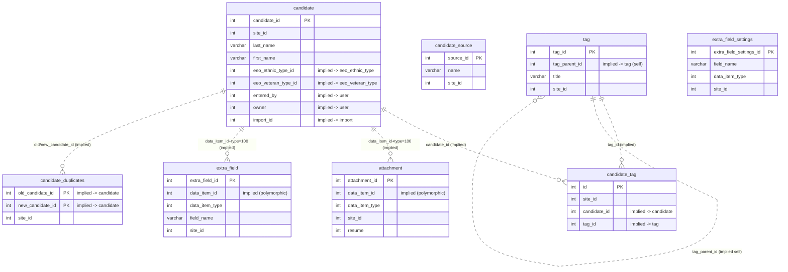
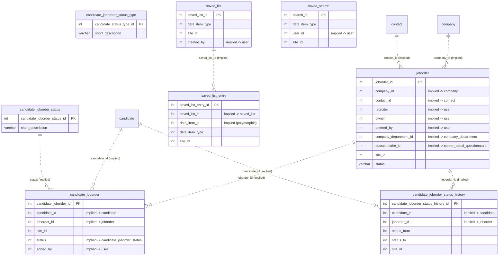
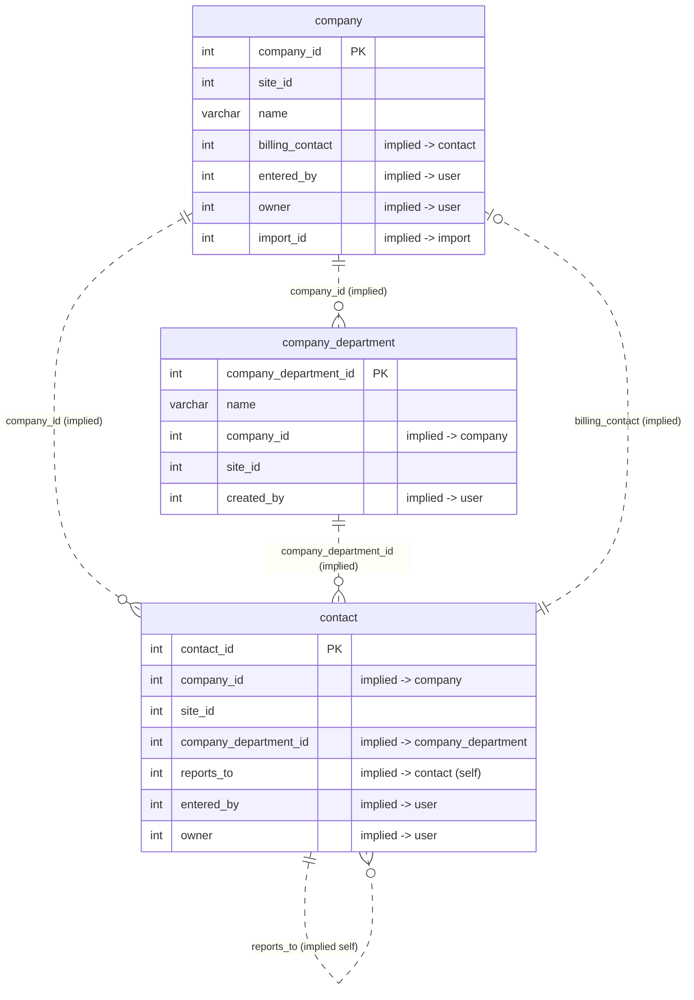
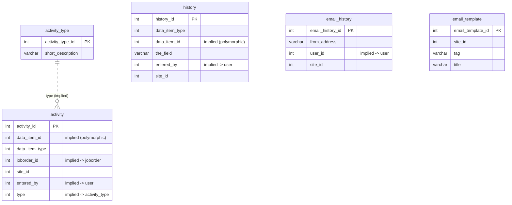
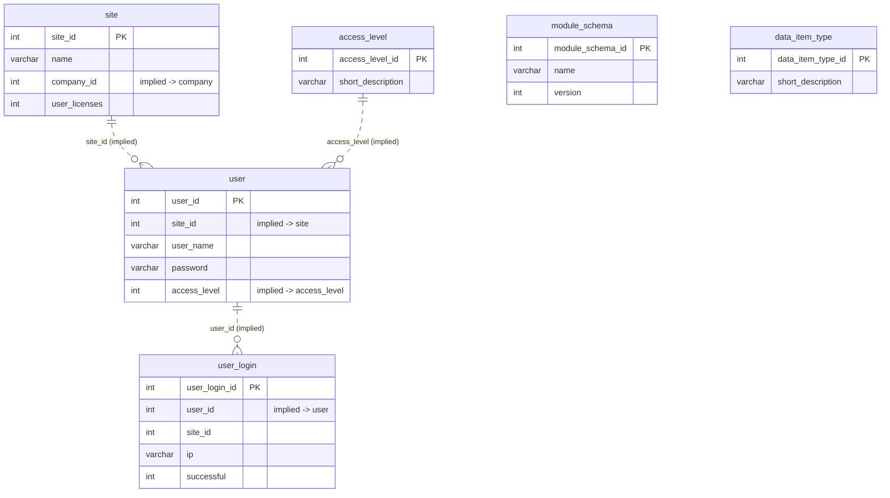
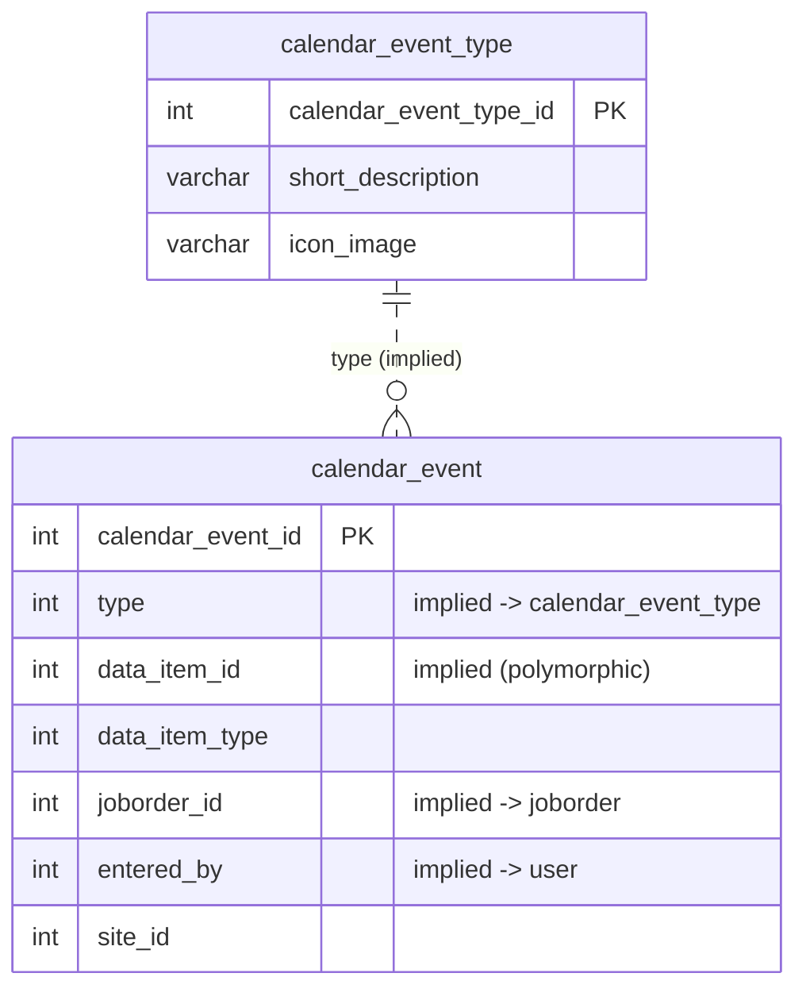
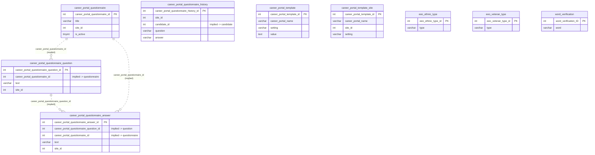

# 04 — Database Schema & ER Model

> Scope: This document describes **only** the schema defined in `db/cats_schema.sql` (the baseline install schema). Incremental migration files (`db/upgrade-*.sql`) exist in the same directory; their change history is deferred to **doc 19**. Every table is cited to its `CREATE TABLE` line in `db/cats_schema.sql`.

## Overview

### File facts

- Source file: `db/cats_schema.sql`, 1170 lines (header comment names the origin DB `cats_dev`, dumped via SQLyog against MySQL 5.1.31).
- **Exactly 55 `CREATE TABLE` statements** (verified by count of `CREATE TABLE` occurrences).
- **Engine / charset:** every table is declared `ENGINE=InnoDB`. Most tables use `DEFAULT CHARSET=utf8 COLLATE=utf8_unicode_ci`; a subset of the newer / career-portal tables declare only `DEFAULT CHARSET=utf8` (no explicit collation): `career_portal_questionnaire` (db/cats_schema.sql:339), `career_portal_questionnaire_answer` (db/cats_schema.sql:352), `career_portal_questionnaire_history` (db/cats_schema.sql:372), `career_portal_questionnaire_question` (db/cats_schema.sql:388), `career_portal_template` (db/cats_schema.sql:405), `career_portal_template_site` (db/cats_schema.sql:440), `eeo_ethnic_type` (db/cats_schema.sql:565), `eeo_veteran_type` (db/cats_schema.sql:581), `extension_statistics` (db/cats_schema.sql:638), `extra_field` (db/cats_schema.sql:651), `http_log` (db/cats_schema.sql:727), `http_log_types` (db/cats_schema.sql:746), `queue` (db/cats_schema.sql:884), `sph_counter` (db/cats_schema.sql:1014), `xml_feed_submits` (db/cats_schema.sql:1130), `xml_feeds` (db/cats_schema.sql:1142). The connection charset is forced via `/*!40101 SET NAMES utf8 */;` (db/cats_schema.sql:8).
- **No explicit `FOREIGN KEY` / `REFERENCES` constraints exist anywhere in the file** (verified by grep — zero matches). Likewise there are **no `CONSTRAINT` clauses**. All inter-table relationships are therefore **implied** by `*_id` columns plus secondary `KEY` indexes; they are not enforced at the database level. Throughout this document such relationships are labelled **(implied)**.

### The 55 tables grouped by domain

| Domain | Tables |
|---|---|
| Candidates & resumes | `candidate`, `candidate_source`, `candidate_tag`, `tag`, `attachment`, `extra_field`, `extra_field_settings`, `candidate_duplicates` |
| Job orders & pipeline | `joborder`, `candidate_joborder`, `candidate_joborder_status`, `candidate_joborder_status_history`, `candidate_jobordrer_status_type` (sic), `saved_list`, `saved_list_entry`, `saved_search` |
| Companies & contacts | `company`, `company_department`, `contact` |
| Activity & history | `activity`, `activity_type`, `history`, `email_history`, `email_template` |
| Users, sites & ACL | `site`, `user`, `user_login`, `access_level`, `module_schema`, `data_item_type` |
| Calendar | `calendar_event`, `calendar_event_type` |
| Career portal | `career_portal_questionnaire`, `career_portal_questionnaire_answer`, `career_portal_questionnaire_history`, `career_portal_questionnaire_question`, `career_portal_template`, `career_portal_template_site`, `eeo_ethnic_type`, `eeo_veteran_type`, `word_verification` |
| System / infra | `queue`, `settings`, `system`, `import`, `http_log`, `http_log_types`, `extension_statistics`, `sph_counter`, `installtest`, `zipcodes`, `feedback`, `xml_feeds`, `xml_feed_submits`, `mru` |

That is 8 + 8 + 3 + 5 + 6 + 2 + 9 + 14 = **55 tables**.

### Multi-tenancy via `site_id`

OpenCATS is multi-tenant: a single database holds many "sites" (tenants), keyed by `site.site_id` (db/cats_schema.sql:977). The seed data ships two sites: `site_id=1` (`example.com`) and `site_id=180` (`CATS_ADMIN`) (db/cats_schema.sql:1009-1010).

**Tables that carry a `site_id` column (verified by scanning every CREATE TABLE — 39 of 55):**

`activity`, `attachment`, `calendar_event`, `candidate`, `candidate_duplicates`, `candidate_joborder`, `candidate_joborder_status_history`, `candidate_source`, `candidate_tag`, `career_portal_questionnaire`, `career_portal_questionnaire_answer`, `career_portal_questionnaire_history`, `career_portal_questionnaire_question`, `career_portal_template_site`, `company`, `company_department`, `contact`, `email_history`, `email_template`, `extra_field`, `extra_field_settings`, `feedback`, `history`, `http_log`, `import`, `joborder`, `mru`, `queue`, `saved_list`, `saved_list_entry`, `saved_search`, `settings`, `tag`, `user`, `user_login`, plus `site.site_id` itself (the PK).

**Tables WITHOUT `site_id` (16):** `access_level`, `activity_type`, `calendar_event_type`, `candidate_joborder_status`, `candidate_jobordrer_status_type`, `career_portal_template`, `data_item_type`, `eeo_ethnic_type`, `eeo_veteran_type`, `extension_statistics`, `http_log_types`, `installtest`, `module_schema`, `sph_counter`, `system`, `word_verification`, `xml_feeds`, `xml_feed_submits`, `zipcodes`.

> Note: the "without `site_id`" list above is the set of global / lookup / system tables — ACL levels, enumerations (activity types, status types, EEO types, calendar event types, data item types), the global `career_portal_template` library (its per-tenant overrides live in `career_portal_template_site`), schema/version bookkeeping, the Sphinx counter, and reference data (`zipcodes`, `xml_feeds`). These are shared across all tenants.

### The polymorphic `data_item_type` convention

Several tables (`activity`, `attachment`, `calendar_event`, `history`, `saved_list`, `saved_list_entry`, `extra_field`, `extra_field_settings`, `mru`) reference a target row polymorphically via a pair of columns: `data_item_id` + `data_item_type`. The `data_item_type` enumeration is seeded in `data_item_type` (db/cats_schema.sql:549): `100=Candidate`, `200=Company`, `300=Contact`, `400=Job Order`. There is no DB-level constraint tying `data_item_id` to any concrete table — the linkage is **implied** and resolved in application code.

---

## ER diagrams (by domain)

Relationships below use the `*_id` linkage actually present in the schema. All are **implied** (no DB FK constraints). Diagrams omit non-key columns for readability.

### Candidates & resumes

> `candidate.source` is a free-text `varchar(128)` (db/cats_schema.sql:175); the `candidate_source` table is a separate site-scoped lookup of source names — there is no `source_id` FK column on `candidate`, so the two are only loosely related.

### Job orders & pipeline

> Note the misspelled table name **`candidate_jobordrer_status_type`** (db/cats_schema.sql:304) — "jobordrer" with a transposed `r`. Its PK column is `candidate_status_type_id`. It ships with no seed rows. The *active* pipeline-status lookup used by the seed data is `candidate_joborder_status` (correctly spelled, db/cats_schema.sql:257), which has 11 seeded statuses (0 No Status … 800 Placed).

### Companies & contacts

### Activity & history

### Users, sites & ACL

### Calendar

### Career portal

> `eeo_ethnic_type` / `eeo_veteran_type` are EEO lookups referenced by `candidate.eeo_ethnic_type_id` / `candidate.eeo_veteran_type_id` (db/cats_schema.sql:190-191, both **implied**). `word_verification` holds CAPTCHA words for the public portal forms.

### System / infra

```mermaid
erDiagram
    queue {
        int queue_id PK
        int site_id
        varchar task
        text args
        tinyint priority
    }
    settings {
        int settings_id PK
        varchar setting
        varchar value
        int site_id
        int settings_type
    }
    system {
        int system_id PK
        int uid
        int available_version
    }
    import {
        int import_id PK
        varchar module_name
        int site_id
        int reverted
    }
    http_log {
        int log_id PK
        int site_id
        char remote_addr
        int log_type "implied -> http_log_types"
    }
    http_log_types {
        int log_type_id PK
        varchar name
    }
    extension_statistics {
        int extension_statistics_id PK
        varchar extension
        varchar action
    }
    sph_counter {
        int counter_id PK
        int max_doc_id
    }
    mru {
        int mru_id PK
        int user_id "implied -> user"
        int site_id
        int data_item_type
    }
    feedback {
        int feedback_id PK
        int user_id "implied -> user"
        int site_id
    }
    xml_feeds {
        int xml_feed_id PK
        varchar name
        varchar post_url
    }
    xml_feed_submits {
        int feed_id PK
        varchar feed_site
        date date_last_post
    }
    zipcodes {
        mediumint zipcode PK
        tinytext city
        varchar state
    }
    installtest {
        int id PK
    }
    http_log_types ||..o{ http_log : "log_type (implied)"
```

---

## Data dictionary

Columns are pasted verbatim from the `CREATE TABLE` statements (column name + SQL type; `NOT NULL`/`DEFAULT`/`COLLATE` clauses summarised where space-constrained). "implied FK" means an `*_id` column with no DB constraint.

### `candidate` (db/cats_schema.sql:161)

Core entity: a person being tracked. PK `candidate_id`.

| Column | Type | Notes |
|---|---|---|
| `candidate_id` | `int(11)` | PK, AUTO_INCREMENT |
| `site_id` | `int(11)` | tenant scope |
| `last_name` | `varchar(64)` | indexed |
| `first_name` | `varchar(64)` | indexed |
| `middle_name` | `varchar(32)` | |
| `phone_home` / `phone_cell` / `phone_work` | `varchar(40)` | each indexed |
| `address` / `address2` | `text` | |
| `city` | `varchar(64)` | |
| `state` | `varchar(64)` | |
| `zip` | `varchar(16)` | |
| `source` | `varchar(128)` | free text |
| `date_available` | `datetime` | |
| `can_relocate` | `int(1)` | |
| `notes` | `text` | |
| `key_skills` | `text` | indexed (prefix 255) |
| `current_employer` | `varchar(128)` | |
| `entered_by` | `int(11)` | implied FK → `user`; COMMENT 'Created-by user.' |
| `owner` | `int(11)` | implied FK → `user` |
| `date_created` / `date_modified` | `datetime` | |
| `email1` / `email2` | `varchar(128)` | |
| `web_site` | `varchar(128)` | |
| `import_id` | `int(11)` | implied FK → `import` |
| `is_hot` | `int(1)` | |
| `eeo_ethnic_type_id` | `int(11)` | implied FK → `eeo_ethnic_type` |
| `eeo_veteran_type_id` | `int(11)` | implied FK → `eeo_veteran_type` |
| `eeo_disability_status` | `varchar(5)` | |
| `eeo_gender` | `varchar(5)` | |
| `desired_pay` / `current_pay` | `varchar(64)` | |
| `is_active` | `int(1)` | default 1 |
| `is_admin_hidden` | `int(1)` | |
| `best_time_to_call` | `varchar(255)` | |

### `joborder` (db/cats_schema.sql:784)

Core entity: an open position. PK `joborder_id`.

| Column | Type | Notes |
|---|---|---|
| `joborder_id` | `int(11)` | PK, AUTO_INCREMENT |
| `recruiter` | `int(11)` | implied FK → `user` |
| `contact_id` | `int(11)` | implied FK → `contact` |
| `company_id` | `int(11)` | implied FK → `company` |
| `entered_by` | `int(11)` | implied FK → `user` |
| `owner` | `int(11)` | implied FK → `user` |
| `site_id` | `int(11)` | tenant scope |
| `client_job_id` | `varchar(32)` | |
| `title` | `varchar(64)` | indexed |
| `description` | `text` | |
| `notes` | `text` | |
| `type` | `varchar(64)` | default 'C' |
| `duration` | `varchar(64)` | |
| `rate_max` | `varchar(255)` | |
| `salary` | `varchar(64)` | |
| `status` | `varchar(64)` | default 'Active' |
| `is_hot` | `int(1)` | |
| `openings` | `int(11)` | |
| `city` | `varchar(64)` | |
| `state` | `varchar(64)` | |
| `start_date` | `datetime` | |
| `date_created` / `date_modified` | `datetime` | |
| `public` | `int(1)` | |
| `company_department_id` | `int(11)` | implied FK → `company_department` |
| `is_admin_hidden` | `int(1)` | |
| `openings_available` | `int(11)` | |
| `questionnaire_id` | `int(11)` | implied FK → `career_portal_questionnaire` |
| `import_id` | `int(11)` | implied FK → `import` |

### `candidate_joborder` (db/cats_schema.sql:231)

Pipeline join: a candidate attached to a job order. PK `candidate_joborder_id`.

| Column | Type | Notes |
|---|---|---|
| `candidate_joborder_id` | `int(11)` | PK, AUTO_INCREMENT |
| `candidate_id` | `int(11)` | implied FK → `candidate` |
| `joborder_id` | `int(11)` | implied FK → `joborder` |
| `site_id` | `int(11)` | tenant scope |
| `status` | `int(11)` | implied FK → `candidate_joborder_status` |
| `date_submitted` | `datetime` | |
| `date_created` / `date_modified` | `datetime` | |
| `rating_value` | `int(5)` | |
| `added_by` | `int(11)` | implied FK → `user` |

### `candidate_joborder_status_history` (db/cats_schema.sql:283)

Audit trail of pipeline status transitions. PK `candidate_joborder_status_history_id`.

| Column | Type | Notes |
|---|---|---|
| `candidate_joborder_status_history_id` | `int(11)` | PK, AUTO_INCREMENT |
| `candidate_id` | `int(11)` | implied FK → `candidate` |
| `joborder_id` | `int(11)` | implied FK → `joborder` |
| `date` | `datetime` | |
| `status_from` | `int(11)` | status code |
| `status_to` | `int(11)` | status code |
| `site_id` | `int(11)` | tenant scope |

### `company` (db/cats_schema.sql:453)

Core entity: a client/employer. PK `company_id`. (Seed row `company_id=1` = "Internal Postings".)

| Column | Type | Notes |
|---|---|---|
| `company_id` | `int(11)` | PK, AUTO_INCREMENT |
| `site_id` | `int(11)` | tenant scope |
| `billing_contact` | `int(11)` | implied FK → `contact` |
| `name` | `varchar(64)` | indexed |
| `address` / `address2` | `text` | |
| `city` | `varchar(64)` | |
| `state` | `varchar(64)` | |
| `zip` | `varchar(16)` | |
| `phone1` / `phone2` | `varchar(40)` | |
| `url` | `varchar(128)` | |
| `key_technologies` | `text` | indexed (prefix 255) |
| `notes` | `text` | |
| `entered_by` | `int(11)` | implied FK → `user` |
| `owner` | `int(11)` | implied FK → `user` |
| `date_created` / `date_modified` | `datetime` | |
| `is_hot` | `int(1)` | |
| `fax_number` | `varchar(40)` | |
| `import_id` | `int(11)` | implied FK → `import` |
| `default_company` | `int(1)` | |

### `contact` (db/cats_schema.sql:507)

Core entity: a person at a company. PK `contact_id`.

| Column | Type | Notes |
|---|---|---|
| `contact_id` | `int(11)` | PK, AUTO_INCREMENT |
| `company_id` | `int(11)` | implied FK → `company` |
| `site_id` | `int(11)` | tenant scope |
| `last_name` / `first_name` | `varchar(64)` | indexed |
| `title` | `varchar(128)` | |
| `email1` / `email2` | `varchar(128)` | |
| `phone_work` / `phone_cell` / `phone_other` | `varchar(40)` | |
| `address` / `address2` | `text` | |
| `city` | `varchar(64)` | |
| `state` | `varchar(64)` | |
| `zip` | `varchar(16)` | |
| `is_hot` | `int(1)` | |
| `notes` | `text` | |
| `entered_by` | `int(11)` | implied FK → `user` |
| `owner` | `int(11)` | implied FK → `user` |
| `date_created` / `date_modified` | `datetime` | |
| `left_company` | `int(1)` | |
| `import_id` | `int(11)` | implied FK → `import` |
| `company_department_id` | `int(11)` | implied FK → `company_department` |
| `reports_to` | `int(11)` | implied FK → `contact` (self); default -1 |

### `activity` (db/cats_schema.sql:35)

Logged interaction/note against a data item. PK `activity_id`.

| Column | Type | Notes |
|---|---|---|
| `activity_id` | `int(11)` | PK, AUTO_INCREMENT |
| `data_item_id` | `int(11)` | polymorphic target id (implied) |
| `data_item_type` | `int(11)` | polymorphic type → `data_item_type` |
| `joborder_id` | `int(11)` | implied FK → `joborder` (nullable) |
| `site_id` | `int(11)` | tenant scope |
| `entered_by` | `int(11)` | implied FK → `user` |
| `date_created` | `datetime` | |
| `type` | `int(11)` | implied FK → `activity_type` |
| `notes` | `text` | |
| `date_modified` | `datetime` | |

### `attachment` (db/cats_schema.sql:84)

File attachment (incl. resumes). PK `attachment_id`.

| Column | Type | Notes |
|---|---|---|
| `attachment_id` | `int(11)` | PK, AUTO_INCREMENT |
| `data_item_id` | `int(11)` | polymorphic target id (implied) |
| `data_item_type` | `int(11)` | polymorphic type |
| `site_id` | `int(11)` | tenant scope |
| `title` | `varchar(128)` | |
| `original_filename` | `varchar(255)` | |
| `stored_filename` | `varchar(255)` | |
| `content_type` | `varchar(255)` | |
| `resume` | `int(1)` | flag |
| `text` | `text` | extracted text |
| `date_created` / `date_modified` | `datetime` | |
| `profile_image` | `int(1)` | |
| `directory_name` | `varchar(64)` | |
| `md5_sum` | `varchar(40)` | indexed |
| `file_size_kb` | `int(11)` | |
| `md5_sum_text` | `varchar(40)` | |

### `user` (db/cats_schema.sql:1054)

Application user. PK `user_id`. Seed: `admin` (access_level 500), `cats@rootadmin` on site 180.

| Column | Type | Notes |
|---|---|---|
| `user_id` | `int(11)` | PK, AUTO_INCREMENT |
| `site_id` | `int(11)` | implied FK → `site` |
| `user_name` | `varchar(64)` | |
| `email` | `varchar(128)` | |
| `password` | `varchar(255)` | (seed uses `md5('cats')`) |
| `access_level` | `int(11)` | implied FK → `access_level`; default 100 |
| `can_change_password` | `int(1)` | |
| `is_test_user` | `int(1)` | |
| `last_name` / `first_name` | `varchar(40)` | |
| `is_demo` | `int(1)` | |
| `categories` | `varchar(192)` | |
| `session_cookie` | `varchar(256)` | |
| `pipeline_entries_per_page` | `int(8)` | default 15 |
| `column_preferences` | `longtext` | |
| `force_logout` | `int(1)` | |
| `title` | `varchar(64)` | |
| `phone_work` / `phone_cell` / `phone_other` | `varchar(64)` | |
| `address` | `text` | |
| `notes` | `text` | |
| `company` | `varchar(255)` | |
| `city` | `varchar(64)` | |
| `state` | `varchar(64)` | |
| `zip_code` | `varchar(16)` | |
| `country` | `varchar(128)` | |
| `can_see_eeo_info` | `int(1)` | |

### `site` (db/cats_schema.sql:977)

Tenant. PK `site_id`.

| Column | Type | Notes |
|---|---|---|
| `site_id` | `int(11)` | PK, AUTO_INCREMENT |
| `name` | `varchar(255)` | |
| `is_demo` | `int(1)` | |
| `user_licenses` | `int(11)` | |
| `entered_by` | `int(11)` | implied FK → `user` |
| `date_created` | `datetime` | |
| `unix_name` | `varchar(128)` | |
| `company_id` | `int(11)` | implied FK → `company` |
| `is_free` | `int(1)` | |
| `account_active` | `int(1)` | default 1 |
| `account_deleted` | `int(1)` | indexed |
| `reason_disabled` | `text` | |
| `time_zone` | `int(5)` | |
| `time_format_24` | `int(1)` | |
| `date_format_ddmmyy` | `int(1)` | |
| `default_phone_country_code` | `varchar(8)` | default '+1' |
| `is_hr_mode` | `int(1)` | |
| `file_size_kb` | `int(11)` | |
| `page_views` | `bigint(20)` | |
| `page_view_days` | `int(11)` | |
| `last_viewed_day` | `date` | |
| `first_time_setup` | `tinyint(4)` | |
| `localization_configured` | `int(1)` | |
| `agreed_to_license` | `int(1)` | |
| `limit_warning` | `tinyint(1)` | |

### `access_level` (db/cats_schema.sql:16)

ACL lookup. PK `access_level_id`. Seeded 0/100/200/300/400/500.

| Column | Type | Notes |
|---|---|---|
| `access_level_id` | `int(11)` | PK (no AUTO_INCREMENT, default 0) |
| `short_description` | `varchar(32)` | indexed |
| `long_description` | `text` | |

### `saved_list` (db/cats_schema.sql:903)

User-defined list (static or dynamic). PK `saved_list_id`.

| Column | Type | Notes |
|---|---|---|
| `saved_list_id` | `int(11)` | PK, AUTO_INCREMENT |
| `description` | `varchar(64)` | indexed |
| `data_item_type` | `int(11)` | |
| `site_id` | `int(11)` | tenant scope |
| `is_dynamic` | `int(1)` | |
| `datagrid_instance` | `varchar(64)` | |
| `parameters` | `text` | |
| `created_by` | `int(11)` | implied FK → `user` |
| `number_entries` | `int(11)` | |
| `date_created` / `date_modified` | `datetime` | |

### `saved_list_entry` (db/cats_schema.sql:925)

Membership row of a (static) saved list. PK `saved_list_entry_id`.

| Column | Type | Notes |
|---|---|---|
| `saved_list_entry_id` | `int(11)` | PK, AUTO_INCREMENT |
| `saved_list_id` | `int(11)` | implied FK → `saved_list` |
| `data_item_type` | `int(11)` | polymorphic type |
| `data_item_id` | `int(11)` | polymorphic target id (implied) |
| `site_id` | `int(11)` | tenant scope |
| `date_created` | `datetime` | |

### `settings` (db/cats_schema.sql:959)

Per-site key/value settings. PK `settings_id`. Seeded `fromAddress`, `configured` for sites 1 & 180.

| Column | Type | Notes |
|---|---|---|
| `settings_id` | `int(11)` | PK, AUTO_INCREMENT |
| `setting` | `varchar(255)` | key |
| `value` | `varchar(255)` | |
| `site_id` | `int(11)` | tenant scope |
| `settings_type` | `int(11)` | |

### `queue` (db/cats_schema.sql:884)

Background task queue. PK `queue_id`.

| Column | Type | Notes |
|---|---|---|
| `queue_id` | `int(11)` | PK, AUTO_INCREMENT |
| `site_id` | `int(11)` | tenant scope |
| `task` | `varchar(125)` | |
| `args` | `text` | |
| `priority` | `tinyint(2)` | default 5; COMMENT '1-5, 1 is highest priority' |
| `date_created` | `datetime` | |
| `date_timeout` | `datetime` | |
| `date_completed` | `datetime` | |
| `locked` | `tinyint(1) unsigned` | |
| `error` | `tinyint(1) unsigned` | |
| `response` | `varchar(255)` | |

### `extra_field` (db/cats_schema.sql:651)

Custom-field value attached to a data item. PK `extra_field_id`.

| Column | Type | Notes |
|---|---|---|
| `extra_field_id` | `int(11)` | PK, AUTO_INCREMENT |
| `data_item_id` | `int(11)` | polymorphic target id (implied) |
| `field_name` | `varchar(255)` | |
| `value` | `text` | |
| `import_id` | `int(11)` | implied FK → `import` |
| `site_id` | `int(11)` | tenant scope |
| `data_item_type` | `int(11)` | polymorphic type |

### `calendar_event` (db/cats_schema.sql:114)

Calendar entry. PK `calendar_event_id`.

| Column | Type | Notes |
|---|---|---|
| `calendar_event_id` | `int(11)` | PK, AUTO_INCREMENT |
| `type` | `int(11)` | implied FK → `calendar_event_type` |
| `date` | `datetime` | |
| `title` | `text` | |
| `all_day` | `int(1)` | |
| `data_item_id` | `int(11)` | polymorphic target id (implied); default -1 |
| `data_item_type` | `int(11)` | default -1 |
| `entered_by` | `int(11)` | implied FK → `user` |
| `date_created` / `date_modified` | `datetime` | |
| `site_id` | `int(11)` | tenant scope |
| `joborder_id` | `int(11)` | implied FK → `joborder` |
| `description` | `text` | |
| `duration` | `int(11)` | default 60 |
| `reminder_enabled` | `int(1)` | |
| `reminder_email` | `text` | |
| `reminder_time` | `int(11)` | |
| `public` | `int(1)` | default 1 |

---

## Remaining tables (one-line role + key columns)

- **`activity_type`** (db/cats_schema.sql:64) — lookup of activity types; PK `activity_type_id`, `short_description`. Seeded 100..800.
- **`calendar_event_type`** (db/cats_schema.sql:142) — lookup; PK `calendar_event_type_id`, `short_description`, `icon_image`. Seeded 100..600.
- **`candidate_duplicates`** (db/cats_schema.sql:218) — merge tracking; composite PK `(old_candidate_id, new_candidate_id)`, `site_id`. Both ids implied FK → `candidate`.
- **`candidate_joborder_status`** (db/cats_schema.sql:257) — pipeline-status lookup; PK `candidate_joborder_status_id`, `short_description`, `can_be_scheduled`, `triggers_email`, `is_enabled`. 11 seeded statuses.
- **`candidate_jobordrer_status_type`** (db/cats_schema.sql:304) — misspelled status-type lookup (sic); PK `candidate_status_type_id`, `short_description`, `can_be_scheduled`. No seed rows.
- **`candidate_source`** (db/cats_schema.sql:316) — site-scoped source names; PK `source_id`, `name`, `site_id`, `date_created`.
- **`candidate_tag`** (db/cats_schema.sql:329) — candidate↔tag join; PK `id`, `site_id`, `candidate_id` (implied FK → `candidate`), `tag_id` (implied FK → `tag`). All ids `int(10) unsigned`.
- **`tag`** (db/cats_schema.sql:1040) — tag definitions; PK `tag_id` (`int(10) unsigned`), `tag_parent_id` (implied self FK), `title`, `description`, `site_id`, `date_created timestamp DEFAULT CURRENT_TIMESTAMP`.
- **`career_portal_questionnaire`** (db/cats_schema.sql:339) — portal questionnaire; PK `career_portal_questionnaire_id`, `title`, `site_id`, `description`, `is_active tinyint(1)`.
- **`career_portal_questionnaire_question`** (db/cats_schema.sql:388) — questions; PK …`_question_id`, `career_portal_questionnaire_id` (implied FK), `text`, `minimum_length`, `maximum_length`, `required`, `position`, `site_id`, `type`.
- **`career_portal_questionnaire_answer`** (db/cats_schema.sql:352) — answer options + actions; PK …`_answer_id`, `career_portal_questionnaire_question_id` (implied FK), `career_portal_questionnaire_id` (implied FK), `text`, `action_*` columns, `position`, `site_id`.
- **`career_portal_questionnaire_history`** (db/cats_schema.sql:372) — captured Q&A per candidate; PK …`_history_id`, `site_id`, `candidate_id` (implied FK → `candidate`), `question`, `answer`, `questionnaire_title`, `questionnaire_description`, `date`.
- **`career_portal_template`** (db/cats_schema.sql:405) — global template library (no `site_id`); PK `career_portal_template_id`, `career_portal_name`, `setting`, `value`. 22 seeded rows ("Blank Page", "CATS 2.0").
- **`career_portal_template_site`** (db/cats_schema.sql:440) — per-site template overrides; PK `career_portal_template_id`, `career_portal_name`, `site_id`, `setting`, `value`.
- **`company_department`** (db/cats_schema.sql:493) — department within a company; PK `company_department_id`, `name`, `company_id` (implied FK → `company`), `site_id`, `date_created`, `created_by` (implied FK → `user`).
- **`data_item_type`** (db/cats_schema.sql:549) — polymorphic-type lookup; PK `data_item_type_id`, `short_description`. Seeded 100 Candidate / 200 Company / 300 Contact / 400 Job Order.
- **`eeo_ethnic_type`** (db/cats_schema.sql:565) — EEO ethnicity lookup; PK `eeo_ethnic_type_id`, `type`. 5 seeded rows.
- **`eeo_veteran_type`** (db/cats_schema.sql:581) — EEO veteran-status lookup; PK `eeo_veteran_type_id`, `type`. 4 seeded rows.
- **`email_history`** (db/cats_schema.sql:596) — sent-email log; PK `email_history_id`, `from_address`, `recipients`, `text`, `user_id` (implied FK → `user`), `site_id`, `date`.
- **`email_template`** (db/cats_schema.sql:614) — notification templates; PK `email_template_id`, `text`, `allow_substitution`, `site_id`, `tag`, `title`, `possible_variables`, `disabled`. 7 seeded templates.
- **`extension_statistics`** (db/cats_schema.sql:638) — browser-extension usage stats; PK `extension_statistics_id`, `extension`, `action`, `user`, `date`. No `site_id`.
- **`extra_field_settings`** (db/cats_schema.sql:668) — custom-field definitions; PK `extra_field_settings_id`, `field_name`, `import_id`, `site_id`, `date_created`, `data_item_type`, `extra_field_type`, `extra_field_options`, `position`. 4 seeded rows.
- **`feedback`** (db/cats_schema.sql:690) — in-app feedback; PK `feedback_id`, `user_id` (implied FK → `user`), `site_id`, `date_created`, `subject`, `reply_to_address`, `reply_to_name`, `feedback`, `archived`.
- **`history`** (db/cats_schema.sql:707) — field-level change audit; PK `history_id`, `data_item_type`, `data_item_id` (polymorphic, implied), `the_field`, `previous_value`, `new_value`, `description`, `set_date`, `entered_by` (implied FK → `user`), `site_id`.
- **`http_log`** (db/cats_schema.sql:727) — HTTP request log; PK `log_id`, `site_id`, `remote_addr char(16)`, `http_user_agent`, `script_filename`, `request_method`, `query_string`, `request_uri`, `script_name`, `log_type` (implied FK → `http_log_types`), `date`.
- **`http_log_types`** (db/cats_schema.sql:746) — log-type lookup; PK `log_type_id`, `name`, `description`, `default_log_type tinyint(1) unsigned zerofill`. Seeded 1=XML. No `site_id`.
- **`import`** (db/cats_schema.sql:760) — import batch record; PK `import_id`, `module_name`, `reverted`, `site_id`, `import_errors`, `added_lines`, `date_created`. Referenced by `*.import_id` columns on candidate/company/contact/joborder/extra_field (all implied).
- **`installtest`** (db/cats_schema.sql:775) — install probe table; single column PK `id int(11)`. No `site_id`.
- **`module_schema`** (db/cats_schema.sql:833) — per-module schema version bookkeeping; PK `module_schema_id`, `name`, `version`. 23 seeded module rows.
- **`mru`** (db/cats_schema.sql:868) — most-recently-used items per user; PK `mru_id`, `user_id` (implied FK → `user`), `site_id`, `data_item_type`, `data_item_text`, `url`, `date_created`.
- **`saved_search`** (db/cats_schema.sql:943) — saved search definitions; PK `search_id`, `data_item_text`, `url`, `is_custom`, `data_item_type`, `user_id` (implied FK → `user`), `site_id`, `date_created`.
- **`sph_counter`** (db/cats_schema.sql:1014) — Sphinx full-text index counter; PK `counter_id`, `max_doc_id`. No `site_id`.
- **`system`** (db/cats_schema.sql:1024) — single-row system/version state; PK `system_id int(20)`, `uid`, `available_version`, `date_version_checked`, `available_version_description`, `disable_version_check`. 1 seeded row.
- **`user_login`** (db/cats_schema.sql:1097) — login audit; PK `user_login_id`, `user_id` (implied FK → `user`), `site_id`, `ip`, `user_agent`, `date`, `successful`, `host`, `date_refreshed`.
- **`word_verification`** (db/cats_schema.sql:1120) — CAPTCHA word list; PK `word_verification_ID` (note capitalised `ID`), `word`. No `site_id`.
- **`xml_feeds`** (db/cats_schema.sql:1142) — job-board feed definitions; PK `xml_feed_id`, `name`, `description`, `website`, `post_url`, `success_string`, `xml_template_name`. Seeded Indeed & SimplyHired. No `site_id`.
- **`xml_feed_submits`** (db/cats_schema.sql:1130) — feed submission log; PK `feed_id`, `feed_site`, `feed_url`, `date_last_post`. No `site_id`.
- **`zipcodes`** (db/cats_schema.sql:1160) — US zip→city/state/areacode reference; PK `zipcode mediumint(9)`, `city tinytext`, `state varchar(2)`, `areacode smallint(6)`. No `site_id`.

---

## How `site_id` scopes data

The `site_id` column is the tenant discriminator. Application queries filter on it so each site sees only its own rows. There is no DB-level constraint or FK to `site`; isolation is enforced in code. Examples:

1. **`candidate.site_id`** (db/cats_schema.sql:163) — candidates belong to one site; the composite index `IDX_site_first_last_modified (site_id, first_name, last_name, date_modified)` (db/cats_schema.sql:210) shows that name searches are always rooted at `site_id`.
2. **`joborder.site_id`** (db/cats_schema.sql:791) — job orders are site-scoped; the index `IDX_site_id_status (site_id, status(8))` (db/cats_schema.sql:826) confirms status filtering is per-site.
3. **`activity.site_id`** (db/cats_schema.sql:40) — activity feeds are per-tenant; multiple composite indexes lead with `site_id`, e.g. `IDX_data_item_id_type_site (site_id, data_item_id, data_item_type)` (db/cats_schema.sql:55) and `IDX_activity_site_type_created_job` (db/cats_schema.sql:57).

Lookup/enumeration tables (e.g. `access_level`, `data_item_type`, `candidate_joborder_status`, EEO types, `calendar_event_type`) deliberately have **no** `site_id` — they are shared globally.

---

## Note on migrations

`db/cats_schema.sql` is the baseline. Incremental upgrade scripts also exist in `db/` (do not apply them as part of reading this doc — their detailed history is **doc 19**):

- `db/upgrade-0.5.0-0.5.1.sql`
- `db/upgrade-0.5.1-0.5.2.sql`
- `db/upgrade-0.5.2-0.5.5.sql`
- `db/upgrade-0.5.5-0.6.x.sql`
- `db/upgrade-0.6.x-0.7.0.sql`
- `db/upgrade-0.9.4-0.9.5.sql`
- `db/upgrade-zipcodes.sql`

---

## Source evidence (line ranges read)

- `db/cats_schema.sql` lines 1–1170 read in full (paginated 1–626 then 627–1170).
- `CREATE TABLE` count = 55, confirmed via `grep -c "CREATE TABLE"`. All 55 line numbers enumerated via `grep -n`.
- `ENGINE`/`CHARSET` lines confirmed via grep (all `ENGINE=InnoDB`).
- Absence of `FOREIGN KEY`/`REFERENCES`/`CONSTRAINT` confirmed via grep (zero matches).
- `site_id` presence per table verified by an awk scan of each `CREATE TABLE` block (39 tables carry `site_id`, 16 do not).
- `db/upgrade-*.sql` filenames listed via `ls`.

## Unverified / open questions

- **Implied vs. enforced FKs:** every relationship in this document is **implied** from `*_id` columns and secondary indexes. The exact target table for some generic columns (e.g. `mru.data_item_type`, `saved_search.data_item_type`) is resolved in application code, not verified here.
- **`candidate.source` vs `candidate_source`:** `candidate.source` is free-text `varchar(128)`; the relationship to the `candidate_source` lookup table is not expressed by any FK column on `candidate`. How (or whether) they are kept in sync is application-level and unverified.
- **`candidate_jobordrer_status_type` (sic):** ships empty and is misspelled; whether any code still references it (vs. `candidate_joborder_status`) is not determined from the schema alone.
- **`career_portal_template` vs `career_portal_template_site`:** both share the column name `career_portal_template_id` as an AUTO_INCREMENT PK; the relationship between the global library and per-site overrides (by `career_portal_name`/`setting`) is inferred, not constrained.
- **Charset inconsistency:** the mix of `utf8_unicode_ci` (most tables) vs. charset-only `utf8` (career-portal, EEO, queue, http_log, xml_feed, sph_counter, etc.) is reported as-is; the functional impact (collation mismatches on joins) is not assessed here.
- **AUTO_INCREMENT seed offsets** (e.g. `site` starts at 181, `user` at 1251, `email_template` at 8) are reproduced from the dump but their significance is not analysed.
</content>
</invoke>
