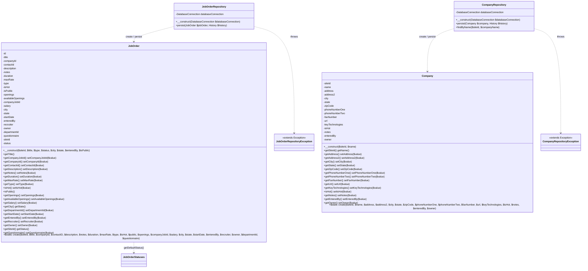
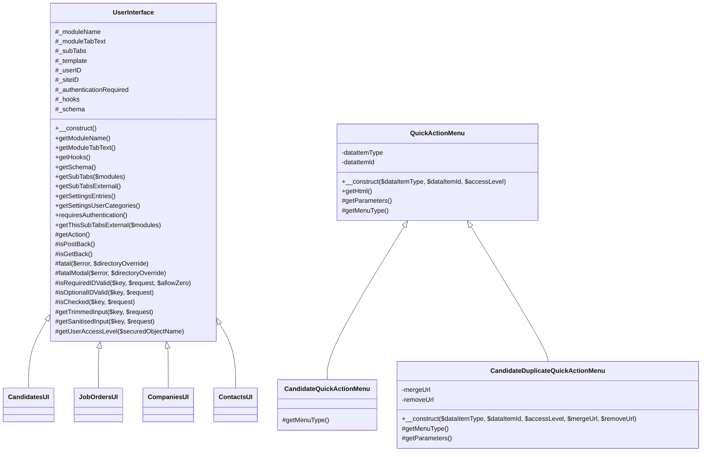

# 06 — Component & Class Diagrams

This document diagrams the **real** classes in this repository. Every member shown is copied
from source and cited to a `file:line` that was opened while writing this doc. No generic
patterns are described beyond what the code literally does.

---

## The two layers

OpenCATS contains two coexisting persistence styles.

### Layer 1 — Legacy `lib/` "manager" classes

These are the workhorses. Each domain manager is constructed with a `$siteID`, grabs the
shared `DatabaseConnection` singleton into a `$_db` member, and exposes CRUD-ish methods that
build SQL strings inline and run them through `$_db`.

Concrete evidence — every manager has the same constructor shape:

```php
public function __construct($siteID)
{
    $this->_siteID = $siteID;
    $this->_db = DatabaseConnection::getInstance();
    // some also build an ExtraFields helper, e.g. Candidates
    $this->extraFields = new ExtraFields($siteID, DATA_ITEM_CANDIDATE);
}
```

- `Candidates::__construct($siteID)` (lib/Candidates.php:54), members `private $_db; private $_siteID; public $extraFields;` (lib/Candidates.php:48-51).
- `JobOrders::__construct($siteID)` (lib/JobOrders.php:64), members `public $_db; public $_siteID; public $extraFields;` (lib/JobOrders.php:58-61) — note JobOrders exposes them as `public`, the others as `private`.
- `Companies::__construct($siteID)` (lib/Companies.php:59), `private $_db; private $_siteID;` (lib/Companies.php:53-54).
- `Contacts::__construct($siteID)` (lib/Contacts.php:51), `private $_db; private $_siteID;` (lib/Contacts.php:45-46).
- `Pipelines::__construct($siteID)` (lib/Pipelines.php:47), `private $_db; private $_siteID;` (lib/Pipelines.php:43-44) — no `extraFields`.
- `ActivityEntries::__construct($siteID)` (lib/ActivityEntries.php:69), `private $_db; private $_siteID;` (lib/ActivityEntries.php:65-66) — no `extraFields`.

The SQL is built inside the methods, e.g. `Candidates::add()` opens with `$sql = sprintf("INSERT INTO candidate (...`
(lib/Candidates.php:102-103).

### Layer 2 — Modern `src/OpenCATS/Entity` repository pattern

A newer, partial refactor splits responsibilities into three pieces per aggregate:

1. **Entity value object** — plain fields + getters/setters + a static `create(...)` factory.
   Example: `JobOrder` (src/OpenCATS/Entity/JobOrder.php:6) and `Company` (src/OpenCATS/Entity/Company.php:4).
2. **Repository** — constructed with a typed `\DatabaseConnection`, has a `persist(...)` method
   that writes the entity and records History.
   Example: `JobOrderRepository` (src/OpenCATS/Entity/JobOrderRepository.php:10) and
   `CompanyRepository` (src/OpenCATS/Entity/CompanyRepository.php:7).
3. **Typed exception** — thrown by the repository on a failed write.
   `JobOrderRepositoryException extends Exception` (src/OpenCATS/Entity/JobOrderRepositoryException.php:3) and
   `CompanyRepositoryException extends \Exception` (src/OpenCATS/Entity/CompanyRepositoryException.php:4).

The two layers are bridged: the legacy `Companies::add()` already delegates to
`Company::create(...)` (lib/Companies.php:90), and `JobOrder::create()` calls into the legacy
`\JobOrderStatuses::getDefaultStatus()` (src/OpenCATS/Entity/JobOrder.php:291). The repository
also reaches back into legacy code, `include_once(LEGACY_ROOT . '/lib/History.php')`
(src/OpenCATS/Entity/JobOrderRepository.php:6) and calls `$history->storeHistoryNew(...)`
(src/OpenCATS/Entity/JobOrderRepository.php:114). The source even flags the duplication:
`// FIXME: It's way too similar to CompanyRepository` (src/OpenCATS/Entity/JobOrderRepository.php:8).

A key contrast in safety: the legacy managers build SQL with `sprintf` directly, whereas the
repositories funnel every value through `$databaseConnection->makeQueryString(...)` /
`makeQueryInteger(...)` / `makeQueryStringOrNULL(...)`
(src/OpenCATS/Entity/JobOrderRepository.php:79-103).

---

## classDiagram: `lib/` domain managers

Split into two diagrams for readability. Only the top-level manager classes are shown
(each file also contains a `*DataGrid` and helper classes, omitted here).

### Candidates, JobOrders, ActivityEntries

```mermaid
classDiagram
    class Candidates {
        -DatabaseConnection _db
        -_siteID
        +ExtraFields extraFields
        +__construct($siteID)
        +add($firstName, $middleName, $lastName, $email1, $email2, $phoneHome, $phoneCell, $phoneWork, $address, $address2, $city, $state, $zip, $source, $keySkills, $dateAvailable, $currentEmployer, $canRelocate, $currentPay, $desiredPay, $notes, $webSite, $bestTimeToCall, $enteredBy, $owner, $gender, $race, $veteran, $disability, $skipHistory)
        +update($candidateID, $isActive, $firstName, $middleName, $lastName, $email1, $email2, $phoneHome, $phoneCell, $phoneWork, $address, $address2, $city, $state, $zip, $source, $keySkills, $dateAvailable, $currentEmployer, $canRelocate, $currentPay, $desiredPay, $notes, $webSite, $bestTimeToCall, $owner, $isHot, $email, $emailAddress, $gender, $race, $veteran, $disability)
        +delete($candidateID)
        +get($candidateID)
        +getWithDuplicity($candidateID)
        +getForEditing($candidateID)
        +getExport($IDs)
        +getIDByEmail($email)
        +getIDByPhone($phone)
        +getCount($allowAdministrativeHidden)
        +getAll($allowAdministrativeHidden)
        +getResumes($candidateID)
        +getResume($attachmentID)
        +getJobOrdersArray($candidateID)
        +updateModified($candidateID)
        +getUpcomingEvents($candidateID)
        +getPossibleSources()
        +updatePossibleSources($updates)
        +administrativeHideShow($candidateID, $state)
        +checkDuplicity($firstName, $middleName, $lastName, $email1, $email2, $phoneHome, $phoneCell, $phoneWork, $address, $city)
        +getDuplicatesCount()
        +removeDuplicity($oldCandidateID, $newCandidateID)
        +addDuplicates($candidateID, $duplicates)
        +mergeDuplicates($params, $rs)
        +checkIfLinked($oldCandidateID, $newCandidateID)
        +getListsForCandidate($candidateID)
    }

    class JobOrders {
        +DatabaseConnection _db
        +_siteID
        +ExtraFields extraFields
        +__construct($siteID)
        +add($title, $companyId, $contactId, $description, $notes, $duration, $maxRate, $type, $isHot, $public, $openings, $companyJobId, $salary, $city, $state, $startDate, $enteredBy, $recruiter, $owner, $department, $questionnaire)
        +update($jobOrderID, $title, $companyJobID, $companyID, $contactID, $description, $notes, $duration, $maxRate, $type, $isHot, $openings, $openingsAvailable, $salary, $city, $state, $startDate, $status, $recruiter, $owner, $public, $email, $emailAddress, $department, $questionnaire)
        +delete($jobOrderID)
        +getCount()
        +get($jobOrderID)
        +getForEditing($jobOrderID)
        +getAll($status, $userID, $companyID, $contactID, $onlyHot, $onlyPublic, $allowAdministrativeHidden)
        +updateModified($jobOrderID)
        +updateOpeningsAvailable($jobOrderID, $count)
        +administrativeHideShow($jobOrderID, $state)
        +checkOpenings($regardingID)
    }

    class ActivityEntries {
        -DatabaseConnection _db
        -_siteID
        +__construct($siteID)
        +add($dataItemID, $dataItemType, $activityType, $activityNotes, $enteredBy, $jobOrderID, $dateCreated)
        +update($activityID, $activityType, $activityNotes, $jobOrderID, $date, $timezoneOffset)
        +delete($activityID)
        +getCount()
        +get($activityID)
        +getAllByDataItem($dataItemID, $dataItemType)
        +getAllByCompany($companyID)
        +getTypes()
    }
```



### Companies, Contacts, Pipelines

```mermaid
classDiagram
    class Companies {
        -DatabaseConnection _db
        -_siteID
        +ExtraFields extraFields
        +__construct($siteID)
        +add($name, $address, $address2, $city, $state, $zip, $phone1, $phone2, $faxNumber, $url, $keyTechnologies, $isHot, $notes, $enteredBy, $owner)
        +update($companyID, $name, $address, $address2, $city, $state, $zip, $phone1, $phone2, $faxNumber, $url, $keyTechnologies, $isHot, $notes, $owner, $billingContact, $email, $emailAddress)
        +delete($companyID)
        +get($companyID)
        +getForEditing($companyID)
        +setCompanyDefault($companyID)
        +getDefaultCompany()
        +getSelectList()
        +getLocationArray($companyID)
        +getContactsArray($companyID)
        +getJobOrdersArray($companyID)
        +getDepartments($companyID)
        +updateDepartments($companyID, $updates)
        +companyByName($name)
    }

    class Contacts {
        -DatabaseConnection _db
        -_siteID
        +ExtraFields extraFields
        +__construct($siteID)
        +add($companyID, $firstName, $lastName, $title, $department, $reportsTo, $email1, $email2, $phoneWork, $phoneCell, $phoneOther, $address, $address2, $city, $state, $zip, $isHot, $notes, $enteredBy, $owner)
        +update($contactID, $companyID, $firstName, $lastName, $title, $department, $reportsTo, $email1, $email2, $phoneWork, $phoneCell, $phoneOther, $address, $address2, $city, $state, $zip, $isHot, $leftCompany, $notes, $owner, $email, $emailAddress)
        +updateByCompany($companyID, $address, $address2, $city, $state, $zip)
        +delete($contactID)
        +getCount()
        +get($contactID)
        +getForEditing($contactID)
        +getAll($userID, $companyID)
        +getUpcomingEvents($contactID)
        +updateModified($contactID)
        +getJobOrdersArray($contactID)
        +getNonClosedJobOrdersArray($contactID)
        +getColdCallList($userID, $companyID)
        +getDepartmentIDByName($departmentName, $companyID, $db)
    }

    class Pipelines {
        -DatabaseConnection _db
        -_siteID
        +__construct($siteID)
        +add($candidateID, $jobOrderID, $userID)
        +remove($candidateID, $jobOrderID)
        +get($candidateID, $jobOrderID)
        +getCandidateJobOrderID($candidateID, $jobOrderID)
        +setStatus($candidateID, $jobOrderID, $statusID, $emailAddress, $emailText)
        +getStatuses()
        +getStatusesForPicking()
        +addStatusHistory($candidateID, $jobOrderID, $statusToID, $statusFromID)
        +getCandidatePipeline($candidateID)
        +getNonClosedCandidatePipeline($candidateID)
        +getJobOrderPipeline($jobOrderID, $orderBy)
        +updateRatingValue($candidateJobOrderID, $value)
        +getRatingValue($candidateJobOrderID)
        +getPipelineDetails($candidateJobOrderID)
    }
```



All members above are enumerated from the grep of `public function` / member declarations and
verified against the cited lines in the method inventory below.

---

## classDiagram: `src/OpenCATS/Entity`

Shows the two refactored aggregates. The repository **creates/persists** the entity and
**throws** the typed exception. Entity field lists are complete; getters/setters are
abbreviated in the diagram (full inventory cited below).



Note: `JobOrder::create()` is a static factory that internally `new JobOrder(...)` then calls
the setters (src/OpenCATS/Entity/JobOrder.php:263-314); `Company::create()` does the same
(src/OpenCATS/Entity/Company.php:183-218). The repositories do not call `create()` themselves —
the legacy `Companies::add()` calls `Company::create(...)` (lib/Companies.php:90) and then would
hand the entity to the repository's `persist()`.

---

## classDiagram: UI hierarchy

Two independent UI hierarchies exist. `lib/UserInterface.php` is the base for all module
controllers; `src/OpenCATS/UI/QuickActionMenu` is a small self-contained widget hierarchy.



`CandidatesUI` (modules/candidates/CandidatesUI.php:53), `JobOrdersUI`
(modules/joborders/JobOrdersUI.php:52), `CompaniesUI` (modules/companies/CompaniesUI.php:44),
and `ContactsUI` are four of ten module controllers that `extend UserInterface` (others found:
SettingsUI, CATSUI, HomeUI, CalendarUI, ActivityUI, ListsUI, RssUI). They are shown as
representative subclasses, not an exhaustive list. Their own public methods are not enumerated
here (out of scope of the requested set).

`CandidateQuickActionMenu` overrides only `getMenuType()` (src/OpenCATS/UI/CandidateQuickActionMenu.php:6).
`CandidateDuplicateQuickActionMenu` adds two fields and overrides the constructor (calling
`parent::__construct`), `getMenuType()`, and `getParameters()` (calling `parent::getParameters()`)
(src/OpenCATS/UI/CandidateDuplicateQuickActionMenu.php:9-27).

---

## Method inventory (line-cited)

### `lib/Candidates.php` — class `Candidates` (lib/Candidates.php:46)
Constructor `__construct($siteID)` (:54). Public methods:
`add(...)` (:95), `update(...)` (:254), `delete($candidateID)` (:370), `get($candidateID)` (:465),
`getWithDuplicity($candidateID)` (:568), `getForEditing($candidateID)` (:602), `getExport($IDs)` (:654),
`getIDByEmail($email)` (:703), `getIDByPhone($phone)` (:730),
`getCount($allowAdministrativeHidden = false)` (:769), `getAll($allowAdministrativeHidden = false)` (:802),
`getResumes($candidateID)` (:857), `getResume($attachmentID)` (:890), `getJobOrdersArray($candidateID)` (:926),
`updateModified($candidateID)` (:958), `getUpcomingEvents($candidateID)` (:984), `getPossibleSources()` (:998),
`updatePossibleSources($updates)` (:1023), `administrativeHideShow($candidateID, $state)` (:1126),
`checkDuplicity(...)` (:1145), `getDuplicatesCount()` (:1226), `removeDuplicity($oldCandidateID, $newCandidateID)` (:1249),
`addDuplicates($candidateID, $duplicates)` (:1272), `mergeDuplicates($params, $rs)` (:1319),
`checkIfLinked($oldCandidateID, $newCandidateID)` (:1862), `getListsForCandidate($candidateID)` (:1900).
(The same file also defines `CandidatesDataGrid extends DataGrid` at :1935 and `EEOSettings` at :2369, omitted.)

### `lib/JobOrders.php` — class `JobOrders` (lib/JobOrders.php:56)
Constructor `__construct($siteID)` (:64). Public methods:
`add(...)` (:94), `update(...)` (:163), `delete($jobOrderID)` (:272), `getCount()` (:368), `get($jobOrderID)` (:389),
`getForEditing($jobOrderID)` (:501), `getAll($status, $userID = -1, $companyID = -1, $contactID = -1, $onlyHot = false, $onlyPublic = false, $allowAdministrativeHidden = false)` (:563),
`updateModified($jobOrderID)` (:753), `updateOpeningsAvailable($jobOrderID, $count)` (:778),
`administrativeHideShow($jobOrderID, $state)` (:823), `checkOpenings($regardingID)` (:842).
(Also `JobOrdersDataGrid extends DataGrid` at :878, omitted.)

### `lib/Companies.php` — class `Companies` (lib/Companies.php:51)
Constructor `__construct($siteID)` (:59). Public methods:
`add(...)` (:86), `update(...)` (:137), `delete($companyID)` (:219), `get($companyID)` (:319),
`getForEditing($companyID)` (:379), `setCompanyDefault($companyID)` (:423), `getDefaultCompany()` (:459),
`getSelectList()` (:488), `getLocationArray($companyID)` (:513), `getContactsArray($companyID)` (:541),
`getJobOrdersArray($companyID)` (:571), `getDepartments($companyID)` (:602), `updateDepartments($companyID, $updates)` (:631),
`companyByName($name)` (:724). (Also `CompaniesDataGrid extends DataGrid` at :750, omitted.)

### `lib/Contacts.php` — class `Contacts` (lib/Contacts.php:43)
Constructor `__construct($siteID)` (:51). Public methods:
`add(...)` (:83), `update(...)` (:210), `updateByCompany($companyID, $address, $address2, $city, $state, $zip)` (:315),
`delete($contactID)` (:358), `getCount()` (:414), `get($contactID)` (:435), `getForEditing($contactID)` (:511),
`getAll($userID = -1, $companyID = -1)` (:561), `getUpcomingEvents($contactID)` (:638), `updateModified($contactID)` (:652),
`getJobOrdersArray($contactID)` (:677), `getNonClosedJobOrdersArray($contactID)` (:713),
`getColdCallList($userID = -1, $companyID = -1)` (:750), `getDepartmentIDByName($departmentName, $companyID, $db)` (:821).
(Also `ContactsDataGrid extends DataGrid` at :856, omitted.)

### `lib/Pipelines.php` — class `Pipelines` (lib/Pipelines.php:41)
Constructor `__construct($siteID)` (:47). Public methods:
`add($candidateID, $jobOrderID, $userID = 0)` (:61), `remove($candidateID, $jobOrderID)` (:140),
`get($candidateID, $jobOrderID)` (:198), `getCandidateJobOrderID($candidateID, $jobOrderID)` (:267),
`setStatus($candidateID, $jobOrderID, $statusID, $emailAddress, $emailText)` (:295), `getStatuses()` (:383),
`getStatusesForPicking()` (:405), `addStatusHistory($candidateID, $jobOrderID, $statusToID, $statusFromID)` (:428),
`getCandidatePipeline($candidateID)` (:470), `getNonClosedCandidatePipeline($candidateID)` (:538),
`getJobOrderPipeline($jobOrderID, $orderBy = '')` (:609), `updateRatingValue($candidateJobOrderID, $value)` (:720),
`getRatingValue($candidateJobOrderID)` (:744), `getPipelineDetails($candidateJobOrderID)` (:769).

### `lib/ActivityEntries.php` — class `ActivityEntries` (lib/ActivityEntries.php:63)
Constructor `__construct($siteID)` (:69). Public methods:
`add($dataItemID, $dataItemType, $activityType, $activityNotes, $enteredBy, $jobOrderID = -1, $dateCreated = false)` (:88),
`update($activityID, $activityType, $activityNotes, $jobOrderID = false, $date = false, $timezoneOffset)` (:181),
`delete($activityID)` (:318), `getCount()` (:399), `get($activityID)` (:420),
`getAllByDataItem($dataItemID, $dataItemType)` (:470), `getAllByCompany($companyID)` (:527), `getTypes()` (:590).

### `src/OpenCATS/Entity/JobOrder.php` — class `JobOrder` (:6)
Constructor `__construct($siteId, $title, $type, $status, $city, $state, $enteredBy, $isPublic)` (:34).
Methods: `getTitle()` (:53), `getCompanyJobId()` (:58), `setCompanyJobId($value)` (:63), `getCompanyId()` (:68),
`setCompanyId($value)` (:73), `getContactId()` (:78), `setContactId($value)` (:83), `getDescription()` (:88),
`setDescription($value)` (:93), `getNotes()` (:98), `setNotes($value)` (:103), `getDuration()` (:108),
`setDuration($value)` (:113), `getMaxRate()` (:118), `setMaxRate($value)` (:123), `getType()` (:128),
`setType($value)` (:133), `isHot()` (:138), `setIsHot($value)` (:143), `isPublic()` (:148), `getOpenings()` (:153),
`setOpenings($value)` (:158), `getAvailableOpenings()` (:163), `setAvailableOpenings($value)` (:168), `getSalary()` (:173),
`setSalary($value)` (:178), `getCity()` (:183), `getState()` (:188), `getDepartmentId()` (:193),
`setDepartmemtId($value)` (:198, sic — typo in source), `getStartDate()` (:203), `setStartDate($value)` (:208),
`getEnteredBy()` (:213), `setEnteredBy($value)` (:218), `getRecruiter()` (:223), `setRecruiter($value)` (:228),
`getOwner()` (:233), `setOwner($value)` (:238), `getSiteId()` (:243), `getQuestionnaire()` (:248),
`setQuestionnaire($value)` (:253), `getStatus()` (:258), and static `create(...)` (:263).
Fields: 25 private fields `$id...$status` (:8-32). Note: `$id`, `$enteredBy` and `$departmentId` are not set by
the constructor (the constructor body assigns only 7 of the 8 params; `$enteredBy` param is never stored — :44-51).

### `src/OpenCATS/Entity/JobOrderRepository.php` — class `JobOrderRepository` (:10)
Field `private $databaseConnection` (:12). Constructor `__construct(\DatabaseConnection $databaseConnection)` (:14).
Method `persist(JobOrder $jobOrder, \History $history)` (:19) — builds an `INSERT INTO joborder`, on success calls
`$history->storeHistoryNew(DATA_ITEM_JOBORDER, $jobOrderId)` and returns the id (:114-115); on failure
`throw new JobOrderRepositoryException('errorPersistingJobOrder')` (:117).

### `src/OpenCATS/Entity/JobOrderRepositoryException.php` (:3)
`class JobOrderRepositoryException extends Exception {}` — empty body. Namespaced (see Unverified note).

### `src/OpenCATS/Entity/Company.php` — class `Company` (:4)
Constructor `__construct($siteId, $name)` (:23). Methods: `getSiteId()` (:29), `getName()` (:34),
`setAddress($value)` (:39), `getAddress()` (:44), `setAddress2($value)` (:49), `getAddress2()` (:54),
`setCity($value)` (:59), `getCity()` (:64), `setState($value)` (:69), `getState()` (:74), `setZipCode($value)` (:79),
`getZipCode()` (:84), `setPhoneNumberOne($value)` (:89), `getPhoneNumberOne()` (:94), `setPhoneNumberTwo($value)` (:99),
`getPhoneNumberTwo()` (:104), `setFaxNumber($value)` (:109), `getFaxNumber()` (:114), `setUrl($value)` (:120),
`getUrl()` (:125), `setKeyTechnologies($value)` (:130), `getKeyTechnologies()` (:135), `setIsHot($value)` (:140),
`isHot()` (:145), `setNotes($value)` (:150), `getNotes()` (:155), `setEnteredBy($value)` (:162), `getEnteredBy()` (:167),
`setOwner($value)` (:173), `getOwner()` (:178), and static `create(...)` (:183). Fields: 16 private fields (:6-21).

### `src/OpenCATS/Entity/CompanyRepository.php` — class `CompanyRepository` (:7)
Field `private $databaseConnection` (:9). Constructor `__construct(\DatabaseConnection $databaseConnection)` (:11).
Methods: `persist(Company $company, \History $history)` (:16) — `INSERT INTO company`, calls
`$history->storeHistoryNew(DATA_ITEM_COMPANY, $companyId)` on success (:85), else
`throw new CompanyRepositoryException('errorPersistingCompany')` (:88); `findByName($siteId, $companyName)` (:93) —
runs a `LIKE` SELECT and returns `getAllAssoc` (:131).

### `src/OpenCATS/Entity/CompanyRepositoryException.php` (:4)
`class CompanyRepositoryException extends \Exception {}` — empty body.

### `lib/UserInterface.php` — class `UserInterface` (:38)
Constructor `__construct()` (:54). Public: `getModuleName()` (:74), `getModuleTabText()` (:84), `getHooks()` (:94),
`getSchema()` (:104), `getSubTabs($modules = array())` (:114), `getSubTabsExternal()` (:130), `getSettingsEntries()` (:146),
`getSettingsUserCategories()` (:162), `requiresAuthentication()` (:177), `getThisSubTabsExternal($modules)` (:402).
Protected: `getAction()` (:193), `isPostBack()` (:209), `isGetBack()` (:225), `fatal($error, $directoryOverride = '')` (:242),
`fatalModal($error, $directoryOverride = '')` (:281), `isRequiredIDValid($key, $request, $allowZero = false)` (:318),
`isOptionalIDValid($key, $request)` (:338), `isChecked($key, $request)` (:356), `getTrimmedInput($key, $request)` (:374),
`getSanitisedInput($key, $request)` (:388), `getUserAccessLevel($securedObjectName)` (:429).

### `src/OpenCATS/UI/QuickActionMenu.php` — class `QuickActionMenu` (:4)
Fields `private $dataItemType; private $dataItemId;` (:6-7) (note `$accessLevel` is assigned in the constructor at :13
but is **not** declared as a property). Constructor `__construct($dataItemType, $dataItemId, $accessLevel)` (:9).
Public `getHtml()` (:16). Protected `getParameters()` (:26), `getMenuType()` (:41).

### `src/OpenCATS/UI/CandidateQuickActionMenu.php` — `CandidateQuickActionMenu extends QuickActionMenu` (:4)
Override `getMenuType()` (:6).

### `src/OpenCATS/UI/CandidateDuplicateQuickActionMenu.php` — `CandidateDuplicateQuickActionMenu extends QuickActionMenu` (:4)
Fields `private $mergeUrl; private $removeUrl;` (:6-7). Override `__construct($dataItemType, $dataItemId, $accessLevel, $mergeUrl, $removeUrl)` (:9),
`getMenuType()` (:16), `getParameters()` (:21).

---

## Source evidence

| File | Lines opened | Key facts captured |
|------|--------------|--------------------|
| lib/Candidates.php | 46-160, 254-262 (+ full method grep) | constructor, members, 27 public methods, `add()` SQL |
| lib/JobOrders.php | 56-69, 94-97, 163-167, 563-565 (+ grep) | `public` `$_db`/`$_siteID`, 11 public methods |
| lib/Companies.php | 51-65, 86-90, 137-141 (+ grep) | delegates to `Company::create` at :90, 14 public methods |
| lib/Contacts.php | 43-56, 83-86, 210-214, 315-317 (+ grep) | 14 public methods |
| lib/Pipelines.php | 41-52, 295-297, 428-430 (+ grep) | no `extraFields`, 14 public methods |
| lib/ActivityEntries.php | 63-91, 181-183 (+ grep) | no `extraFields`, 8 public methods |
| src/OpenCATS/Entity/JobOrder.php | 1-320 (full) | 25 fields, all getters/setters, static `create`, `JobOrderStatuses` coupling at :291 |
| src/OpenCATS/Entity/JobOrderRepository.php | 1-121 (full) | `persist()`, History coupling, FIXME at :8, throws at :117 |
| src/OpenCATS/Entity/JobOrderRepositoryException.php | 1-3 (full) | empty subclass of Exception |
| src/OpenCATS/Entity/Company.php | 1-220 (full) | 16 fields, getters/setters, static `create` |
| src/OpenCATS/Entity/CompanyRepository.php | 1-134 (full) | `persist()` + `findByName()`, throws at :88 |
| src/OpenCATS/Entity/CompanyRepositoryException.php | 1-4 (full) | empty subclass of `\Exception` |
| lib/UserInterface.php | 38-57 (+ grep) | base members + public/protected method set |
| src/OpenCATS/UI/QuickActionMenu.php | 1-46 (full) | base widget, `getHtml`/`getParameters`/`getMenuType` |
| src/OpenCATS/UI/CandidateQuickActionMenu.php | 1-10 (full) | one override |
| src/OpenCATS/UI/CandidateDuplicateQuickActionMenu.php | 1-28 (full) | adds fields + 3 overrides |
| modules/*/…UI.php | grep only | confirmed `extends UserInterface` for Candidates/JobOrders/Companies/Contacts (+6 more) |

---

## Unverified / open questions

- **`JobOrderRepositoryException` namespace is malformed.** The file declares
  `namespace \OpenCATS\Entity;` with a leading backslash (src/OpenCATS/Entity/JobOrderRepositoryException.php:2)
  and `extends Exception` (no leading `\`) — unlike `CompanyRepositoryException` which uses
  `namespace OpenCATS\Entity;` and `extends \Exception`. I did not run PHP to confirm whether the
  JobOrder variant actually loads/parses; flagging as a possible latent bug.
- **`$accessLevel` undeclared property** on `QuickActionMenu` — used at :13/:18 but never declared as
  a class property (PHP 7.4 allows dynamic properties, deprecated in 8.x). Verified by reading the file;
  not tested at runtime.
- **`JobOrder` constructor drops `$enteredBy`.** The 8-arg constructor stores only 7 (no
  `$this->enteredBy = $enteredBy`, src/OpenCATS/Entity/JobOrder.php:44-51); `enteredBy` is instead set
  later via `setEnteredBy()` inside `create()` (:309). Stated as observed; intent unverified.
- **Module `*UI` public methods not enumerated.** Only the `extends UserInterface` relationship was
  verified (grep). Their own method surfaces were out of the requested scope and are not diagrammed.
- **`*DataGrid` and `EEOSettings` classes** in the lib files were intentionally omitted from the
  manager diagrams; their members were not fully inventoried.
- I did not verify whether `Companies::add()` ultimately routes the created `Company` through
  `CompanyRepository::persist()` end-to-end (would require reading further into lib/Companies.php:90+).
