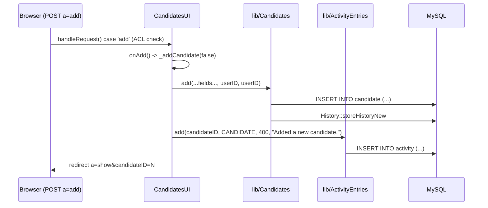
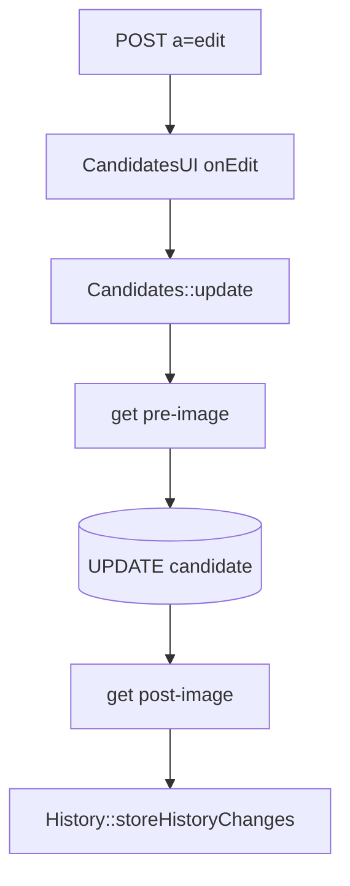
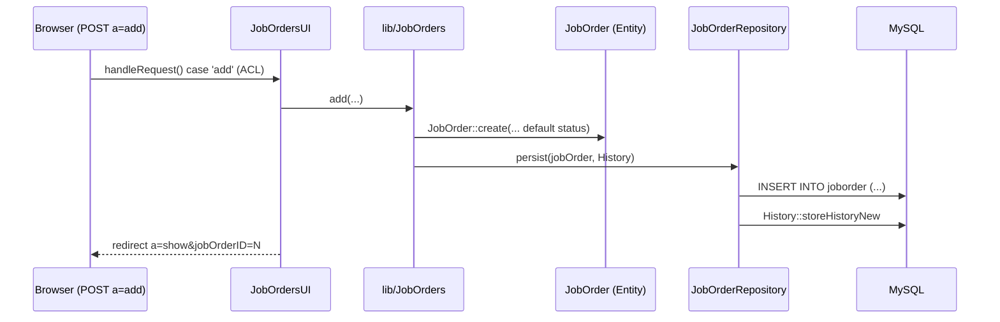
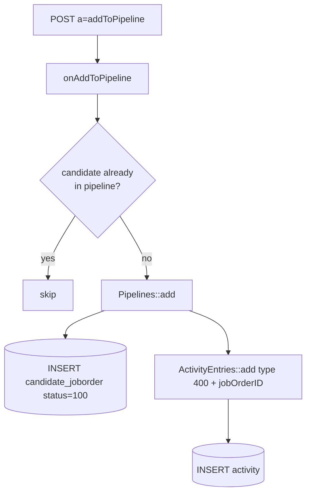
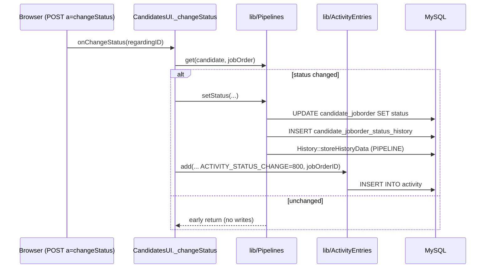
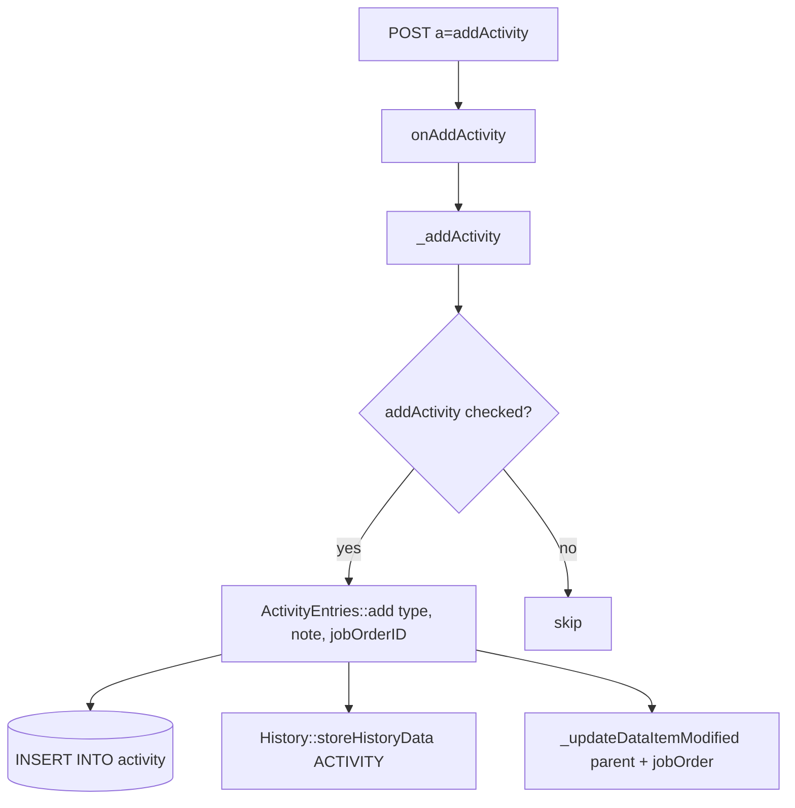
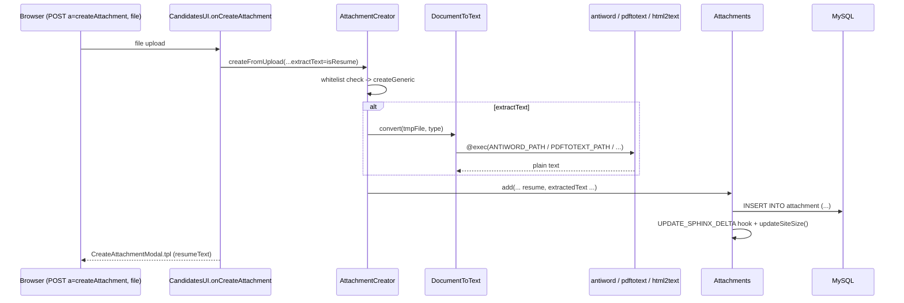

# 07 — Core User Workflows

This document traces seven real end-to-end workflows through the OpenCATS code,
from the HTTP request dispatch in a module's `*UI.php` handler, through the
`lib/` business-logic class, down to the actual SQL written to MySQL. Every step
is cited with the file and line that was read to verify it.

All module handlers are dispatched from a `handleRequest()` `switch ($action)`
block. Each `case` first enforces an ACL via `getUserAccessLevel('<module>.<action>')`
compared against an `ACCESS_LEVEL_*` constant, then branches on
`$this->isPostBack()` to call either the GET handler (renders the form) or the
POST handler (`on*`, persists the data).

Pipeline status integer values referenced throughout
(`constants.php:120-130`):

| Constant | Value |
|---|---|
| `PIPELINE_STATUS_NOSTATUS` | 0 |
| `PIPELINE_STATUS_NOCONTACT` | 100 |
| `PIPELINE_STATUS_CONTACTED` | 200 |
| `PIPELINE_STATUS_CANDIDATE_REPLIED` | 250 |
| `PIPELINE_STATUS_QUALIFYING` | 300 |
| `PIPELINE_STATUS_SUBMITTED` | 400 |
| `PIPELINE_STATUS_INTERVIEWING` | 500 |
| `PIPELINE_STATUS_OFFERED` | 600 |
| `PIPELINE_STATUS_NOTINCONSIDERATION` | 650 |
| `PIPELINE_STATUS_CLIENTDECLINED` | 700 |
| `PIPELINE_STATUS_PLACED` | 800 |

---

## 1) Add a candidate

**Trigger:** `m=candidates&a=add` (POST). ACL: `candidates.add >= ACCESS_LEVEL_EDIT`
(`modules/candidates/CandidatesUI.php:96-110`).

### Step-by-step trace

1. `handleRequest()` matches `case 'add'`, checks the ACL, and because the
   request is a postback calls `onAdd()`
   (`CandidatesUI.php:96-110`).
2. `onAdd()` (`CandidatesUI.php:1153-1179`) first calls
   `checkParsingFunctions()`; if resume parsing is requested it diverts to the
   parsing `add()` form path, otherwise it calls the private helper
   `_addCandidate(false)`.
3. `_addCandidate($isModal, $directoryOverride='')`
   (`CandidatesUI.php:2751`) reads and trims every `$_POST` field
   (`CandidatesUI.php:2832-2853`), normalizes phone numbers via
   `StringUtility::extractPhoneNumber()` (`CandidatesUI.php:2793-2827`),
   validates/converts `dateAvailable` (`CandidatesUI.php:2776-2791`), runs
   duplicate detection `$candidates->checkDuplicity(...)`
   (`CandidatesUI.php:2875`), then calls `lib/Candidates.php::add(...)`
   (`CandidatesUI.php:2877-2907`), passing `$this->_userID` as both `enteredBy`
   and `owner`.
4. `Candidates::add(...)` (`lib/Candidates.php:95-219`) builds and runs the
   INSERT. Signature:

   ```php
   public function add($firstName, $middleName, $lastName, $email1, $email2,
       $phoneHome, $phoneCell, $phoneWork, $address, $address2, $city, $state, $zip,
       $source, $keySkills, $dateAvailable, $currentEmployer, $canRelocate,
       $currentPay, $desiredPay, $notes, $webSite, $bestTimeToCall, $enteredBy, $owner,
       $gender = '', $race = '', $veteran = '', $disability = '',
       $skipHistory = false)
   ```

   Actual SQL (`lib/Candidates.php:102-203`):

   ```sql
   INSERT INTO candidate (
       first_name, middle_name, last_name, email1, email2,
       phone_home, phone_cell, phone_work, address, address2,
       city, state, zip, source, key_skills, date_available,
       current_employer, can_relocate, current_pay, desired_pay,
       notes, web_site, best_time_to_call, entered_by, is_hot,
       owner, site_id, date_created, date_modified,
       eeo_ethnic_type_id, eeo_veteran_type_id, eeo_disability_status, eeo_gender
   )
   VALUES (
       %s, %s, %s, %s, %s, %s, %s, %s, %s, %s, %s, %s, %s, %s, %s, %s,
       %s, %s, %s, %s, %s, %s, %s, %s, 0, %s, %s, NOW(), NOW(), %s, %s, %s, %s
   )
   ```

   `is_hot` is hard-coded to `0`; `date_created`/`date_modified` are `NOW()`.
   After the insert it grabs `getLastInsertID()` and (unless `$skipHistory`)
   delegates audit logging to the generic helper
   `History::storeHistoryNew(DATA_ITEM_CANDIDATE, $candidateID)`
   (`lib/Candidates.php:210-216`).
5. Back in `_addCandidate`, extra fields, the candidate source list, and any
   uploaded resume are persisted (`CandidatesUI.php:2920-2948`).
6. `onAdd()` then writes an activity entry of type `400`
   (`ACTIVITY_OTHER`) with note `"Added a new candidate."` via
   `ActivityEntries::add(...)` (`CandidatesUI.php:1167-1174`), then redirects to
   the candidate show page (`CandidatesUI.php:1176-1178`).



**Tables written:** `candidate`, `activity`, plus `candidate_*` extra-field /
source tables and the history table written by `History`.

---

## 2) Edit a candidate

**Trigger:** `m=candidates&a=edit`. ACL: `candidates.edit >= ACCESS_LEVEL_EDIT`
(`CandidatesUI.php:112-126`). GET renders `edit()`; POST runs `onEdit()`.

### Step-by-step trace

1. `case 'edit'` enforces the ACL and on postback calls `onEdit()`
   (`CandidatesUI.php:112-126`).
2. `onEdit()` (`CandidatesUI.php:1283`) validates `candidateID` and the optional
   `owner` id (`CandidatesUI.php:1288-1298`), validates/converts
   `dateAvailable`, and reads all the editable `$_POST` fields
   (`CandidatesUI.php:1425-1450`).
3. It then calls `Candidates::update(...)` (`CandidatesUI.php:1461-1495`).
4. `Candidates::update(...)` (`lib/Candidates.php:254-259`) signature:

   ```php
   public function update($candidateID, $isActive, $firstName, $middleName, $lastName,
       $email1, $email2, $phoneHome, $phoneCell, $phoneWork, $address, $address2,
       $city, $state, $zip, $source, $keySkills, $dateAvailable,
       $currentEmployer, $canRelocate, $currentPay, $desiredPay,
       $notes, $webSite, $bestTimeToCall, $owner, $isHot, $email, $emailAddress,
       $gender = '', $race = '', $veteran = '', $disability = '')
   ```

   Actual SQL (`lib/Candidates.php:261-299`):

   ```sql
   UPDATE candidate
   SET is_active = %s, first_name = %s, middle_name = %s, last_name = %s,
       email1 = %s, email2 = %s, phone_home = %s, phone_work = %s, phone_cell = %s,
       address = %s, address2 = %s, city = %s, state = %s, zip = %s,
       source = %s, key_skills = %s, date_available = %s, current_employer = %s,
       current_pay = %s, desired_pay = %s, can_relocate = %s, is_hot = %s,
       notes = %s, web_site = %s, best_time_to_call = %s, owner = %s,
       date_modified = NOW(), eeo_ethnic_type_id = %s, eeo_veteran_type_id = %s,
       eeo_disability_status = %s, eeo_gender = %s
   WHERE candidate_id = %s AND site_id = %s
   ```

5. History is captured by a **before/after diff**: `update()` reads
   `$this->get($candidateID)` before the query, runs the UPDATE, reads `get()`
   again, then calls the generic helper
   `History::storeHistoryChanges(DATA_ITEM_CANDIDATE, $candidateID, $preHistory, $postHistory)`
   (`lib/Candidates.php:334-341`). If `$emailAddress`/`$email` are non-empty an
   ownership-assignment notification is mailed (`lib/Candidates.php:348-354`).



**Tables written:** `candidate` (UPDATE), history table (diff), extra-field /
source tables.

---

## 3) Create a job order

**Trigger:** `m=joborders&a=add`. ACL: `joborders.add >= ACCESS_LEVEL_EDIT`
(`modules/joborders/JobOrdersUI.php:116-130`). This path uses the newer
Entity/Repository layer under `src/OpenCATS/Entity/`.

### Step-by-step trace

1. `case 'add'` enforces the ACL and on postback calls `onAdd()`
   (`JobOrdersUI.php:116-130`).
2. `onAdd()` (`JobOrdersUI.php:735`) validates `companyID`, `recruiter`,
   `owner`, `openings`, optional `contactID` (`JobOrdersUI.php:737-771`),
   validates/converts `startDate` (`JobOrdersUI.php:776-791`), reads the hot /
   public flags and optional questionnaire id
   (`JobOrdersUI.php:793-807`), reads the form fields, and requires
   `title`, `type`, `city` (`JobOrdersUI.php:827-831`).
3. It calls `JobOrders::add(...)` (`JobOrdersUI.php:836-841`).
4. `JobOrders::add(...)` (`lib/JobOrders.php:94-137`) signature:

   ```php
   public function add($title, $companyId, $contactId, $description, $notes,
       $duration, $maxRate, $type, $isHot, $public, $openings, $companyJobId,
       $salary, $city, $state, $startDate, $enteredBy, $recruiter, $owner,
       $department, $questionnaire = false)
   ```

   It resolves the department name to an id via
   `Contacts::getDepartmentIDByName(...)` (`lib/JobOrders.php:103-105`),
   constructs a domain object with `JobOrder::create(...)`
   (`lib/JobOrders.php:106-129`) — whose status defaults to
   `\JobOrderStatuses::getDefaultStatus()`
   (`src/OpenCATS/Entity/JobOrder.php:291`) — then persists through the
   repository: `(new JobOrderRepository($this->_db))->persist($jobOrder, new History($this->_siteID))`
   (`lib/JobOrders.php:130-136`). A `JobOrderRepositoryException` is caught and
   returned as `-1`.
5. `JobOrderRepository::persist(JobOrder $jobOrder, \History $history)`
   (`src/OpenCATS/Entity/JobOrderRepository.php:19`) builds and runs the INSERT.
   Actual SQL (`JobOrderRepository.php:22-104`):

   ```sql
   INSERT INTO joborder (
       title, client_job_id, company_id, contact_id, description, notes,
       duration, rate_max, type, is_hot, public, openings, openings_available,
       salary, city, state, company_department_id, start_date, entered_by,
       recruiter, owner, site_id, date_created, date_modified,
       questionnaire_id, status
   )
   VALUES (
       %s, %s, %s, %s, %s, %s, %s, %s, %s, %s, %s, %s, %s, %s, %s, %s, %s,
       %s, %s, %s, %s, %s, NOW(), NOW(), %s, %s
   )
   ```

   On success it captures `getLastInsertID()` and calls the generic helper
   `History::storeHistoryNew(DATA_ITEM_JOBORDER, $jobOrderId)`
   (`JobOrderRepository.php:105-115`).
6. Back in `onAdd()`, extra fields are saved
   (`$jobOrders->extraFields->setValuesOnEdit($jobOrderID)`,
   `JobOrdersUI.php:849`) and the user is redirected to the job-order show page
   (`JobOrdersUI.php:853-855`).



**Tables written:** `joborder`, extra-field table, history table.
Note: unlike candidate add, **no activity row is written** on job-order creation.

---

## 4) Add a candidate to a job order pipeline

**Trigger:** `m=candidates&a=addToPipeline` (POST). ACL:
`pipelines.addToPipeline >= ACCESS_LEVEL_EDIT`
(`CandidatesUI.php:190-203`). (The mirror action exists in JobOrdersUI as well —
`JobOrdersUI.php:1320-1346` — with the same `Pipelines::add` + activity calls.)

### Step-by-step trace

1. `case 'addToPipeline'` enforces the ACL and on postback calls
   `onAddToPipeline()`; a non-postback is rejected
   (`CandidatesUI.php:190-203`).
2. `onAddToPipeline()` (`CandidatesUI.php:1676`) validates `jobOrderID`, then
   builds `$candidateIDArray` from either a single `candidateID` or a stored
   `candidateIDArrayStored` selection (`CandidatesUI.php:1678-1722`).
3. It loads the existing pipeline with `$pipelines->getJobOrderPipeline($jobOrderID)`
   and drops any candidates already in it (`CandidatesUI.php:1732-1741`).
4. For each remaining candidate it calls `Pipelines::add($candidateID, $jobOrderID, $this->_userID)`
   (`CandidatesUI.php:1744-1749`).
5. `Pipelines::add($candidateID, $jobOrderID, $userID = 0)`
   (`lib/Pipelines.php:61`) first SELECTs `COUNT(candidate_id)` from
   `candidate_joborder` for that pair and returns `false` if the candidate is
   already in the pipeline (`lib/Pipelines.php:63-90`). Otherwise the INSERT
   (`lib/Pipelines.php:97-122`):

   ```sql
   INSERT INTO candidate_joborder (
       site_id, joborder_id, candidate_id, status, added_by,
       date_created, date_modified%s
   )
   VALUES (
       %s, %s, %s, 100, %s, NOW(), NOW()%s
   )
   ```

   The initial `status` is hard-coded to `100` (`PIPELINE_STATUS_NOCONTACT`).
   The `%s` placeholders after `date_modified`/`NOW()` are the `$extraFields`/
   `$extraValues` injected by the `PIPELINES_ADD_SQL` hook
   (`lib/Pipelines.php:92-95`).
6. After each successful add, `onAddToPipeline()` writes an activity of type
   `400` with note `"Added candidate to job order."`, linked to the job order
   via `ActivityEntries::add(..., $jobOrderID)` (`CandidatesUI.php:1751-1758`).



**Tables written:** `candidate_joborder` (status 100), `activity`.

---

## 5) Change pipeline status (+ activity)

**Trigger:** `m=candidates&a=changeStatus` (POST). ACL:
`pipelines.changeStatus >= ACCESS_LEVEL_EDIT` (`CandidatesUI.php:237-252`).

### Step-by-step trace

1. `case 'changeStatus'` enforces the ACL and on postback calls
   `onChangeStatus()` (`CandidatesUI.php:237-252`).
2. `onChangeStatus()` (`CandidatesUI.php:2049-2060`) validates `regardingID`
   (the job order id) and delegates to the private helper
   `_changeStatus(false, $regardingID)`.
3. `_changeStatus($isJobOrdersMode, $regardingID, $directoryOverride='')`
   (`CandidatesUI.php:3420`) validates `candidateID` and `statusID`, confirms
   the status is one returned by `Pipelines::getStatusesForPicking()`
   (`CandidatesUI.php:3441-3466`), and — if the target is
   `PIPELINE_STATUS_PLACED` — checks `JobOrders::checkOpenings()` before
   allowing it (`CandidatesUI.php:3468-3478`).
4. It loads the current pipeline row with `$pipelines->get($candidateID, $regardingID)`
   and computes `$statusChanged = ($statusID != $data['statusID'])`
   (`CandidatesUI.php:3484-3499`). Email-notification handling is resolved into
   `$email`/`$customMessage` (`CandidatesUI.php:3501-3536`).
5. If the status actually changed it calls
   `Pipelines::setStatus($candidateID, $regardingID, $statusID, $email, $customMessage)`
   (`CandidatesUI.php:3538-3543`).
6. `Pipelines::setStatus($candidateID, $jobOrderID, $statusID, $emailAddress, $emailText)`
   (`lib/Pipelines.php:295`):
   - SELECTs the existing `status` and `candidate_joborder_id`
     (`lib/Pipelines.php:299-315`); **early-returns if the status is unchanged**
     so as not to "scew the history" (`lib/Pipelines.php:325-331`).
   - Runs the UPDATE (`lib/Pipelines.php:334-348`):

     ```sql
     UPDATE candidate_joborder
     SET status = %s, date_modified = NOW()
     WHERE candidate_joborder_id = %s AND site_id = %s
     ```

   - Calls `addStatusHistory($candidateID, $jobOrderID, $statusID, $oldStatusID)`
     (`lib/Pipelines.php:351-353`), which INSERTs the status-history row
     (`lib/Pipelines.php:428-462`):

     ```sql
     INSERT INTO candidate_joborder_status_history (
         joborder_id, candidate_id, site_id, date, status_to, status_from
     )
     VALUES (%s, %s, %s, NOW(), %s, %s)
     ```

   - Also writes the generic audit trail via
     `History::storeHistoryData(DATA_ITEM_PIPELINE, $candidateJobOrderID, 'PIPELINE', $oldStatusID, $statusID, ...)`
     (`lib/Pipelines.php:355-366`), and mails the candidate if `$emailAddress`
     is non-empty (`lib/Pipelines.php:368-379`).
7. **Placement side effects** in `_changeStatus`: moving *to* `PLACED`
   decrements `openings_available` and moving *away from* `PLACED` increments it
   via `JobOrders::updateOpeningsAvailable(...)` (`CandidatesUI.php:3546-3557`).
8. **Linked activity:** unless the form sends `addActivityProvided` with the
   checkbox cleared (`addActivity` defaults to true), `_changeStatus` writes an
   activity of type `ACTIVITY_STATUS_CHANGE` (= `800`,
   `lib/ActivityEntries.php:40`) with note
   `sprintf('Status change: %s', $newStatusDescription)`, linked to the job
   order: `ActivityEntries::add($candidateID, DATA_ITEM_CANDIDATE, ACTIVITY_STATUS_CHANGE, $activityNote, $this->_userID, $regardingID)`
   (`CandidatesUI.php:3558-3583`).



**Tables written (when status changed):** `candidate_joborder` (UPDATE),
`candidate_joborder_status_history` (INSERT), `activity` (INSERT, type 800),
history table; `joborder.openings_available` may also be updated on PLACED
transitions.

---

## 6) Log a standalone activity

**Trigger:** `m=candidates&a=addActivity` (POST). ACL:
`pipelines.addActivity >= ACCESS_LEVEL_EDIT` (`CandidatesUI.php:221-235`). This
is the "Log an Activity / schedule event" modal — distinct from the implicit
activity written during a status change.

### Step-by-step trace

1. `case 'addActivity'` enforces the ACL and on postback calls
   `onAddActivity()` (`CandidatesUI.php:221-235`).
2. `onAddActivity()` (`CandidatesUI.php:2036-2047`) validates the optional
   `regardingID` (job order) and delegates to
   `_addActivity(false, $regardingID)`.
3. `_addActivity($isJobOrdersMode, $regardingID, $directoryOverride='')`
   (`CandidatesUI.php:3112`) validates `candidateID`
   (`CandidatesUI.php:3126-3131`). If the `addActivity` checkbox is set it:
   - validates `activityTypeID` against `ActivityEntries::getTypes()`
     (`CandidatesUI.php:3137-3150`),
   - reads `activityNote` (`CandidatesUI.php:3152`),
   - optionally builds an explicit `date_created` timestamp (YYYY-MM-DD HH:MM:SS)
     from the `activityDate`/`activityHour`/`activityMinute`/`activityMeridiem`
     fields (`CandidatesUI.php:3154-3191`),
   - then calls `ActivityEntries::add(...)` (`CandidatesUI.php:3194-3202`):

     ```php
     $activityEntries->add(
         $candidateID, DATA_ITEM_CANDIDATE, $activityTypeID,
         $activityNote, $this->_userID, $regardingID, $activityDateCreated
     );
     ```
4. `ActivityEntries::add(...)` (`lib/ActivityEntries.php:88`) signature:

   ```php
   public function add($dataItemID, $dataItemType, $activityType,
       $activityNotes, $enteredBy, $jobOrderID = -1, $dateCreated = false)
   ```

   It coerces an invalid `$jobOrderID` to `-1` (stored NULL), and uses the
   provided `$dateCreated` only if it matches `YYYY-MM-DD HH:MM:SS`, otherwise
   `NOW()` (`lib/ActivityEntries.php:91-104`). SQL
   (`lib/ActivityEntries.php:106-137`):

   ```sql
   INSERT INTO activity (
       data_item_id, data_item_type, joborder_id, entered_by, type,
       notes, site_id, date_created, date_modified
   )
   VALUES (%s, %s, %s, %s, %s, %s, %s, %s, NOW())
   ```

   (`joborder_id` uses `makeQueryIntegerOrNULL`, so `-1` becomes `NULL` =
   "General".) After the insert it writes the generic audit row via
   `History::storeHistoryData(... 'ACTIVITY', '(NEW)', $activityNotes, '(USER) Added activity.')`
   (`lib/ActivityEntries.php:147-155`), then bumps the parent data item's
   modified timestamp (and the job order's, if linked) via the private helper
   `_updateDataItemModified()` (`lib/ActivityEntries.php:157-167`,
   implementation at `lib/ActivityEntries.php:614-640`).
5. The same `_addActivity` flow optionally schedules a calendar event when the
   `scheduleEvent` checkbox is set (`CandidatesUI.php:3216` onward) — that branch
   writes to the calendar, not covered here.



**Tables written:** `activity` (INSERT), history table; `candidate` (and
`joborder` if linked) modified-timestamp UPDATEs via `updateModified()`.

---

## 7) Upload & parse a resume

**Trigger:** `m=candidates&a=createAttachment` (POST). ACL:
`candidates.createAttachment >= ACCESS_LEVEL_EDIT`
(`CandidatesUI.php:287-304`). (Resumes also enter via the candidate-add path at
`CandidatesUI.php:2941-2948`, which calls the same `AttachmentCreator`.)

### Step-by-step trace

1. `case 'createAttachment'` enforces the ACL, `include_once`s
   `lib/DocumentToText.php`, and on postback calls `onCreateAttachment()`
   (`CandidatesUI.php:287-304`).
2. `onCreateAttachment()` (`CandidatesUI.php:2541`) validates `candidateID` and
   the `resume` flag (`CandidatesUI.php:2543-2565`), then instantiates
   `AttachmentCreator` and calls
   `createFromUpload(DATA_ITEM_CANDIDATE, $candidateID, 'file', false, $isResume)`
   (`CandidatesUI.php:2569-2572`). The 5th argument `$extractText` = `$isResume`,
   so text extraction runs only for resumes.
3. `AttachmentCreator::createFromUpload($dataItemType, $dataItemID, $fileField, $isProfileImage, $extractText)`
   (`lib/Attachments.php:931`) reads the `$_FILES` metadata
   (`Attachments.php:934-939`), enforces an **extension whitelist** —
   `bmp, csv, doc, docx, heic, jpeg, jpg, msg, odg, odt, pages, pdf, png, ppt,
   pptx, rtf, tiff, wpd, wps, xls, xlsx, xps`
   (`Attachments.php:953-968`) — then delegates to `createGeneric(...)`
   (`Attachments.php:978-981`).
4. `createGeneric(...)` (`lib/Attachments.php:1066`): if `$extractText` is true
   it builds a `DocumentToText`, resolves the document type with
   `getDocumentType($storedFilename, $contentType)`, and calls
   `$documentToText->convert($tempFilename, $documentType)`
   (`Attachments.php:1083-1121`). Extraction errors set
   `_isTextExtractionError`/`_textExtractionError` but are non-fatal for normal
   candidate resumes (only `DATA_ITEM_BULKRESUME` treats an extraction failure as
   fatal, `Attachments.php:1124-1133`).
5. `DocumentToText::convert($fileName, $documentType)`
   (`lib/DocumentToText.php:72`) escapes the path with
   `escapeshellarg(realpath($fileName))` (`DocumentToText.php:101`) and selects
   an extraction strategy by type (`DocumentToText.php:104-194`):
   - **DOC** → external `antiword`:
     `'"'. ANTIWORD_PATH . '" -m ' . ANTIWORD_MAP . ' ' . $escapedFilename`
     (`DocumentToText.php:106-116`). Errors out if `ANTIWORD_PATH == ''`.
     (A DOC whose first bytes are `{\rtf` is reclassified to RTF first,
     `DocumentToText.php:83-96`.)
   - **PDF** → external `pdftotext` (XPDF):
     `'"'. PDFTOTEXT_PATH . '" -layout ' . $escapedFilename . ' -'`
     (`DocumentToText.php:118-128`).
   - **HTML** → external `html2text` via `HTML2TEXT_PATH`
     (`DocumentToText.php:130-148`).
   - **TEXT** → read directly (`_readTextFile`, `DocumentToText.php:150-152`).
   - **RTF / ODT / DOCX** → handled in-process by `rtf2text` / `odt2text` /
     `docx2text` (the latter two unzip the document XML)
     (`DocumentToText.php:154-187`, `388-394`).
   - **UNKNOWN** → error (`DocumentToText.php:189-193`).

   The external commands are run by the private helper `_executeCommand()`,
   which on non-Windows calls `@exec($command, $output, $returnCode)`
   (`DocumentToText.php:376-385`); ISO-8859-1 output is converted to UTF-8 with
   `iconv` (`DocumentToText.php:210-215`). Extracted text is returned via
   `getString()` (`DocumentToText.php:240-243`).

   **Config constants** (all defined in `config.php`, default to placeholder
   paths and must be set per install):
   - `ANTIWORD_PATH` (`config.php:62`), `ANTIWORD_MAP` = `'8859-1.txt'`
     (`config.php:63`)
   - `PDFTOTEXT_PATH` (`config.php:69`)
   - `HTML2TEXT_PATH` (`config.php:75`)
   - `UNRTF_PATH` (`config.php:81`)
6. Back in `createGeneric`, the attachment row is written via
   `Attachments::add(...)` (`Attachments.php:1180-1184`). Signature
   (`lib/Attachments.php:73-76`):

   ```php
   public function add($dataItemType, $dataItemID, $attachmentTitle,
       $originalFilename, $storedFilename, $contentType, $isResume,
       $resumeText, $isProfileImage, $directoryName, $fileSize = 0, $md5sum = '')
   ```

   The extracted text is run through `DatabaseSearch::fulltextEncode()` and an
   `md5sum_text` computed (`Attachments.php:86-96`). SQL
   (`Attachments.php:98-149`):

   ```sql
   INSERT INTO attachment (
       data_item_type, data_item_id, title, original_filename, stored_filename,
       content_type, resume, text, profile_image, site_id,
       date_created, date_modified, directory_name, md5_sum, md5_sum_text, file_size_kb
   )
   VALUES (%s, %s, %s, %s, %s, %s, %s, %s, %s, %s, NOW(), NOW(), %s, %s, %s, %s)
   ```

   After insert it fires the `UPDATE_SPHINX_DELTA` hook and calls
   `updateSiteSize()` (`Attachments.php:157-164`).
7. Before inserting, `createGeneric` checks for **duplicate** attachments by
   `(dataItem, fileSize, md5sum, text)` via `getMatching(...)`; a duplicate sets
   `_duplicatesOccurred` and aborts without inserting
   (`Attachments.php:1142-1170`). The physical file is then stored under a
   unique directory and the `directory_name` column is later finalized
   (`Attachments.php:1201-1212`).
8. `onCreateAttachment()` surfaces extraction errors / extracted text back to
   the `CreateAttachmentModal.tpl` template (`CandidatesUI.php:2574-2599`).



**Tables written:** `attachment` (INSERT, with `text`/`md5_sum_text` populated
from extraction). Site-size bookkeeping is updated via `updateSiteSize()`; the
binary text extraction itself touches no DB (external process + temp file only).

---

## Source evidence

- `modules/candidates/CandidatesUI.php`
  - dispatch/ACL: add `:96-110`, edit `:112-126`, addToPipeline `:190-203`,
    addActivity `:221-235`, changeStatus `:237-252`, createAttachment `:287-304`
  - `onAdd()` `:1153-1179`; `_addCandidate()` `:2751`, field reads `:2832-2853`,
    `Candidates::add` call `:2877-2907`, activity write `:1167-1174`
  - `onEdit()` `:1283`, `Candidates::update` call `:1461-1495`
  - `onAddToPipeline()` `:1676`, dedupe `:1732-1741`, `Pipelines::add` `:1744-1749`,
    activity `:1751-1758`
  - `onChangeStatus()` `:2049-2060`; `_changeStatus()` `:3420`,
    `setStatus` call `:3538-3543`, placement openings `:3546-3557`,
    status-change activity `:3558-3583`
  - `onAddActivity()` `:2036-2047`; `_addActivity()` `:3112`,
    `ActivityEntries::add` call `:3194-3202`
  - `onCreateAttachment()` `:2541`, `createFromUpload` call `:2569-2572`
- `lib/Candidates.php`: `add()` `:95-219` (INSERT `:102-203`),
  `update()` `:254-356` (UPDATE `:261-299`, history diff `:334-341`)
- `lib/JobOrders.php`: `add()` `:94-137`; `update()` `:163-243`
- `src/OpenCATS/Entity/JobOrder.php`: `create()` `:263`, default status `:291`
- `src/OpenCATS/Entity/JobOrderRepository.php`: `persist()` `:19`
  (INSERT `:22-104`, `storeHistoryNew` `:114`)
- `lib/Pipelines.php`: `add()` `:61` (INSERT `:97-122`), `remove()` `:140`,
  `setStatus()` `:295` (UPDATE `:334-348`, unchanged early-return `:325-331`),
  `addStatusHistory()` `:428` (INSERT `:431-453`)
- `lib/ActivityEntries.php`: type constants `:33-40`, `add()` `:88`
  (INSERT `:106-137`, `storeHistoryData` `:147-155`,
  `_updateDataItemModified()` `:614-640`)
- `lib/Attachments.php`: `add()` `:73` (INSERT `:98-149`),
  `createFromUpload()` `:931` (whitelist `:953-968`),
  `createGeneric()` `:1066` (extract `:1083-1135`, dup check `:1142-1170`,
  add row `:1180-1184`)
- `lib/DocumentToText.php`: `convert()` `:72` (escape `:101`, DOC `:106-116`,
  PDF `:118-128`, HTML `:130-148`, RTF/ODT/DOCX `:154-187`),
  `_executeCommand()` exec `:378`, `getString()` `:240`
- `config.php`: `ANTIWORD_PATH` `:62`, `ANTIWORD_MAP` `:63`,
  `PDFTOTEXT_PATH` `:69`, `HTML2TEXT_PATH` `:75`, `UNRTF_PATH` `:81`
- `constants.php`: `PIPELINE_STATUS_*` `:120-130`

## Unverified / open questions

- **`History` helper internals.** Every workflow funnels audit logging through
  `History::storeHistoryNew` / `storeHistoryChanges` / `storeHistoryData`
  (`lib/History.php`). The exact target table and column layout for those writes
  were not opened here; they are treated as a generic helper. The audit row in
  `setStatus` is keyed by `DATA_ITEM_PIPELINE` on `$candidateJobOrderID`
  (`lib/Pipelines.php:359-366`).
- **`updateSiteSize()` and the `UPDATE_SPHINX_DELTA` hook**
  (`lib/Attachments.php:160-162`) were not traced to their SQL/effects.
- **Resume-parsing add path.** `onAdd()` branches to a parsing-specific `add()`
  form when `checkParsingFunctions()` returns an array
  (`CandidatesUI.php:1155-1158`); that branch (and `ParseUtility`) was not traced
  in depth — the documented add path is the standard non-parsing one.
- **`makeQueryString` / `makeQueryInteger` / `makeQueryStringOrNULL` /
  `makeQueryIntegerOrNULL`** are the DB layer's escaping/placeholder helpers
  (`DatabaseConnection`); assumed to produce safely-quoted SQL literals but their
  implementation was not opened.
- The Windows code path in `DocumentToText::_executeCommand()` uses a WSH shell
  (`DocumentToText.php:365-374`); only the non-Windows `@exec` path
  (`:378`) was the basis for the trace.
