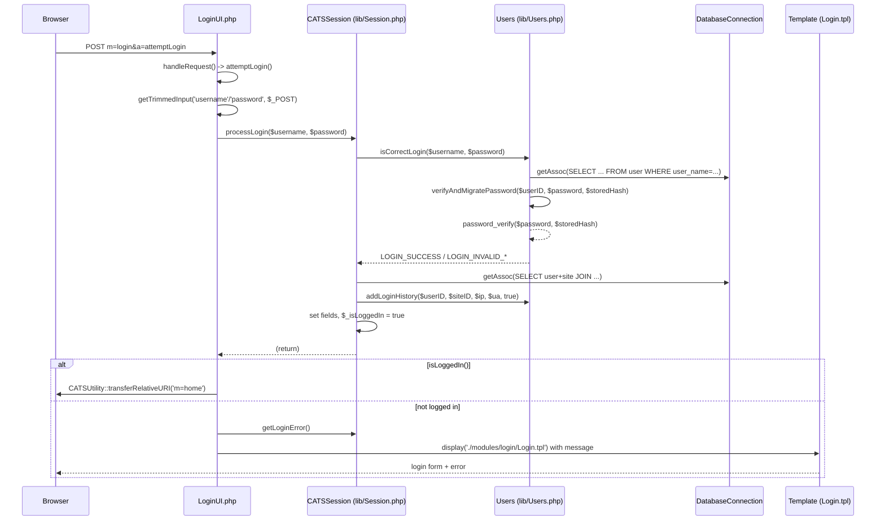

# 08 — Sequence Diagrams

This document traces five concrete call chains through the actual OpenCATS code (PHP 7.4). Every participant is a real class or file, and every message is a method call verified by reading the source. File and line citations point at the exact code each message was built from.

All diagrams use Mermaid `sequenceDiagram`. Participants are named after the real file/class they represent.

---

## A) Login / Authentication

**Entry point:** `LoginUI::attemptLogin()` (`modules/login/LoginUI.php:179`), dispatched from `LoginUI::handleRequest()` (`modules/login/LoginUI.php:48`, `case 'attemptLogin'` at line 53).

After reading the trimmed `username`/`password` from `$_POST` (`LoginUI.php:228-229`), it makes a "blind attempt" via the session object:

```php
/* Make a blind attempt at logging the user in. */
$_SESSION['CATS']->processLogin($username, $password);    // LoginUI.php:247
```

`CATSSession::processLogin($username, $password, $addToHistory = true)` (`lib/Session.php:666`) delegates credential checking to `Users::isCorrectLogin($username, $password)` (`lib/Users.php:796`), which in the SQL path calls the private `verifyAndMigratePassword($userID, $password, $storedHash)` (`lib/Users.php:1296`). That method finishes with `password_verify($password, $storedHash)` (`lib/Users.php:1310`) for modern hashes (and `md5()` comparison + rehash for legacy 32-hex hashes, `Users.php:1298-1307`). On `LOGIN_SUCCESS` (`Session.php:811`) `processLogin` populates the session fields (`Session.php:812-900`) and sets `$this->_isLoggedIn = true` (`Session.php:900`). Back in `attemptLogin`, on success it redirects with `CATSUtility::transferRelativeURI('m=home')` (`LoginUI.php:434`); on failure it re-renders `Login.tpl` with `$_SESSION['CATS']->getLoginError()` (`LoginUI.php:252`, `getLoginError()` at `Session.php:1075`).



**Error / edge handling:** `isCorrectLogin` returns `LOGIN_INVALID_USER` for empty/unknown username (`Users.php:801-803, 830`) and `LOGIN_INVALID_PASSWORD` for empty/wrong password (`Users.php:806-808, 857`); `processLogin` maps these (plus `LOGIN_DISABLED`, `LOGIN_ROOT_ONLY`, `LOGIN_PENDING_APPROVAL`) to user-facing messages and logs failed attempts via `addLoginHistory(..., false)` (`Session.php:758-801`). Missing POST keys are caught earlier in `attemptLogin` before any session call (`LoginUI.php:191-226`).

---

## B) Candidate Save (POST)

**Entry point:** `index.php`. After `session_start()` (`index.php:75`) and the CSRF gate, the request is routed to a module.

The CSRF check fires for authenticated POSTs (`index.php:145-163`):

```php
if (!$_SESSION['CATS']->isCSRFTokenValid($token))
{
    CommonErrors::fatal(COMMONERROR_BADFIELDS, null, 'Invalid request.');   // index.php:161
}
```

Routing then calls `ModuleUtility::loadModule($_GET['m'])` (`index.php:275`). `ModuleUtility::loadModule($moduleName)` (`lib/ModuleUtility.php:51`) includes the module class file, then `new $moduleClass()` and `$module->handleRequest()` (`ModuleUtility.php:78-79`). For `m=candidates` this is `CandidatesUI::handleRequest()` (`modules/candidates/CandidatesUI.php:81`), `case 'add'` (line 96): on a postback it permission-checks then calls `$this->onAdd()` (`CandidatesUI.php:103`).

`onAdd()` (`CandidatesUI.php:1153`) calls the private `_addCandidate(false)` (`CandidatesUI.php:1160`, defined at `CandidatesUI.php:2751`), which reads the form fields and calls `Candidates::add(...)` (`CandidatesUI.php:2877`). `Candidates::add($firstName, $middleName, $lastName, $email1, $email2, ...)` (`lib/Candidates.php:95`) builds an `INSERT INTO candidate (...)` and runs `$this->_db->query($sql)` (`Candidates.php:204`) via `DatabaseConnection::query($query, $ignoreErrors = false)` (`lib/DatabaseConnection.php:159`), then returns `getLastInsertID()` (`Candidates.php:210`). On success `onAdd()` redirects with `CATSUtility::transferRelativeURI('m=candidates&a=show&candidateID=' . $candidateID)` (`CandidatesUI.php:1176-1178`).

```mermaid
sequenceDiagram
    participant Browser
    participant Index as index.php
    participant Session as CATSSession (lib/Session.php)
    participant ModUtil as ModuleUtility (lib/ModuleUtility.php)
    participant UI as CandidatesUI.php
    participant Cand as Candidates (lib/Candidates.php)
    participant DB as DatabaseConnection (lib/DatabaseConnection.php)
    participant MariaDB

    Browser->>Index: POST m=candidates&a=add (+csrfToken)
    Index->>Session: isCSRFTokenValid($token)
    alt invalid token
        Index->>Browser: CommonErrors::fatal(... 'Invalid request.')
    end
    Index->>ModUtil: loadModule('candidates')
    ModUtil->>UI: new CandidatesUI(); handleRequest()
    UI->>UI: case 'add' -> onAdd()
    UI->>UI: _addCandidate(false) reads $_POST fields
    UI->>Cand: add($firstName, ..., $owner, ...)
    Cand->>DB: query("INSERT INTO candidate (...)")
    DB->>MariaDB: mysqli execute
    MariaDB-->>DB: result
    Cand->>DB: getLastInsertID()
    Cand-->>UI: $candidateID
    UI->>Browser: transferRelativeURI('m=candidates&a=show&candidateID=...')
```

**Error / edge handling:** `_addCandidate` calls `CommonErrors::fatal(COMMONERROR_MISSINGFIELDS, ...)` if first/last name are empty (`CandidatesUI.php:2866-2869`). `Candidates::add` returns `-1` if the query fails (`Candidates.php:205-208`), and `onAdd` raises `CommonErrors::fatal(COMMONERROR_RECORDERROR, ...)` when `$candidateID <= 0` (`CandidatesUI.php:1162-1165`). The `case 'add'` arm also gates on `candidates.add` access level `< ACCESS_LEVEL_EDIT` (`CandidatesUI.php:97-100`).

---

## C) AJAX Call

**Entry point:** `ajax.php`. The handler chosen and read here is `ajax/getCandidateIdByEmail.php`.

`ajax.php` starts a session only for POST (`ajax.php:50-54`), then for logged-in POSTs validates the token with `$_SESSION['CATS']->isCSRFTokenValid($token)` (`ajax.php:66`), emitting an XML error and `die()` on failure (`ajax.php:67-78`). It sanitizes the `f` parameter to a filename (`ajax.php:120-135`), checks `is_readable($filename)` (`ajax.php:137`), then `include`s the handler inside an output buffer (`ajax.php:157-159`).

The handler `ajax/getCandidateIdByEmail.php` constructs `new SecureAJAXInterface()` (`getCandidateIdByEmail.php:30`). `SecureAJAXInterface::__construct()` (`lib/AJAXInterface.php:202`) calls `session_start()`, enforces login via `isSessionLoggedIn()` (`AJAXInterface.php:210, 267`), re-checks CSRF on POST (`AJAXInterface.php:218-232`), and caches site/user IDs. The handler then does `$candidates = new Candidates($siteID)` and `$candidates->getIDByEmail($email)` (`getCandidateIdByEmail.php:43-47`, `Candidates::getIDByEmail` at `lib/Candidates.php:703`), builds an XML `<data>` string, and emits it via `$interface->outputXMLPage($output)` (`getCandidateIdByEmail.php:71`, `AJAXInterface::outputXMLPage` at `AJAXInterface.php:47`).

```mermaid
sequenceDiagram
    participant Browser
    participant Ajax as ajax.php
    participant Session as CATSSession (lib/Session.php)
    participant Handler as ajax/getCandidateIdByEmail.php
    participant SAI as SecureAJAXInterface (lib/AJAXInterface.php)
    participant Cand as Candidates (lib/Candidates.php)
    participant DB as DatabaseConnection

    Browser->>Ajax: GET/POST f=getCandidateIdByEmail&email=...
    opt POST + logged in
        Ajax->>Session: isCSRFTokenValid($token)
        alt invalid
            Ajax->>Browser: XML errorcode -1 'Invalid request.' + die()
        end
    end
    Ajax->>Ajax: sanitize f -> ajax/getCandidateIdByEmail.php; is_readable()
    Ajax->>Handler: include($filename) (ob_start buffer)
    Handler->>SAI: new SecureAJAXInterface()
    SAI->>Session: isSessionLoggedIn() / isCSRFTokenValid()
    SAI-->>Handler: getSiteID()
    Handler->>Cand: new Candidates($siteID); getIDByEmail($email)
    Cand->>DB: getColumn(SELECT candidate_id ... WHERE email...)
    Cand-->>Handler: $candidateID (or -1)
    Handler->>SAI: outputXMLPage("<data>...</data>")
    SAI-->>Browser: text/xml response
```

**Error / edge handling:** Empty `f` -> XML `No function specified.` + `die()` (`ajax.php:81-93`); installer active blocks non-`install` actions (`ajax.php:95-118`); unreadable filename -> `Invalid function name.` + `die()` (`ajax.php:137-149`). The handler itself `die('Invalid E-Mail address.')` when `email` is absent (`getCandidateIdByEmail.php:34-37`), and `SecureAJAXInterface` outputs `outputXMLErrorPage(-1, 'You are not logged in...')` then `die()` for an unauthenticated session (`AJAXInterface.php:210-216`).

---

## D) Async Queue Processing

**Entry point:** `QueueCLI.php`, run from cron. It bootstraps config/libraries, starts a session, registers per-module tasks with `ModuleUtility::registerModuleTasks()` (`QueueCLI.php:64`), then calls:

```php
$retVal = QueueProcessor::startNextTask();   // QueueCLI.php:69
```

`QueueProcessor::startNextTask()` (`lib/QueueProcessor.php:166`) selects the highest-priority unlocked, error-free, incomplete row (`SELECT * FROM queue WHERE locked=0 AND error=0 AND ISNULL(date_completed) ORDER BY priority DESC LIMIT 1`, `QueueProcessor.php:170-184`). If none, it returns `TASKRET_NO_TASKS` (`QueueProcessor.php:189`); otherwise it calls `startTask($siteID, $taskPath, $args, $priority, $taskID)` (`QueueProcessor.php:194-196`).

`QueueProcessor::startTask(...)` (`QueueProcessor.php:229`) locks the row with `setTaskLock($taskID, 1)` (`QueueProcessor.php:231`, defined at line 54), instantiates the task via `getInstantiatedTask($taskPath)` (`QueueProcessor.php:234`), then `$curTask->setTaskID($taskID)` and `$retVal = $curTask->run($siteID, $args)` (`QueueProcessor.php:246-247`). The concrete task here is `Reminders::run($siteID, $args)` (`modules/calendar/tasks/Reminders.php:50`). After the run it unlocks (`setTaskLock($taskID, 0)`, line 249) and dispatches on the return code (`QueueProcessor.php:252-271`): `TASKRET_SUCCESS` -> `setTaskCompleted($taskID)` (line 99), `TASKRET_FAILURE`/`TASKRET_ERROR` -> `setTaskError($taskID)` (line 73), `TASKRET_SUCCESS_NOLOG` -> `setTaskCompleted` + `removeTask` (lines 268-269).

```mermaid
sequenceDiagram
    participant Cron
    participant CLI as QueueCLI.php
    participant QP as QueueProcessor (lib/QueueProcessor.php)
    participant DB as DatabaseConnection
    participant Task as Reminders (modules/calendar/tasks/Reminders.php)

    Cron->>CLI: php QueueCLI.php
    CLI->>QP: registerModuleTasks() (via ModuleUtility)
    CLI->>QP: startNextTask()
    QP->>DB: getAssoc(SELECT * FROM queue WHERE locked=0 AND error=0 ... LIMIT 1)
    alt no rows
        QP-->>CLI: TASKRET_NO_TASKS
    else row found
        QP->>QP: startTask($siteID,$taskPath,$args,$priority,$taskID)
        QP->>DB: setTaskLock($taskID, 1)
        QP->>Task: getInstantiatedTask($taskPath); setTaskID($taskID)
        QP->>Task: run($siteID, $args)
        Task-->>QP: TASKRET_SUCCESS / TASKRET_FAILURE / TASKRET_ERROR / TASKRET_SUCCESS_NOLOG
        QP->>DB: setTaskLock($taskID, 0)
        alt SUCCESS
            QP->>DB: setTaskCompleted($taskID)
        else FAILURE / ERROR
            QP->>DB: setTaskError($taskID)
        else SUCCESS_NOLOG
            QP->>DB: setTaskCompleted($taskID); removeTask($taskID)
        end
        QP-->>CLI: $retVal
    end
    CLI->>CLI: touch(QUEUE_STATUS_FILE)
```

**Error / edge handling:** If the task class cannot be loaded, `startTask` records `setTaskResponse($taskID, 'Cannot load task...')` then `setTaskError($taskID)` and returns early (`QueueProcessor.php:236-243`). `setTaskError` with code 1 also runs the `QUEUEERROR_NOTIFY_DEV` hook (`QueueProcessor.php:90-92`). Stale locked rows past `date_timeout` are reaped to `error=1` by `cleanUpErroredTasks()` (`QueueProcessor.php:469-486`), invoked from `QueueCLI.php:85`.

---

## E) Email Send

**Entry point (traced):** the calendar reminder path, since chain D already lands in `Reminders::run()`. `Reminders::run($siteID, $args)` (`modules/calendar/tasks/Reminders.php:50`) loads due reminders via `Calendar::getAllDueReminders()` (`Reminders.php:58`) and for each calls `Calendar::sendEmail($data['siteID'], 0, $emailDestination, $emailSubject, $emailContents)` (`Reminders.php:93-99`).

`Calendar::sendEmail($siteID, $userID, $destination, $subject, $body)` (`lib/Calendar.php:988`) constructs `new Mailer($siteID, $userID)` (`Calendar.php:996`), splits the destination on `,`/`;`, and for each address calls `$mailer->sendToOne(array($address, ''), $subject, $body, true)` (`Calendar.php:1003-1008`).

`Mailer::__construct($siteID, $userID = -1)` (`lib/Mailer.php:71`) creates `new PHPMailer(true)` (`Mailer.php:76`), loads `MailerSettings::getAll()` (`Mailer.php:79-80`), and calls `refreshSettings()` (`Mailer.php:83`) which configures transport per `MAIL_MAILER` — for `MAILER_MODE_SMTP` it sets `isSMTP()`, `Host`, `Port`, `SMTPSecure`, and optional `SMTPAuth`/`Username`/`Password` (`Mailer.php:324-345`).

`Mailer::sendToOne($recipient, $subject, $body, $isHTML = false, $logMessage = true, $replyTo = array(), $wrapLinesAt = 78)` (`Mailer.php:122`) is a proxy to `Mailer::send($from, $recipients, $subject, $body, $isHTML, $logMessage, $replyTo, $wrapLinesAt, $signature)` (`Mailer.php:193`). `send()` populates PHPMailer fields, then per recipient `AddAddress(...)` and `$this->_mailer->Send()` (`Mailer.php:234, 241`); on success with `$logMessage`, it calls the private `logMessage($from, $to, $subject, $body)` which inserts into `email_history` (`Mailer.php:252, 363-392`).

```mermaid
sequenceDiagram
    participant Task as Reminders (modules/calendar/tasks/Reminders.php)
    participant Cal as Calendar (lib/Calendar.php)
    participant Mailer as Mailer (lib/Mailer.php)
    participant PHPMailer as PHPMailer (vendor)
    participant SMTP
    participant DB as DatabaseConnection

    Task->>Cal: sendEmail($siteID, 0, $dest, $subject, $body)
    Cal->>Mailer: new Mailer($siteID, $userID)
    Mailer->>PHPMailer: new PHPMailer(true)
    Mailer->>Mailer: MailerSettings::getAll(); refreshSettings()
    Mailer->>PHPMailer: isSMTP(); Host/Port/SMTPSecure/SMTPAuth
    Cal->>Mailer: sendToOne([address,''], $subject, $body, true)
    Mailer->>Mailer: send($from, $recipients, ...)
    Mailer->>PHPMailer: AddAddress($addr, $name); isHTML(); Body=...
    Mailer->>PHPMailer: Send()
    PHPMailer->>SMTP: deliver message
    SMTP-->>PHPMailer: ok / error
    alt sent OK and logMessage
        Mailer->>DB: logMessage() -> INSERT INTO email_history
    else send failed
        Mailer->>Mailer: collect $failedRecipients; set _errorMessage
    end
    Mailer-->>Cal: true / false
```

**Error / edge handling:** `Calendar::sendEmail` returns immediately if `$destination` is empty (`Calendar.php:990-993`). In `Mailer::send`, any recipient whose `$this->_mailer->Send()` returns false is collected into `$failedRecipients` with its `ErrorInfo`; if non-empty the method builds `$this->_errorMessage` and returns `false` (`Mailer.php:241-277`), retrievable via `getError()` (`Mailer.php:288`). PHPMailer is constructed with exceptions enabled (`new PHPMailer(true)`, `Mailer.php:76`). When `MAIL_MAILER == MAILER_MODE_DISABLED`, `refreshSettings` configures no transport (`Mailer.php:316-317`).

---

## Source evidence

| Chain | Files / methods opened (with lines) |
|-------|-------------------------------------|
| A | `modules/login/LoginUI.php:48,53,179,228-247,250-252,434`; `lib/Session.php:666-672,724-729,749-809,811-900,1075,1258`; `lib/Users.php:796-861,1291-1311` (`password_verify` at 1310) |
| B | `index.php:75,145-163,259-276`; `lib/ModuleUtility.php:51-80`; `modules/candidates/CandidatesUI.php:81,96-110,1153-1178,2751,2866-2918`; `lib/Candidates.php:95-210`; `lib/DatabaseConnection.php:159` |
| C | `ajax.php:50-178`; `ajax/getCandidateIdByEmail.php:30-71`; `lib/AJAXInterface.php:47-53,196-277`; `lib/Candidates.php:703` |
| D | `QueueCLI.php:34-87`; `lib/QueueProcessor.php:54-117,166-198,229-275,303-319,446-486`; `modules/calendar/tasks/Reminders.php:33-112`; `modules/queue/lib/Task.php:29-40` |
| E | `modules/calendar/tasks/Reminders.php:50-99`; `lib/Calendar.php:988-1010`; `lib/Mailer.php:61-100,122-136,193-281,288,312-352,363-392` |

## Unverified / open questions

- **PHPMailer internals (`Send()`, SMTP handshake):** treated as a vendor black box (`vendor/`); the SMTP leg of diagram E was not traced into PHPMailer source.
- **`DatabaseConnection::query` / `getAssoc` / `getColumn` bodies:** only the `query()` signature at `lib/DatabaseConnection.php:159` was confirmed; the MariaDB driver calls (mysqli) inside are summarized as `mysqli execute`, not line-traced.
- **Chain D task selection in practice:** `Reminders` was used as the concrete task because it is the real scheduled task with a `run()` that sends mail; an arbitrary queued task could instead be any class returned by `getInstantiatedTask()` (`QueueProcessor.php:201-216`), which uses `eval()` to instantiate by name — not enumerated here.
- **Other email entry points** named in the brief (careers owner-notify, `settings` test email, candidate status email) exist but were not opened; chain E was traced through the calendar reminder path, which exercises the same `Mailer::sendToOne -> send` core.
- **`Users::isCorrectLogin` LDAP branch** (`Users.php:838-852`) is real but was not exercised in diagram A, which follows the default `AUTH_MODE == 'sql'` path.
