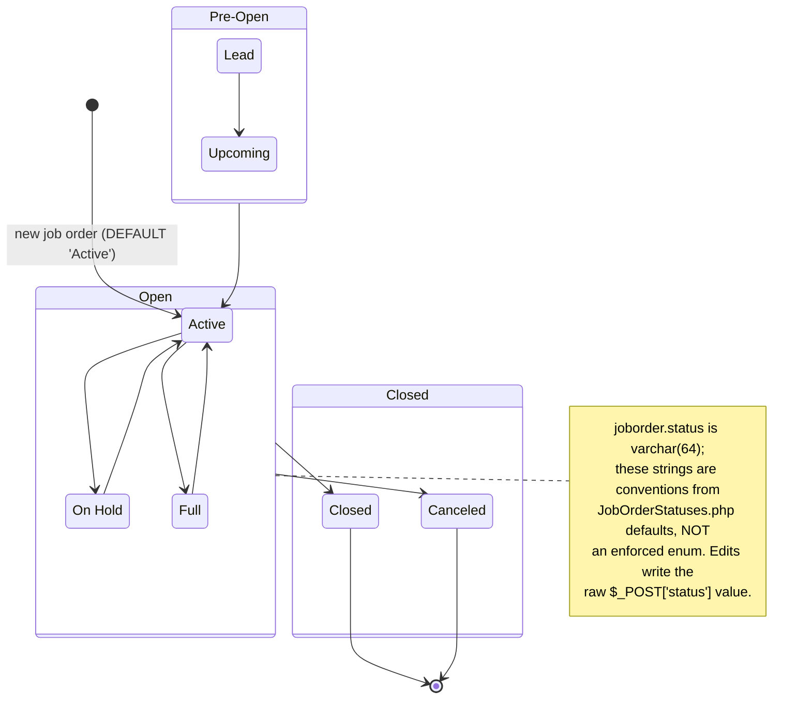
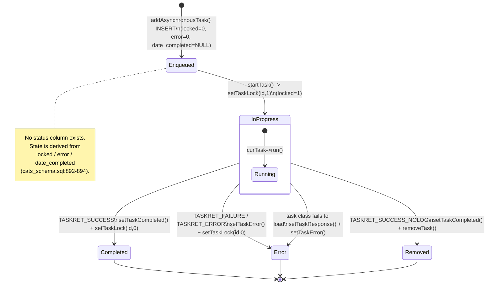

# 09 — State Diagrams

This document models the lifecycles that **actually exist** in the OpenCATS codebase and schema. Every state value, label, and transition is cited to `constants.php`, `db/cats_schema.sql`, or the concrete library method that performs it. Where a "lifecycle" is not actually enforced by code (free-text fields, derived states), this is stated explicitly.

Four lifecycles exist in the code/schema:

1. **Candidate pipeline status** — a numeric enum (`PIPELINE_STATUS_*` constants), persisted in `candidate_joborder.status`, with an audit trail in `candidate_joborder_status_history`.
2. **Job order status** — a free-text `varchar` field; "states" are conventional strings, **not** an enforced enum.
3. **Async queue item status** — **no status column exists**; the state is *derived* from the `locked`, `error`, and `date_completed` columns.
4. **Session / login state** — logged-out → logged-in (at an access level) → forced logout / disabled.

---

## 1. Candidate pipeline status

This is the only true enumerated state machine in OpenCATS. A candidate's progress through a job order pipeline is stored as a numeric `status` on the `candidate_joborder` join row.

### States (value + constant + label + cite)

The numeric constants are defined in `constants.php:120-130`:

| Value | Constant (`constants.php:120-130`) | Label (`candidate_joborder_status` seed, `db/cats_schema.sql:269-279`) | `triggers_email` |
|------:|------------------------------------|------------------------------------------------------------------------|:----------------:|
| `0`   | `PIPELINE_STATUS_NOSTATUS`           | `No Status`            (line 269) | 0 |
| `100` | `PIPELINE_STATUS_NOCONTACT`          | `No Contact`           (line 270) | 0 |
| `200` | `PIPELINE_STATUS_CONTACTED`          | `Contacted`            (line 271) | 0 |
| `250` | `PIPELINE_STATUS_CANDIDATE_REPLIED`  | `Candidate Responded`  (line 272) | 0 |
| `300` | `PIPELINE_STATUS_QUALIFYING`         | `Qualifying`           (line 273) | 1 |
| `400` | `PIPELINE_STATUS_SUBMITTED`          | `Submitted`            (line 274) | 1 |
| `500` | `PIPELINE_STATUS_INTERVIEWING`       | `Interviewing`         (line 275) | 1 |
| `600` | `PIPELINE_STATUS_OFFERED`            | `Offered`              (line 276) | 1 |
| `650` | `PIPELINE_STATUS_NOTINCONSIDERATION` | `Not in Consideration` (line 277) | 0 |
| `700` | `PIPELINE_STATUS_CLIENTDECLINED`     | `Client Declined`      (line 278) | 0 |
| `800` | `PIPELINE_STATUS_PLACED`             | `Placed`               (line 279) | 1 |

Note: `PIPELINE_STATUS_CANDIDATE_REPLIED` is defined at `constants.php:122` (value `250`) *before* `PIPELINE_STATUS_CONTACTED` (`constants.php:123`, value `200`), but the numeric **values** order them as `200` (Contacted) → `250` (Candidate Responded). The lookup table is queried `ORDER BY candidate_joborder_status_id ASC` (`lib/Pipelines.php:395-396`, `:419-420`), so the UI ordering follows the numeric value, not the constant definition order.

The schema column itself is `candidate_joborder.status int(11) NOT NULL DEFAULT '0'` (`db/cats_schema.sql:236`) — i.e. it defaults to `No Status` (0) at the SQL level, though application code overrides this on insert (see below).

### Transition triggers

- **Entry / "Add candidate to pipeline":** `Pipelines::add()` inserts the `candidate_joborder` row with `status` hardcoded to `100` (`No Contact`) — see the literal `100` in the INSERT at `lib/Pipelines.php:111`. So the practical initial state is `PIPELINE_STATUS_NOCONTACT`, not `No Status`.
- **Status change:** `Pipelines::setStatus($candidateID, $jobOrderID, $statusID, $emailAddress, $emailText)` (`lib/Pipelines.php:295`) performs the transition:
  - Reads the current status as `oldStatusID` (`lib/Pipelines.php:299-323`).
  - **No-op guard:** if `$oldStatusID == $statusID` it returns without touching the DB or history (`lib/Pipelines.php:325-331`).
  - `UPDATE candidate_joborder SET status = <new>` (`lib/Pipelines.php:334-348`).
  - Inserts an audit row via `Pipelines::addStatusHistory()` → `INSERT INTO candidate_joborder_status_history (... status_to, status_from)` (`lib/Pipelines.php:351-353`, `:428-453`); the history table is defined at `db/cats_schema.sql:283-298` with `status_from` and `status_to` columns.
  - Records a generic audit entry via `History::storeHistoryData(DATA_ITEM_PIPELINE, ...)` (`lib/Pipelines.php:358-366`).
  - If an `$emailAddress` was supplied, sends a `CANDIDATE_STATUSCHANGE_SUBJECT` notification (`lib/Pipelines.php:368-379`).
- **UI driver:** the status change is invoked from the candidates module via `CandidatesUI::_changeStatus()` (`modules/candidates/CandidatesUI.php:3420`), which calls `$pipelines->setStatus(...)` (`modules/candidates/CandidatesUI.php:3541-3543`). The public actions reaching it are `changeStatus()` / `onChangeStatus()` (`modules/candidates/CandidatesUI.php:1841`, `:2049`).
- **Placed side-effect:** when the new status is `PIPELINE_STATUS_PLACED` and openings remain, `JobOrders::updateOpeningsAvailable()` decrements the open count; moving *away* from `PLACED` increments it (`modules/candidates/CandidatesUI.php:3545-3554`).

### Honesty note — transitions are NOT a constrained graph

`setStatus()` accepts **any** `$statusID` and applies it directly; there is no code that restricts which status may follow which (e.g. nothing prevents jumping from `No Contact` straight to `Placed`, or moving backwards). The only gates are:

- the no-op guard (same → same is ignored), and
- the lookup filter `is_enabled = 1` and (for picking) `candidate_joborder_status_id != 0` used to populate the dropdown (`lib/Pipelines.php:393-396`, `:415-420`).

So the diagram below shows the **conventional forward progression** the values imply, but the engine itself permits any transition between any two enabled statuses. The dashed edges to the terminal-ish states emphasise they are reachable from many points.

```mermaid
stateDiagram-v2
    [*] --> NoContact: Pipelines::add() inserts status = 100

    NoContact: No Contact (100)
    Contacted: Contacted (200)
    CandidateResponded: Candidate Responded (250)
    Qualifying: Qualifying (300)
    Submitted: Submitted (400)
    Interviewing: Interviewing (500)
    Offered: Offered (600)
    Placed: Placed (800)
    NotInConsideration: Not in Consideration (650)
    ClientDeclined: Client Declined (700)

    NoContact --> Contacted: setStatus()
    Contacted --> CandidateResponded: setStatus()
    CandidateResponded --> Qualifying: setStatus()
    Qualifying --> Submitted: setStatus()
    Submitted --> Interviewing: setStatus()
    Interviewing --> Offered: setStatus()
    Offered --> Placed: setStatus()

    Qualifying --> NotInConsideration: setStatus()
    Submitted --> ClientDeclined: setStatus()
    Interviewing --> ClientDeclined: setStatus()
    Offered --> ClientDeclined: setStatus()

    Placed --> [*]

    note right of NoContact
        setStatus() permits ANY enabled
        status as the next value; this
        forward flow is convention only.
        Same-to-same is a no-op.
    end note
```

> The literal value `0` (`No Status` / `PIPELINE_STATUS_NOSTATUS`) is the SQL default of the column but is excluded from the pickable list (`getStatusesForPicking()`, `lib/Pipelines.php:418`), so it is not normally a chosen state. The home-page "important candidates" query treats both `PIPELINE_STATUS_NOCONTACT` and `PIPELINE_STATUS_NOSTATUS` as the pre-contact bucket (`lib/JobOrders.php:1022`).

---

## 2. Job order status

**This is a free-text `varchar`, not an enum.** The schema declares:

```
`status` varchar(64) COLLATE utf8_unicode_ci NOT NULL DEFAULT 'Active',
```

`db/cats_schema.sql:800` (table `joborder`, `db/cats_schema.sql:784`). There is an index on the first 8 chars: `KEY IDX_site_id_status (site_id, status(8))` (`db/cats_schema.sql:826`).

Because it is a string column, **any value can be stored**; the "states" are conventions defined as PHP arrays in `lib/JobOrderStatuses.php` (overridable via `config.php` constants — see the commented template at `lib/JobOrderStatuses.php:10-37`).

### Conventional status strings (cite)

From the defaults in `lib/JobOrderStatuses.php`:

| Group | Status strings | Cite |
|-------|----------------|------|
| `Open`     | `Active`, `On Hold`, `Full` | `lib/JobOrderStatuses.php:43` (`$_defaultStatusGroups`) |
| `Closed`   | `Closed`, `Canceled`        | `lib/JobOrderStatuses.php:44` |
| `Pre-Open` | `Upcoming`, `Lead`          | `lib/JobOrderStatuses.php:45` |

- **Default status:** `'Active'` — `JobOrderStatuses::getDefaultStatus()` returns `JOB_ORDER_STATUS_DEFAULT` if defined, else the private default `'Active'` (`lib/JobOrderStatuses.php:56`, `:162-168`). This matches the SQL `DEFAULT 'Active'`.
- **Sharing (XML/RSS/Careers portal):** only `Active` is shared by default (`$_defaultSharingStatuses = array('Active')`, `lib/JobOrderStatuses.php:54`; `getShareStatusSQL()`, `:93-108`).
- **Statistics:** `Active`, `OnHold`, `Full`, `Closed` (`$_defaultStatisticsStatuses`, `lib/JobOrderStatuses.php:55`; `getStatisticsStatusSQL()`, `:113-128`). *(Note the inconsistency: this default uses `OnHold` (no space) while the status group uses `On Hold` (with a space) — `lib/JobOrderStatuses.php:43` vs `:55`. This is a real artifact in the code, not a typo in this doc.)*

### Transition triggers — honesty note

There is **no state-machine method** for job order status. The value is set by job-order add/edit form handling: `modules/joborders/JobOrdersUI.php:1054` reads `$_POST['status']` (and validates only that it is non-empty). Any allowed transition is whatever the UI dropdown offers — there is **no code enforcing legal transitions** between job-order statuses, and no audit table specific to this field. Treat the diagram as a *convention map*, not an enforced FSM.



---

## 3. Async queue item status

**There is no `status` column on the `queue` table.** The lifecycle is *derived* from three columns:

From `db/cats_schema.sql:884-897` (`CREATE TABLE queue`):

- `date_completed datetime DEFAULT NULL` (`db/cats_schema.sql:892`) — NULL until done.
- `locked tinyint(1) unsigned NOT NULL DEFAULT '0'` (`db/cats_schema.sql:893`) — `1` while a worker is running the task.
- `error tinyint(1) unsigned DEFAULT '0'` (`db/cats_schema.sql:894`) — `1` on failure.
- `response varchar(255) DEFAULT NULL` (`db/cats_schema.sql:895`) — free-text result/diagnostic.

A task is selected for execution by `startNextTask()` only when it is **not locked, not errored, and not completed** — the comment and predicates are `locked = 0 AND error = 0 AND ISNULL(date_completed)` (`lib/QueueProcessor.php:162-163`, `:175-179`).

### Derived states + transition methods (cite)

| Derived state | Column condition | Set by |
|---------------|------------------|--------|
| **Enqueued** | `locked=0`, `error=0`, `date_completed IS NULL` | `addAsynchronousTask()` INSERT (`lib/QueueProcessor.php:278`, `:284-288`) |
| **In-progress (locked)** | `locked=1` | `startTask()` → `setTaskLock($taskID, 1)` (`lib/QueueProcessor.php:229`, `:231`; `setTaskLock` at `:54-70`) |
| **Completed** | `date_completed` set, `locked=0` | `setTaskCompleted($taskID)` → `UPDATE queue SET date_completed = NOW()` (`lib/QueueProcessor.php:99-117`); unlock via `setTaskLock(...,0)` at `:249` |
| **Error** | `error=1`, `locked=0` | `setTaskError($taskID)` → `UPDATE queue SET error = <code>` (`lib/QueueProcessor.php:73-96`); unlock at `:249` |

`startTask()` drives the terminal transitions via the task's return value (`lib/QueueProcessor.php:247-271`):

- `TASKRET_SUCCESS` → `setTaskCompleted()` (`:254-256`)
- `TASKRET_FAILURE` / `TASKRET_ERROR` → `setTaskError()` (`:258-264`)
- `TASKRET_SUCCESS_NOLOG` → `setTaskCompleted()` **then** `removeTask()` (row deleted) (`:266-270`)
- If the task class cannot be loaded, `setTaskResponse(...)` + `setTaskError()` before running (`:236-244`).

Note: `setTaskLock($taskID, 0)` is always called after `run()` returns (`lib/QueueProcessor.php:249`), so completed and errored rows end up unlocked.



> Cleanup transitions also exist: completed rows older than a threshold are purged (`(TO_DAYS(NOW()) - TO_DAYS(date_completed)) > %s AND ... NOT ISNULL(date_completed)`, `lib/QueueProcessor.php:455-461`), and a timeout sweep flips long-locked rows to `error=1, locked=0` (`lib/QueueProcessor.php:477-480`). See doc `12 — Async Queue & Scheduled Jobs` for the surrounding cron/CLI mechanics.

---

## 4. Session / login state

A `Session` object (`lib/Session.php`) tracks `$_isLoggedIn` (`lib/Session.php:48`, default `false`) and `$_accessLevel` (`:46`, default `-1`). Login is evaluated by `Users::isCorrectLogin()` (`lib/Users.php:796`), which returns one of the `LOGIN_*` codes; `Session::login()` then sets state in the big `switch ($loginStatus)` at `lib/Session.php:749`.

### Login result codes (cite)

Defined in `lib/Users.php:41-47`:

| Constant | Value | Meaning |
|----------|------:|---------|
| `LOGIN_SUCCESS`               | `1`  | Valid password, account enabled → logged in |
| `LOGIN_INVALID_USER`          | `-1` | No such user (or LDAP failure) |
| `LOGIN_INVALID_PASSWORD`      | `-2` | Wrong password |
| `LOGIN_DISABLED`              | `-3` | `access_level <= ACCESS_LEVEL_DISABLED` |
| `LOGIN_CANT_CHANGE_PASSWORD`  | `-4` | (used only in the change-password path, `lib/Users.php:703-705`) |
| `LOGIN_ROOT_ONLY`             | `-5` | Slave mode, non-root user |
| `LOGIN_PENDING_APPROVAL`      | `-6` | New LDAP user auto-created, awaiting approval |

### Access levels (cite — `constants.php:74-82`)

| Constant | Value |
|----------|------:|
| `ACCESS_LEVEL_DELETED`  | `-100` |
| `ACCESS_LEVEL_DISABLED` | `0` |
| `ACCESS_LEVEL_READ`     | `100` |
| `ACCESS_LEVEL_EDIT`     | `200` |
| `ACCESS_LEVEL_DELETE`   | `300` |
| `ACCESS_LEVEL_DEMO`     | `350` |
| `ACCESS_LEVEL_SA`       | `400` |
| `ACCESS_LEVEL_MULTI_SA` | `450` |
| `ACCESS_LEVEL_ROOT`     | `500` |

### Transition triggers (cite)

- **Authentication:** `Users::isCorrectLogin()` returns:
  - `LOGIN_INVALID_USER` for empty/unknown username (`lib/Users.php:803`, `:830`).
  - `LOGIN_INVALID_PASSWORD` for empty/wrong password (`lib/Users.php:808`, `:857`).
  - `LOGIN_DISABLED` when `access_level <= ACCESS_LEVEL_DISABLED` (`lib/Users.php:870-874`).
  - `LOGIN_ROOT_ONLY` when `CATS_SLAVE` and `access_level < ACCESS_LEVEL_ROOT` (`lib/Users.php:877-880`).
  - `LOGIN_PENDING_APPROVAL` for a newly auto-created LDAP user (`lib/Users.php:863-868`).
  - `LOGIN_SUCCESS` otherwise.
- **Becoming logged in:** in the `LOGIN_SUCCESS` branch, `Session` populates user fields and sets `$this->_isLoggedIn = true` (`lib/Session.php:811`, `:900`). All failure branches set `$this->_isLoggedIn = false` (`lib/Session.php:752`, `:770`, `:788`, `:806`).
- **Access-level downgrades during a successful login** (`lib/Session.php`):
  - Demo mode → `ACCESS_LEVEL_DEMO` (`:850-856`).
  - `accountActive == 0` → `ACCESS_LEVEL_READ` (`:862-866`).
  - `accountDeleted == 1` → `ACCESS_LEVEL_DISABLED` (`:868-872`).
- **Logout:** `Session::logout()` sets `$this->_isLoggedIn = false` (`lib/Session.php:254-257`).
- **Forced logout (mid-session):** on every request `index.php` re-checks the user (`index.php:108-143`). It calls `Users::getForceLogoutData()` (`lib/Users.php:450`; selects `force_logout` at `:455`) and, if `forceLogout == 1` **or** the real access level changed, it updates the session's real access level. If the new level is `ACCESS_LEVEL_DISABLED` or `forceLogout == 1`, it calls `logout()`, unsets `$_SESSION['CATS']`, and redirects to `m=login` (`index.php:117-141`).
- **Access-level clamp:** `Session::setRealAccessLevel()` lowers the effective `$_accessLevel` if the real level is lower (`lib/Session.php:422-429`).

```mermaid
stateDiagram-v2
    [*] --> LoggedOut

    LoggedOut --> LoggedOut: failed login\n(INVALID_USER / INVALID_PASSWORD /\nDISABLED / ROOT_ONLY / PENDING_APPROVAL)\nSession sets _isLoggedIn = false

    LoggedOut --> LoggedIn: isCorrectLogin()==LOGIN_SUCCESS\nSession::login() sets _isLoggedIn = true

    state LoggedIn {
        [*] --> AtAccessLevel
        AtAccessLevel: Effective access level\n(READ..ROOT, or DEMO)
        AtAccessLevel --> AtAccessLevel: account inactive -> ACCESS_LEVEL_READ\naccount deleted -> ACCESS_LEVEL_DISABLED\ndemo -> ACCESS_LEVEL_DEMO
    }

    LoggedIn --> LoggedOut: Session::logout()
    LoggedIn --> LoggedOut: index.php force-logout\n(forceLogout==1 or level==DISABLED)\n-> logout() + unset session + redirect m=login

    LoggedOut --> [*]
```

---

## Source evidence

| Lifecycle | Primary sources |
|-----------|-----------------|
| Pipeline status | `constants.php:120-130` (constants); `db/cats_schema.sql:255-298` (`candidate_joborder_status`, `candidate_joborder_status_history`); `db/cats_schema.sql:231-236` (`candidate_joborder.status` col); `lib/Pipelines.php:90-131` (`add()`, initial 100), `:295-380` (`setStatus()`), `:428-453` (`addStatusHistory()`), `:383-425` (lookups); `modules/candidates/CandidatesUI.php:3420-3554` (`_changeStatus()` → `setStatus()`) |
| Job order status | `db/cats_schema.sql:784-826` (`joborder` table, `status varchar(64) DEFAULT 'Active'`, line 800); `lib/JobOrderStatuses.php:10-168` (default status groups, filters, sharing, statistics, default); `modules/joborders/JobOrdersUI.php:1054` (`$_POST['status']`) |
| Async queue | `db/cats_schema.sql:884-897` (`queue` table; `date_completed`/`locked`/`error`/`response`); `lib/QueueProcessor.php:54-117` (`setTaskLock`/`setTaskError`/`setTaskCompleted`), `:162-179` (selection predicates), `:229-275` (`startTask`), `:278-288` (`addAsynchronousTask`), `:455-461` & `:477-480` (cleanup/timeout) |
| Session / login | `lib/Users.php:41-47` (`LOGIN_*`), `:450-455` (`getForceLogoutData`), `:796-880` (`isCorrectLogin`); `constants.php:74-82` (`ACCESS_LEVEL_*`); `lib/Session.php:46-48` (fields), `:244-257` (`isLoggedIn`/`logout`), `:422-429` (`setRealAccessLevel`), `:749-901` (login switch, downgrades); `index.php:108-143` (force-logout block) |

## Unverified / open questions

- **Pipeline transitions are not constrained by code.** `Pipelines::setStatus()` (`lib/Pipelines.php:295`) applies any supplied `$statusID` directly; the only guard is the same→same no-op (`:325-331`). The forward progression in the diagram is a UI/value convention, not an enforced FSM. No code rejects "backwards" or "skip-ahead" transitions.
- **Job order status is genuinely free-text** (`varchar(64)`, `db/cats_schema.sql:800`). The status strings are PHP-array conventions in `lib/JobOrderStatuses.php` and can be overridden by `config.php` constants (template at `lib/JobOrderStatuses.php:10-37`); the DB will accept arbitrary strings. There is no transition validation and no per-status audit table for job orders. The diagram is a convention map only.
- **Inconsistent job-order status spelling in the defaults:** the `Open` group uses `'On Hold'` (with space, `lib/JobOrderStatuses.php:43`) while `$_defaultStatisticsStatuses` uses `'OnHold'` (no space, `lib/JobOrderStatuses.php:55`). Whether real installs store `On Hold` vs `OnHold` was not verified against live data.
- **Queue "status" is entirely derived** — there is no enum/status column. The model here is reconstructed from the column predicates used by the processor; it reflects code behavior, not a declared state field.
- `LOGIN_CANT_CHANGE_PASSWORD` (`lib/Users.php:45`, value `-4`) is part of the change-password flow (`lib/Users.php:703-705`), not the main login `switch`, so it does not appear as a session-state transition in the diagram.
- The exact set of user-facing job-order status dropdown options at runtime depends on `config.php` overrides, which were not inspected (only the library defaults were verified).
