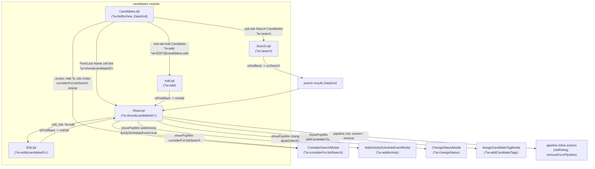

# 10 — UI Workflow & Navigation

This document describes how OpenCATS maps modules to screens (`.tpl` templates),
how the top navigation tabs and per-module sub-tabs are built, how list views
(DataGrid) work, and how the show / edit / add / search / modal flows hang
together. Every claim below is grounded in the actual source files in this
repository.

OpenCATS has no MVC router framework — a single front controller (`index.php`)
loads a module's `*UI.php` class and calls `handleRequest()`, which `switch`es
on the `a=` (action) GET parameter and renders one `.tpl` Smarty-ish PHP template
through `Template::display()`.

---

## The chrome — how every authenticated page is framed

### Front-controller dispatch

`index.php` resolves the requested module (`?m=`) and calls
`ModuleUtility::loadModule()`, which instantiates the module's UI class and
invokes `handleRequest()`:

```php
$module = new $moduleClass();
$module->handleRequest();
```
(lib/ModuleUtility.php:78-79)

The module registry is built by scanning every `modules/*/`*`UI.php` file. For
each module it stores a 5-element array keyed by module name
`[UIClass, tabText, subTabsExternal, settingsEntries, settingsUserCategories]`:

```php
$modules[$moduleName] = array(
    $moduleClass,
    $module->getModuleTabText(),
    $module->getSubTabsExternal(),
    $module->getSettingsEntries(),
    $module->getSettingsUserCategories()
);
```
(lib/ModuleUtility.php:267-273)

So index `[1]` of each module entry is the **tab text** and index `[2]` is its
external sub-tabs — exactly the indices `TemplateUtility::printTabs()` reads
later (`$parameters[1]`, see below).

Each UI class extends `UserInterface` and declares its identity and sub-tabs in
its constructor — e.g. `CandidatesUI`:

```php
$this->_moduleDirectory = 'candidates';
$this->_moduleName      = 'candidates';
$this->_moduleTabText   = 'Candidates';
$this->_subTabs = array(
    'Add Candidate'     => CATSUtility::getIndexName() . '?m=candidates&amp;a=add*al=' . ACCESS_LEVEL_EDIT . '@candidates.add',
    'Search Candidates' => CATSUtility::getIndexName() . '?m=candidates&amp;a=search'
);
```
(modules/candidates/CandidatesUI.php:71-77)

`getModuleTabText()` and `getSubTabs()` are the accessors `TemplateUtility` uses
(lib/UserInterface.php:84-87, 114-123).

### Every authenticated template renders the same four chrome calls

A list/detail/form template's first lines are always (Candidates list view):

```php
<?php TemplateUtility::printHeader('Candidates', array(...js/css...)); ?>
<?php TemplateUtility::printHeaderBlock(); ?>
<?php TemplateUtility::printTabs($this->active); ?>
...
<?php TemplateUtility::printQuickSearch(); ?>
...
<?php TemplateUtility::printFooter(); ?>
```
(modules/candidates/Candidates.tpl:2-4, 13, 172)

- **`printHeader($pageTitle, $headIncludes)`** — opens `<html><head>`, loads
  the core JS bundle (`js/lib.js`, `js/quickAction.js`, `js/submodal/subModal.js`,
  jQuery, …), injects the CSRF token + an `onload` hook that auto-adds a
  `csrfToken` hidden field to every same-origin POST form, then opens `<body>`
  and draws the quick-action-menu holder + popup container
  (lib/TemplateUtility.php:64-70, 1276-1406, 1310-1374, 564-581).
- **`printHeaderBlock()`** — the OpenCATS logo plus the top-right block: the
  logout form (with CSRF token), the logged-in user's full name / username /
  site name, an "Administrator" / "Read Only Access" / "Account Inactive"
  badge, and the new-version notice (lib/TemplateUtility.php:95-211).
- **`printTabs($active, $subActive, $forceHighlight)`** — the primary module tab
  bar and the active module's secondary sub-tab bar (detailed next)
  (lib/TemplateUtility.php:591-816).
- **`printQuickSearch()`** — the "Recent:" MRU list + the Quick Search box that
  posts to `?m=home&a=quickSearch` (or `?m=asp&a=aspSearch` in MSA mode)
  (lib/TemplateUtility.php:265-311).
- **`printFooter()`** — the timer/footer: prints the OpenCATS version + build,
  the "Powered by OpenCATS" link, the copyright, and crucially the
  **server response time** ("timer"): `$_SESSION['CATS']->getExecutionTime()`,
  then closes `</body></html>` (lib/TemplateUtility.php:823-870, 826, 853).
  Report pages use `printReportFooter()` instead (lib/TemplateUtility.php:877-902).

### How `printTabs` builds the tab bar

`printTabs()` loops over `ModuleUtility::getModules()`. For each module it reads
the tab text from `$parameters[1]`:

```php
$modules = ModuleUtility::getModules();
foreach ($modules as $moduleName => $parameters)
{
    $tabText = $parameters[1];
    if (empty($tabText)) { continue; }   // modules with empty tab text are hidden (e.g. login)
    ...
}
```
(lib/TemplateUtility.php:617-626)

- Modules with empty tab text (e.g. the `login` module — its entry in the
  registry example is `'login' => array('LoginUI', '')`,
  lib/ModuleUtility.php:198) are skipped, so they never get a tab.
- A special case renames the **Companies** tab to **My Company** when HR mode is
  on (lib/TemplateUtility.php:629-632).
- The hook `TEMPLATE_UTILITY_EVALUATE_TAB_VISIBLE` can set `$displayTab = false`
  to suppress a module's tab (lib/TemplateUtility.php:635-642).
- The current module (`$moduleName == $active->getModuleName()`) gets
  `class="active"`; others get `class="inactive"`, unless force-highlighted
  (lib/TemplateUtility.php:645-695).

For the active module, the secondary `<ul id="secondary">` is filled by iterating
`$active->getSubTabs($modules)` — i.e. the module's own `_subTabs` merged with any
external sub-tabs other modules contributed (lib/TemplateUtility.php:697-810,
and the merge in lib/UserInterface.php:114-123 / getThisSubTabsExternal 402-423).

---

## Screen types

All templates live under `modules/<module>/*.tpl`. The recurring screen types,
each with a real cited example:

| Type | Example template | Header call | Notes |
|------|------------------|-------------|-------|
| **List / DataGrid** | `modules/candidates/Candidates.tpl` | `printHeader` + `printTabs` | Renders a `DataGrid` via `$this->dataGrid->draw()` (Candidates.tpl:122) |
| **Show (detail)** | `modules/candidates/Show.tpl` | `printHeader` + `printTabs` (or `printModalHeader` when popup) | Detail tables + pipeline list + action links |
| **Add form** | `modules/candidates/Add.tpl` | `printModalHeader` when `$this->isModal`, else `printHeader`+`printTabs` | POSTs back to `a=add` |
| **Edit form** | `modules/candidates/Edit.tpl` | `printHeader` + `printTabs` | POSTs back to `a=edit` |
| **Search form** | `modules/candidates/Search.tpl` | `printHeader` + `printTabs` | Submits "getback" to `a=search`, results shown in a DataGrid |
| **Modal** | `modules/candidates/*Modal.tpl` | `printModalHeader` | Loaded into the submodal iframe via `showPopWin(...)` |
| **Dashboard** | `modules/home/Home.tpl` | `printHeader` + `printTabs` | "Dashboard" tab; mini DataGrids via `drawHTML()` |

### List / DataGrid view

`modules/candidates/Candidates.tpl` (action `a=listByView`) shows the canonical
list page. After the chrome it:

- prints the page header + a view-selector form (`action=...?m=candidates&a=listByView`)
  with "Only My Candidates" / "Only Hot Candidates" checkboxes that toggle
  DataGrid filters via `getJSAddRemoveFilterFromCheckbox()`
  (Candidates.tpl:24-40, 34, 38);
- shows the "Filter by tag" dropdown (Candidates.tpl:42-83);
- draws the grid controls and grid itself:

```php
<?php $this->dataGrid->drawRowsPerPageSelector(); ?>
<?php $this->dataGrid->drawShowFilterControl(); ?>
...
<?php $this->dataGrid->drawFilterArea(); ?>
<?php $this->dataGrid->draw();  ?>
...
<?php $this->dataGrid->printActionArea(); ?>
<?php $this->dataGrid->printNavigation(true); ?>
```
(Candidates.tpl:116-129)

- When there are **zero** candidates it renders the empty-state "no data" splash
  with big "Add Candidate" / "Add Mass Import" buttons instead of a grid — and
  those buttons only appear if `getUserAccessLevel('candidates.add') >= ACCESS_LEVEL_EDIT`
  (Candidates.tpl:133-167, 140).

### Show (detail) view

`modules/candidates/Show.tpl` is the candidate detail screen. Key patterns:

- It can render **either** full-page **or** inside a popup. When `$this->isPopup`
  it calls `printModalHeader`-style minimal chrome; otherwise it calls
  `printHeader` + `printHeaderBlock` + `printTabs` + `printQuickSearch`
  (Show.tpl:6-15).
- A details table (`class="detailsOutside"` / `detailsInside`) shows the
  candidate's fields (Show.tpl:61-88).
- An **Edit** link: `?m=candidates&a=edit&candidateID=...` (Show.tpl:449).
- Quick-action menus are emitted with
  `TemplateUtility::printSingleQuickActionMenu(new CandidateQuickActionMenu(...))`
  (Show.tpl:85, lib/TemplateUtility.php:1187-1190).
- A **pipelines** table listing each job order the candidate is in, each row with
  inline actions (screen, change status, remove) — see the per-module flow below
  (Show.tpl:519-570).

### Add / Edit forms

`Add.tpl` is dual-mode: in modal context it uses `printModalHeader('Candidates',
[...], 'Add New Candidate to this Job Order')`; otherwise full chrome with
`printTabs($this->active, $this->subActive)` (modules/candidates/Add.tpl:2-7).
`Edit.tpl` is always full-page chrome (`printHeader`+`printHeaderBlock`+`printTabs`,
modules/candidates/Edit.tpl:2-4). Both POST back to the same action — the UI's
`handleRequest()` distinguishes the GET (render form) from the POST (process)
case via `isPostBack()`:

```php
case 'add':
    ...
    if ($this->isPostBack()) { $this->onAdd(); }
    else                     { $this->add(); }
```
(modules/candidates/CandidatesUI.php:96-110; `edit` is the parallel case 112-126;
`isPostBack()` defined lib/UserInterface.php:209-217)

### Search form

`Search.tpl` renders the search form with full chrome
(modules/candidates/Search.tpl:2-5). Search uses the **getback** convention
rather than postback — the form result is detected with `isGetBack()`:

```php
case 'search':
    ...
    if ($this->isGetBack()) { $this->onSearch(); }
    else                    { $this->search(); }
```
(modules/candidates/CandidatesUI.php:143-159; `isGetBack()` lib/UserInterface.php:225-233)

### Modals

`*Modal.tpl` files (e.g. `ChangeStatusModal.tpl`, `AddActivityScheduleEventModal.tpl`,
`ConsiderSearchModal.tpl`, `AssignCandidateTagModal.tpl`, `CreateAttachmentModal.tpl`)
open with `printModalHeader(...)` which uses a light grey body and pushes a title
into the parent window via `parentSetPopTitle(...)`
(lib/TemplateUtility.php:79-88). Several are mode-aware — e.g.
`ChangeStatusModal.tpl` switches its title between "Job Orders: Change Status" and
"Candidates: Change Status" depending on `$this->isJobOrdersMode`
(modules/candidates/ChangeStatusModal.tpl:2-6). Modals are opened from links via
the submodal helper `showPopWin(url, width, height, null)` (e.g. Show.tpl:566).
Fatal errors inside a modal render `ErrorModal.tpl` via
`UserInterface::fatalModal()` (lib/UserInterface.php:281-306).

### Dashboard

`modules/home/Home.tpl` is the post-login landing page. `HomeUI` declares
`_moduleTabText = 'Dashboard'` and **no** sub-tabs
(`$this->_subTabs = array()`) (modules/home/HomeUI.php:43-44). The dashboard
renders small DataGrids inline with `drawHTML()` (a compact, non-tabular render),
e.g. `$this->dataGrid2->drawHTML()` for "My Recent Calls"
(modules/home/Home.tpl:14; `drawHTML()` lib/DataGrid.php:1562-1612).

---

## List views (DataGrid)

`DataGrid` is an abstract base; each module supplies concrete grids in
`modules/<module>/dataGrids.php`, and a per-module base class (e.g.
`CandidatesDataGrid` in `lib/Candidates.php`) supplies the column catalogue and
the `getSQL()`. The contract is documented in the long header comment
(lib/DataGrid.php:42-225).

### Instantiation & instance naming

Grids are fetched by an identifier `module:className`:

```php
$dataGrid = DataGrid::get("candidates:candidatesListByViewDataGrid", $dataGridProperties);
```
`DataGrid::get()` splits the identifier, includes
`modules/<module>/dataGrids.php`, and `new`s the class
(lib/DataGrid.php:243-307). `getFromRequest()` rebuilds a grid from the request
vars `i` (identifier) and `p` (JSON parameters) — used by AJAX/export endpoints
(lib/DataGrid.php:315-337).

### Columns

A concrete grid's constructor sets `_defaultColumns` (the initial layout, name +
pixel width) and inherits `_classColumns` (every possible column). Example
default columns for the main candidate list:

```php
$this->_defaultColumns = array(
    array('name' => 'Attachments', 'width' => 31),
    array('name' => 'First Name', 'width' => 75),
    array('name' => 'Last Name', 'width' => 85),
    array('name' => 'City', 'width' => 75),
    array('name' => 'State', 'width' => 50),
    array('name' => 'Key Skills', 'width' => 215),
    array('name' => 'Owner', 'width' => 65),
    array('name' => 'Created', 'width' => 60),
    array('name' => 'Modified', 'width' => 60),
);
```
(modules/candidates/dataGrids.php:24-34)

Each `_classColumns` entry carries SQL fragments and render code. For example the
"First Name" column has a `select`, a `pagerRender` (HTML cell, here a link to the
candidate Show page with hot/cold CSS class), and a `sortableColumn`:

```php
'First Name' => array(
    'select'         => 'candidate.first_name AS firstName',
    'pagerRender'    => '... return \'<a href="...?m=candidates&a=show&candidateID=\'.$rsData[\'candidateID\'].\'" ...>\'.htmlspecialchars($rsData[\'firstName\']).\'</a>\';',
    'sortableColumn' => 'firstName',
    ...
),
```
(lib/Candidates.php:2000-2006)

If a column has no `pagerRender`, the raw `sortableColumn` value is echoed
directly into the cell (lib/DataGrid.php:1969-1976). Column SELECT/JOIN fragments
are de-duplicated by MD5 before being assembled into the query
(lib/DataGrid.php:1115-1126).

### The query

`_getData()` assembles `selectSQL`, `joinSQL`, `whereSQL`, `havingSQL`, the
`ORDER BY` and the `LIMIT`, then hands them to the concrete grid's `getSQL()`,
which wraps them in the actual `FROM`/site-scoped query. For candidates:

```php
"SELECT SQL_CALC_FOUND_ROWS %s
    candidate.candidate_id AS candidateID,
    candidate.candidate_id AS exportID,
    ...
 FROM candidate %s
 WHERE candidate.site_id = %s ..."
```
(lib/DataGrid.php:1395; lib/Candidates.php:2299, 2328-2343). The total row count
comes from `SELECT FOUND_ROWS()` (lib/DataGrid.php:1399-1401).

### Sorting

Sort state lives in the `sortBy` / `sortDirection` parameters, validated in the
constructor: `sortBy` must be a real `sortableColumn` or it `die()`s, and
`sortDirection` is forced to `ASC`/`DESC` (lib/DataGrid.php:456-498). A column
header that has a `sortableColumn` is rendered as a sort link that flips
direction, drawing an up/down/no-sort arrow image (lib/DataGrid.php:1813-1876).
`ORDER BY` is built at lib/DataGrid.php:1393.

### Paging (Pager) and per-page selector

Paging is parameter-driven, not a separate Pager object: `rangeStart` +
`maxResults` drive the `LIMIT` clause (lib/DataGrid.php:1363-1375), and the
constructor clamps the current page between 1 and `_totalPages`, re-querying if
needed (lib/DataGrid.php:588-613). Navigation is drawn by `printNavigation()` —
the `<< First / << Prev / Page N of M / Next >> / Last >>` controls
(lib/DataGrid.php:2281-2443, with `_getPreviousLink()` 2632-2657 and
`_getNextLink()` 2596-2625). The rows-per-page dropdown (15/30/50/100) is
`drawRowsPerPageSelector()` (lib/DataGrid.php:764-819). Passing `true` to
`printNavigation()` also draws the A-Z alpha-navigation bar
(lib/DataGrid.php:2355-2442; alpha filter applied in SQL at 1378-1381).

> Note: there is a `lib/Pager.php` in the repo, but the DataGrid paging shown
> here is implemented inside `DataGrid` itself via `rangeStart`/`maxResults`; see
> Unverified below.

### CSV export — `drawCSV()`

`drawCSV()` reloads the full result set ignoring the page LIMIT, builds a header
row from each exportable column (using `exportColumnHeaderText` if present), then
for each row emits the `exportRender` value (or the `sortableColumn` value),
double-quoting and escaping embedded quotes. It sends
`Content-Disposition: attachment; filename="export.csv"` and a
`text/x-csv` content type, optionally writes a BOM, echoes the CSV, and `die()`s
(lib/DataGrid.php:1444-1554; quoting at 1514, headers 1523-1526, BOM 1528-1543).

### Per-row quick actions, mass actions & filter area

- **Checkboxes & "select all"**: when `showExportCheckboxes` is true and the SQL
  returns an `exportID`, each row gets a checkbox that toggles membership in a JS
  `exportArray` (lib/DataGrid.php:1941-1944), and `printActionArea()` adds the
  "select all" box + the **Action** menu (lib/DataGrid.php:2000-2018).
- **Action menu items** are produced by `getInnerActionArea()`, overridden per
  grid. The candidate list adds **Add To List**, **Add To Job Order**,
  **Send E-Mail**, **Export** — each gated by the user's access level
  (modules/candidates/dataGrids.php:48-72). Items can be plain links
  (`getInnerActionAreaItem`), POSTs (`getInnerActionAreaItemPost`), or popups
  (`getInnerActionAreaItemPopup`) and offer **Selected** vs **All** variants
  (lib/DataGrid.php:2028-2213).
- **Choose-columns box** + drag-to-resize/reorder: the "+" column-selector
  dropdown (`showChooseColumnsBox`) lets the user add/remove/reset columns; column
  layout persists per-user in the session/db via `saveColumns()`
  (lib/DataGrid.php:1683-1731, 1086-1089). Add/remove/reorder are processed in
  `buildColumns()` (lib/DataGrid.php:964-1079).
- **Filter area**: `drawShowFilterControl()` toggles the filter fieldset;
  `drawFilterArea()` renders active filters and the DHTML add-filter UI
  (`lib/datagrid/FilterArea.tpl`), with operators `==`, `=~` (contains),
  `=>`, `=<`, `=#`, and a near-zipcode `=@` (lib/DataGrid.php:826-956;
  operator → SQL mapping in `_getData()` 1192-1325).

---

## Navigation map

```mermaid
flowchart TD
    Login["Login page (?m=login)"] -->|authenticate| Home["Dashboard (?m=home) — Home.tpl"]
    Home -->|click module tab| ModTab{"Module tab\n(printTabs)"}

    ModTab -->|?m=candidates| CList["Candidates list\n?a=listByView — Candidates.tpl\n(DataGrid)"]
    ModTab -->|?m=joborders| JList["Job Orders list\n?a=listByView — JobOrders.tpl"]
    ModTab -->|other modules| OList["companies / contacts / activity / lists / settings ..."]

    CList -->|row link ?a=show| CShow["Candidate detail\nShow.tpl"]
    CList -->|sub-tab 'Add Candidate' ?a=add| CAdd["Add form — Add.tpl"]
    CList -->|sub-tab 'Search Candidates' ?a=search| CSearch["Search form — Search.tpl"]
    CList -->|Action menu / CSV| CMass["mass actions / drawCSV export"]

    CShow -->|Edit link ?a=edit| CEdit["Edit form — Edit.tpl"]
    CShow -->|showPopWin(...)| CModals["Modals:\nChangeStatusModal / AddActivityScheduleEventModal /\nConsiderSearchModal / AssignCandidateTagModal / Attachment"]
    CSearch -->|getback ?a=search results| CSearchResults["results DataGrid"]
    CSearchResults -->|row link| CShow

    CAdd -->|postback ?a=add| CShow
    CEdit -->|postback ?a=edit| CShow
    CShow -.back/breadcrumb.-> CList
    CModals -.close/refresh.-> CShow
```

The "back-links": Show pages link to the list implicitly via the module tab, and
to related records (job orders, companies) inline; Add/Edit POST back and the UI
redirects to the Show page of the saved record.

---

## Per-module UI flow — Candidates

Grounded in `modules/candidates/CandidatesUI.php` (the `handleRequest()` switch)
and the real templates/links:



Cited anchors for the candidate flow:

- `handleRequest()` switch with `show / add / edit / delete / search /
  viewResume / considerForJobSearch` cases, each guarded by
  `getUserAccessLevel('candidates.<action>')`
  (modules/candidates/CandidatesUI.php:81-180).
- List → Show: the First/Last Name `pagerRender` builds `?m=candidates&a=show&candidateID=`
  (lib/Candidates.php:2001, 2010).
- Sub-tabs Add/Search defined in the constructor
  (modules/candidates/CandidatesUI.php:74-77).
- Show → Edit: `?m=candidates&a=edit&candidateID=` (Show.tpl:449).
- Show → modals via `showPopWin(...)`: log activity / schedule event
  `?a=addActivity...&onlyScheduleEvent=true` (Show.tpl:345-346), change status
  `?a=changeStatus` (Show.tpl:565-566), consider for job
  `?a=considerForJobSearch` (Show.tpl:599-600), add tags `?a=addCandidateTags`
  (Show.tpl:433).
- Pipeline rows with inline screen/status/remove actions and rating stars
  (Show.tpl:519-570).
- The candidate list Action menu's "Add To Job Order" popup
  (modules/candidates/dataGrids.php:60).

(The **Job Orders** module mirrors this: `JobOrdersUI` declares its tab text
"Job Orders" and two sub-tabs — "Add Job Order" (a JS popup) and "Search Job
Orders" — modules/joborders/JobOrdersUI.php:83-88, with `Show.tpl`/`Edit.tpl`
following the same show/edit pattern.)

---

## Tab visibility & access — the `*al=` / `@securedObject` syntax

`printTabs()` documents and implements three special suffix conventions inside
tab text and sub-tab URLs (lib/TemplateUtility.php:593-607):

- **`*al=<level>`** — show the tab/sub-tab only if the user's *root* access level
  ≥ `<level>`.
- **`*al=<level>@<securedObject>`** — show only if the user's access level **for
  that named secured object** ≥ `<level>`.
- **`*js=<code>`** (sub-tabs only) — attach JS to the link's `onclick` instead of
  navigating.
- **`*hrmode=0|1`** (sub-tabs only) — show only in/out of HR mode.

#### Module-tab visibility

For an inactive module tab the suffix is parsed and the access check applied:

```php
$al = substr($tabText, $alPosition + 4);
$soPosition = strpos($al, "@");
$soName = '';
if ($soPosition !== false) {
    $soName = substr($al, $soPosition + 1);   // the secured-object name after '@'
    $al     = substr($al, 0, $soPosition);    // the numeric level before '@'
}
if ($_SESSION['CATS']->getAccessLevel($soName) >= $al || $_SESSION['CATS']->isDemo()) {
    echo '<li><a ...>', substr($tabText, 0, $alPosition), '</a></li>';
}
```
(lib/TemplateUtility.php:656-678)

If the access check fails the `<li>` is simply not emitted, so the tab disappears.
(Demo users bypass the check via `isDemo()`.)

#### Sub-tab visibility

Sub-tab URLs are parsed the same way. The candidate "Add Candidate" sub-tab is
declared as
`...?m=candidates&a=add*al=ACCESS_LEVEL_EDIT@candidates.add`
(modules/candidates/CandidatesUI.php:75). In `printTabs`:

```php
$alPosition = strpos($link, "*al=");
if ($alPosition !== false) {
    $al = substr($link, $alPosition + 4);
    $soPosition = strpos($al, "@");
    $soName = '';
    if ($soPosition !== false) {
        $soName = substr($al, $soPosition + 1);
        $al     = substr($al, 0, $soPosition);
    }
    if ($_SESSION['CATS']->getAccessLevel($soName) >= $al || $_SESSION['CATS']->isDemo()) {
        $link = substr($link, 0, $alPosition);   // strip suffix, keep link
    } else {
        $link = '';                              // hide sub-tab
    }
}
```
(lib/TemplateUtility.php:730-752)

An empty `$link` means the sub-tab is not drawn (lib/TemplateUtility.php:800-804).
HR-mode (`*hrmode=`) and JS (`*js=`) suffixes are handled in the same loop
(lib/TemplateUtility.php:713-760), plus a few hard-coded special sub-tabs
(internalPostings / administration / EEO report) with their own visibility rules
(lib/TemplateUtility.php:766-796).

#### The hooks

Two hooks fire inside `printTabs`:

- **`TEMPLATE_UTILITY_EVALUATE_TAB_VISIBLE`** — evaluated per module before
  drawing its tab; it can flip `$displayTab` to hide a module
  (lib/TemplateUtility.php:637-642).
- **`TEMPLATE_UTILITY_DRAW_SUBTABS`** — evaluated after the active module's
  sub-tabs are drawn, allowing a module to append extra sub-tabs
  (lib/TemplateUtility.php:807).

#### Belt-and-suspenders

Hiding the tab is **only cosmetic** — the action itself is independently guarded
inside `handleRequest()`. E.g. `case 'add'` calls
`CommonErrors::fatal(COMMONERROR_PERMISSION, ...)` if
`getUserAccessLevel('candidates.add') < ACCESS_LEVEL_EDIT`
(modules/candidates/CandidatesUI.php:96-100). `getUserAccessLevel()` delegates to
`$_SESSION['CATS']->getAccessLevel($securedObjectName)`
(lib/UserInterface.php:429-432).

---

## Source evidence

- **Module dispatch / registry**: lib/ModuleUtility.php:51-80 (`loadModule` →
  `handleRequest`), 147-165 (`getModules`), 261-273 (registry tuple incl. tabText
  at index 1, subTabsExternal at index 2).
- **UserInterface machinery**: lib/UserInterface.php:40-52 (`_moduleName`,
  `_moduleTabText`, `_subTabs`), 84-87 (`getModuleTabText`), 114-123
  (`getSubTabs` + external merge), 209-233 (`isPostBack`/`isGetBack`), 281-306
  (`fatalModal` → `ErrorModal.tpl`), 429-432 (`getUserAccessLevel`).
- **Chrome / tabs / footer**: lib/TemplateUtility.php:64-88 (header & modal
  header), 95-211 (`printHeaderBlock`), 265-311 (`printQuickSearch`), 591-816
  (`printTabs`), 656-678 & 730-752 (the `*al=`/`@` parsing), 637-642 & 807 (the
  two hooks), 823-870 (`printFooter` incl. timer at 826/853).
- **DataGrid**: lib/DataGrid.php:42-225 (contract), 243-337 (`get`/`getFromRequest`),
  456-498 (sort validation), 588-613 (page clamp), 764-819
  (`drawRowsPerPageSelector`), 826-956 (filter area), 964-1089 (column build/save),
  1097-1402 (`_getData` query + filter operators), 1444-1554 (`drawCSV`), 1562-1612
  (`drawHTML`), 1622-1994 (`draw` table render + sort headers + checkboxes),
  2000-2213 (action area / mass actions), 2281-2443 (`printNavigation` + A-Z),
  2596-2657 (prev/next links).
- **Candidates UI/templates**: modules/candidates/CandidatesUI.php:66-180;
  Candidates.tpl:2-4, 13, 116-129, 133-167, 172; Show.tpl:6-15, 85, 345-346,
  433, 449, 519-570, 599-600; Add.tpl:2-7; Edit.tpl:2-4; Search.tpl:2-6;
  ChangeStatusModal.tpl:2-6; AddActivityScheduleEventModal.tpl:2-10;
  dataGrids.php:8-72; lib/Candidates.php:1935 (CandidatesDataGrid),
  1947-2160 (`_classColumns`), 2299-2343 (`getSQL`).
- **Job Orders / Home**: modules/joborders/JobOrdersUI.php:80-89; HomeUI.php:42-44;
  Home.tpl:2-14.

---

## Unverified / open questions

- **`lib/Pager.php` vs DataGrid paging.** The task brief refers to "paging via
  lib/Pager.php", but the DataGrid paging actually documented and implemented
  here lives inside `lib/DataGrid.php` (the `rangeStart`/`maxResults` →
  `LIMIT` mechanism, `printNavigation()`, prev/next). I did not open
  `lib/Pager.php`, so its role (if any) in DataGrid list views is unverified —
  it may be a separate/legacy pager used elsewhere.
- **Column-preference persistence.** `saveColumns()` calls
  `$_SESSION['CATS']->setColumnPreferences(...)` (lib/DataGrid.php:1086-1089);
  whether that persists to the database vs session-only was not traced into
  `CATSSession`.
- **`drawHTML` vs `draw` selection on the dashboard.** `Home.tpl` uses
  `drawHTML()` for compact widgets; the exact dashboard grid identifiers and
  their `dataGrids.php` definitions in `modules/home/` were not fully read.
- **Access-level constants’ numeric values** (`ACCESS_LEVEL_EDIT`,
  `ACCESS_LEVEL_READ`, etc.) are referenced symbolically here; their integer
  definitions live elsewhere (e.g. a constants/`ACL` file) and were not opened in
  this pass.
- **Sub-tab `getThisSubTabsExternal`** merges sub-tabs other modules contribute
  via their `getSubTabsExternal()` (lib/UserInterface.php:402-423); no module in
  the set I read (candidates/joborders/home) declared `_subTabsExternal`, so I did
  not observe a concrete external sub-tab example in this repo pass.
