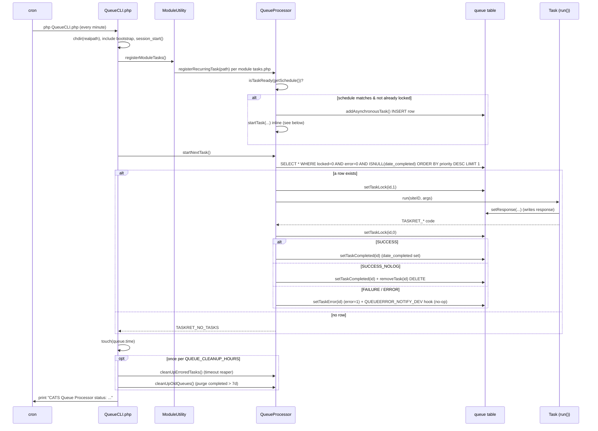

# 12 — Async Queue & Scheduled Jobs

OpenCATS ships a small **Asynchronous Queue Processor**: a single CLI entry point (`QueueCLI.php`) invoked by cron, backed by one database table (`queue`) and a static helper class (`lib/QueueProcessor.php`). It runs two kinds of work:

- **Asynchronous tasks** — rows explicitly `INSERT`ed into the `queue` table via `QueueProcessor::addAsynchronousTask()` (QueueProcessor.php:278).
- **Recurring tasks** — crontab-scheduled jobs that self-register on every CLI run and never persist a row of their own beyond the duration of the run (QueueProcessor.php:126).

In a stock install the only live work is recurring (calendar reminders and exception-log cleanup); see [Task types](#task-types) for the honest scope.

---

## Purpose & invocation

`QueueCLI.php` (repo root) is the cron entry point. Its header comment states its intent (QueueCLI.php:26-32):

```
 * This is the command line interface version of the QueueProcessor. This
 * file should be called by cron, bash script, whatever (not the website)
 * to process the next appropriate queue item.
```

### chdir / realpath setup

The script first resolves its own directory and `chdir`s into it so the relative paths used by tasks (e.g. `./modules/.../tasks/...php`) resolve correctly (QueueCLI.php:35-37):

```php
$CATSHome = realpath(dirname(__FILE__) . '/');
chdir($CATSHome);
```

### Bootstrap include chain

It then pulls in the full legacy bootstrap (QueueCLI.php:39-57):

```php
include_once('./config.php');
include_once(LEGACY_ROOT . '/constants.php');
include_once(LEGACY_ROOT . '/lib/CATSUtility.php');
include_once(LEGACY_ROOT . '/lib/DatabaseConnection.php');
include_once(LEGACY_ROOT . '/lib/DateUtility.php');
include_once(LEGACY_ROOT . '/lib/Template.php');
include_once(LEGACY_ROOT . '/lib/Users.php');
include_once(LEGACY_ROOT . '/lib/MRU.php');
include_once(LEGACY_ROOT . '/lib/Hooks.php');
include_once(LEGACY_ROOT . '/lib/Session.php');       /* Depends: MRU, Users, DatabaseConnection. */
include_once(LEGACY_ROOT . '/lib/UserInterface.php'); /* Depends: Template, Session. */
include_once(LEGACY_ROOT . '/lib/ModuleUtility.php'); /* Depends: UserInterface */
include_once(LEGACY_ROOT . '/lib/TemplateUtility.php');/* Depends: ModuleUtility, Hooks */
include_once(LEGACY_ROOT . '/lib/QueueProcessor.php');
include_once(LEGACY_ROOT . '/modules/queue/constants.php');
```

It then names and starts a PHP session, constructing a `CATSSession` if one does not already exist (QueueCLI.php:59-65):

```php
@session_name(CATS_SESSION_NAME);
session_start();
if (!isset($_SESSION['CATS']) || empty($_SESSION['CATS']))
{
    $_SESSION['CATS'] = new CATSSession();
}
```

`CATS_SESSION_NAME` is `'CATS'` (config.php:148).

### Argument handling

There is **no command-line argument parsing**. `QueueCLI.php` reads no `$argv`/`$argc` and takes no options — every run does the same fixed sequence. The main body is (QueueCLI.php:67-90):

```php
// Register module specific tasks
$taskedModules = ModuleUtility::registerModuleTasks();
print_r($taskedModules);                                  // debug echo; registerModuleTasks() returns nothing

// Execute the next appropriate (if available) queue and return a status code
$retVal = QueueProcessor::startNextTask();

// Mark the queue processor last-run time
touch(QUEUE_STATUS_FILE);

// ... once per QUEUE_CLEANUP_HOURS, run cleanup:
QueueProcessor::cleanUpErroredTasks();
QueueProcessor::cleanUpOldQueues();
```

> Note: `print_r($taskedModules)` prints nothing useful — `ModuleUtility::registerModuleTasks()` has no `return` statement (ModuleUtility.php:86-101), so `$taskedModules` is `null`. This is the registration step, not the dispatch step; its real effect is `include_once`-ing each module's `tasks.php`, which is where recurring tasks fire (see below).

After the run, `QueueCLI.php` prints a human-readable status mapped from the return code (QueueCLI.php:92-110), e.g. `CATS Queue Processor status: NO TASKS`.

### How it is meant to be run

Per the header comment it is a CLI script run by cron. **This repo contains no crontab file, systemd unit, or installer step that registers the cron job** — operators must add the cron entry themselves (e.g. `* * * * * php /path/to/QueueCLI.php`). The intended cadence is **once per minute**, since `QueueProcessor::isActive()` treats the processor as "running" only if the last run was within the last 5 minutes (QueueProcessor.php:513-525), and recurring schedules are evaluated per-minute (see [Task types](#task-types)). See [Unverified](#unverified--open-questions).

The processor uses two marker files in the working directory to track timing:

- `QUEUE_STATUS_FILE` = `'queue.time'` — `touch`ed every run (QueueCLI.php:72); its mtime is the "last run" timestamp (QueueProcessor.php:493-503).
- `QUEUE_CLEANUP_FILE` = `'cleanup.time'` — `touch`ed at most once per `QUEUE_CLEANUP_HOURS` (= 1 hour) to gate the cleanup routines (QueueCLI.php:74-87, constants at modules/queue/constants.php:39-41).

---

## The queue table

The single backing table is `queue`. Real definition (db/cats_schema.sql:884-897):

```sql
CREATE TABLE `queue` (
  `queue_id` int(11) NOT NULL AUTO_INCREMENT,
  `site_id` int(11) NOT NULL,
  `task` varchar(125) NOT NULL,
  `args` text,
  `priority` tinyint(2) NOT NULL DEFAULT '5' COMMENT '1-5, 1 is highest priority',
  `date_created` datetime NOT NULL,
  `date_timeout` datetime NOT NULL,
  `date_completed` datetime DEFAULT NULL,
  `locked` tinyint(1) unsigned NOT NULL DEFAULT '0',
  `error` tinyint(1) unsigned DEFAULT '0',
  `response` varchar(255) DEFAULT NULL,
  PRIMARY KEY (`queue_id`)
) ENGINE=InnoDB DEFAULT CHARSET=utf8;
```

| Column | Type | Role |
|---|---|---|
| `queue_id` | `int` AUTO_INCREMENT | Primary key; the task ID passed to every `QueueProcessor` method (e.g. `setTaskLock($taskID, …)`). |
| `site_id` | `int` | Owning site. Written from the `$siteID` argument on insert (QueueProcessor.php:286-289); recurring tasks use `CATS_ADMIN_SITE` (= 180, constants.php:187) (QueueProcessor.php:156). |
| `task` | `varchar(125)` | Relative path to the task's PHP file, e.g. `./modules/queue/tasks/CleanExceptions.php`. Stored from `$taskPath` (QueueProcessor.php:286-290). The class name is parsed back out of this path (QueueProcessor.php:219-226). |
| `args` | `text` | The task's arguments, **PHP-`serialize()`d** before insert (QueueProcessor.php:291). Passed verbatim to `Task::run($siteID, $args)`. |
| `priority` | `tinyint`, default `5` | Selection order. Per the column comment it is `1-5, 1 is highest priority`. **But see the bug note below** — the selector orders `DESC`. |
| `date_created` | `datetime` | Set to `date('c')` (ISO-8601) at insert (QueueProcessor.php:293). |
| `date_timeout` | `datetime` | `now + DEFAULT_QUEUE_TIMEOUT_MINUTES` (60 min) (QueueProcessor.php:282, 294). Used by `cleanUpErroredTasks()` to reap stuck locked rows. |
| `date_completed` | `datetime`, nullable | `NULL` until the task succeeds; set to `date('c', …)` by `setTaskCompleted()` (QueueProcessor.php:99-117). A non-NULL value marks the row "done" for selection purposes. |
| `locked` | `tinyint(1)` unsigned, default `0` | In-progress flag. Set to `1` while a task runs, back to `0` after (QueueProcessor.php:54-70, 231, 249). |
| `error` | `tinyint(1)` unsigned, default `0` | Error flag. Set to `1` by `setTaskError()` (QueueProcessor.php:73-96). Errored rows are skipped by the selector. |
| `response` | `varchar(255)`, nullable | Free-text log message the task sets via `setResponse()` → `setTaskResponse()` (QueueProcessor.php:322-340). |

There is no enum "status" column — status is derived from the combination of `locked`, `error`, and `date_completed`.

> **Priority-ordering note:** the schema comment says `1` is highest priority, but `startNextTask()` selects `ORDER BY priority DESC LIMIT 1` (QueueProcessor.php:180-181), which picks the **highest** numeric `priority` first (i.e. `5` before `1`). The `SampleTask` docblock also describes priority as "1-5 (5 being lowest priority)" (modules/queue/tasks/SampleTask.php:47). The code and the schema comment therefore disagree about direction. In practice all callers use the same priority (`5`), so this is moot today.

---

## QueueProcessor

`lib/QueueProcessor.php` is a non-instantiable static class (private `__construct`/`__clone`, QueueProcessor.php:49-51). Real public method signatures:

```php
public static function setTaskLock($taskID, $lockCode = 1)                       // :54
public static function setTaskError($taskID, $errorCode = 1)                     // :73
public static function setTaskCompleted($taskID, $completedTime = 0)             // :99
public static function registerRecurringTask($taskPath)                         // :126
public static function startNextTask()                                          // :166
public static function getInstantiatedTask($taskPath)                           // :201
public static function getTaskNameFromPath($taskPath)                           // :219
public static function startTask($siteID, $taskPath, $args, $priority, $taskID) // :229
public static function addAsynchronousTask($siteID, $taskPath, $args, $priority = 5) // :278
public static function removeTask($taskID)                                      // :303
public static function setTaskResponse($taskID, $response)                      // :322
public static function getTaskResponse($taskID)                                 // :343
public static function getActiveTasksCount()                                    // :370
public static function getLockedTasksCount()                                    // :398
public static function getErrorTasksCount()                                     // :422
public static function cleanUpOldQueues()                                       // :446
public static function cleanUpErroredTasks()                                    // :469
public static function getLastRunTime()                                         // :493
public static function isActive()                                               // :513
public static function isTaskReady($schedule)                                   // :528
public function getDayOfMonth() / getDayOfWeek() / getMonth() / getYear()
            / getHour() / getMinute()                                           // :620-653
```

### Selecting the next task

`startNextTask()` picks exactly one eligible row (QueueProcessor.php:166-198):

```sql
SELECT * FROM queue
 WHERE locked = 0
   AND error = 0
   AND ISNULL(date_completed)
 ORDER BY priority DESC
 LIMIT 1
```

"Eligible" = not locked, not errored, not completed. It then dispatches via `startTask($rs['site_id'], $rs['task'], $rs['args'], $rs['priority'], $rs['queue_id'])`. If no row matches it returns `TASKRET_NO_TASKS` (QueueProcessor.php:186-190). Note: only **one** task is processed per CLI invocation.

### Running a task

`startTask()` (QueueProcessor.php:229-275):

1. Locks the row (`setTaskLock($taskID, 1)`).
2. Derives the class name from the path and `include`s + instantiates it via `getInstantiatedTask()` (which uses `eval(sprintf('$curTask = new %s();', $taskName))`, QueueProcessor.php:201-216). If it can't load, it records a response, calls `setTaskError()`, and returns.
3. Calls `$curTask->setTaskID($taskID)` then `$curTask->run($siteID, $args)`.
4. Unlocks the row (`setTaskLock($taskID, 0)`).
5. Switches on the task's return value to mark status (see below).

> Note: the `$args` value passed to `run()` here is the **raw serialized string** read straight from the row (QueueProcessor.php:194) — `startTask()` does not `unserialize()` it. Tasks today take `0`/empty args so this is not exercised. See [Unverified](#unverified--open-questions).

### Marking status

The return-value switch in `startTask()` (QueueProcessor.php:252-271):

| Return value | Action |
|---|---|
| `TASKRET_SUCCESS` | `setTaskCompleted($taskID)` — sets `date_completed`. |
| `TASKRET_FAILURE` | `setTaskError($taskID)` — sets `error = 1`. |
| `TASKRET_ERROR` | `setTaskError($taskID)` — sets `error = 1`. |
| `TASKRET_SUCCESS_NOLOG` | `setTaskCompleted($taskID)` then `removeTask($taskID)` — completes, then `DELETE`s the row. |

### Return / task-type constants

All `TASKRET_*` constants live in the queue module's constants file (modules/queue/constants.php:32-36):

```php
define('TASKRET_NO_TASKS',      0);
define('TASKRET_SUCCESS',       1);
define('TASKRET_FAILURE',       2);
define('TASKRET_ERROR',         3);
define('TASKRET_SUCCESS_NOLOG', 4);
```

Other queue constants (modules/queue/constants.php:38-45):

```php
define('QUEUE_CLEANUP_HOURS',           1);
define('QUEUE_CLEANUP_FILE',            'cleanup.time');
define('QUEUE_STATUS_FILE',             'queue.time');
define('QUEUE_TASK_DIR', './modules/queue/tasks');
define('QUEUE_EXPIRATION_DAYS', 7);
define('DEFAULT_QUEUE_TIMEOUT_MINUTES', 60);
```

(`QUEUE_TASK_DIR` is defined but not referenced anywhere by the processor — paths are taken from each module's `tasks.php`.)

---

## Task types

A "task type" is just a PHP class extending the base `Task` (modules/queue/lib/Task.php) whose file path is stored in `queue.task`. There is **no central switch on task type** — dispatch is purely "load the class named by the file path and call `run()`." Tasks are discovered two ways:

### Recurring tasks (the live path)

`QueueCLI.php` calls `ModuleUtility::registerModuleTasks()`, which `include_once`s every `modules/<module>/tasks/tasks.php` it finds (ModuleUtility.php:86-101). Each `tasks.php` calls `QueueProcessor::registerRecurringTask(<path>)`. That method (QueueProcessor.php:126-158):

- Instantiates the task and checks `isTaskReady($task->getSchedule())` — a crontab-string matcher against the current minute/hour/day (QueueProcessor.php:528-617). If the schedule doesn't match the current time, it returns immediately.
- Guards against concurrent runs: counts `queue` rows with the same `task` name and `locked = 1`; if any exist, it skips (QueueProcessor.php:136-154).
- Otherwise it `addAsynchronousTask(CATS_ADMIN_SITE, $taskName, 0, 5)` to create a row, then immediately `startTask(...)` to run it inline (QueueProcessor.php:156-157).

**Registered recurring tasks in this repo:**

| Task | Registered in | Schedule (`getSchedule()`) | What it does |
|---|---|---|---|
| `Reminders` | modules/calendar/tasks/tasks.php:39 | `* * * * *` (every minute) (modules/calendar/tasks/Reminders.php:46) | Sends calendar event reminder e-mails: `Calendar::getAllDueReminders()` → builds e-mail from `$GLOBALS['eventReminderEmail']` → `$calendar->sendEmail(...)` → `updateEventDisableReminder()` (modules/calendar/tasks/Reminders.php:49-111). Returns `TASKRET_SUCCESS_NOLOG` if nothing is due. **Cross-ref: doc 06 / calendar module.** |
| `CleanExceptions` | modules/queue/tasks/tasks.php:39 | `* 3 * * *` (3am daily) (modules/queue/tasks/CleanExceptions.php:53) | `DELETE FROM exceptions WHERE DATEDIFF(NOW(), exceptions.date) > 7` (modules/queue/tasks/CleanExceptions.php:62-92). |

> There is a near-duplicate `modules/queue/tasks.php` (note: not under `tasks/`) that registers `CleanExceptions` by **bare name** rather than path (modules/queue/tasks.php:41) and `include`s `config.php`. `ModuleUtility::registerModuleTasks()` only loads `modules/<module>/tasks/tasks.php` (ModuleUtility.php:94-96), so the canonical, loaded copy is `modules/queue/tasks/tasks.php`. The bare-name registration in the other file would fail path parsing (`getTaskNameFromPath` expects a `/…​.php` path). It appears to be a stale/unused duplicate.

The sample tasks `SampleTask.php` and `SampleRecurring.php` are templates only — they are **not** registered in any loaded `tasks.php` (the `registerRecurringTask('SampleRecurring')` lines are commented out, e.g. modules/queue/tasks/tasks.php:35).

### Asynchronous (one-shot) tasks — currently dormant

`addAsynchronousTask()` is the public enqueue API, but **no production code calls it.** The only callers of `addAsynchronousTask` / `registerRecurringTask` / `QueueProcessor::*` across the codebase are:

- `QueueProcessor::registerRecurringTask` itself (the two live `tasks/tasks.php` files) and `addAsynchronousTask` from inside `registerRecurringTask` (QueueProcessor.php:156).
- `QueueCLI.php` (the runner).
- `lib/SystemUtility.php:87` → `QueueProcessor::isActive()` (status display only).
- Docblock examples in the Sample task files.

(Verified by grep for `addAsynchronousTask`, `registerRecurringTask`, `QueueProcessor::`, `registerModuleTasks` across all `*.php`.)

### XML feed submission — dormant

`lib/XmlJobExport.php::submitXMLFeeds($siteID)` is documented as the thing that "submits all applicable job feeds … to the asynchronous queue processor" (lib/XmlJobExport.php:101-107), but its entire body is a single hook fire (lib/XmlJobExport.php:108-111):

```php
public static function submitXMLFeeds($siteID)
{
    if (!eval(Hooks::get('XML_SUBMIT_FEEDS_TO_QUEUE'))) return;
}
```

`Hooks::get()` returns `'return true;'` when no hook is registered (lib/Hooks.php:52-56), and **no `XML_SUBMIT_FEEDS_TO_QUEUE` hook is registered anywhere in this repo** (grep finds only this call site). Worse, **`submitXMLFeeds` has no callers at all** (grep for `submitXMLFeeds`). So in a stock OpenCATS install the XML-feed → queue path does nothing. It is a vestigial extension point.

---

## Status transitions

A queue row's lifecycle is expressed through `locked`, `error`, and `date_completed` (there is no single status column):

- **Enqueued / eligible:** `locked = 0`, `error = 0`, `date_completed IS NULL`. Selectable by `startNextTask()` (QueueProcessor.php:174-181). This is also the state counted by `getActiveTasksCount()` (QueueProcessor.php:380-384).
- **In progress:** `locked = 1` while `run()` executes (QueueProcessor.php:231).
- **Success (logged):** `locked = 0`, `date_completed` set (`TASKRET_SUCCESS`).
- **Success (no log):** row `DELETE`d entirely (`TASKRET_SUCCESS_NOLOG`).
- **Error:** `error = 1` (`TASKRET_FAILURE` and `TASKRET_ERROR` both land here).
- **Timed out:** a row stuck `locked = 1` past `date_timeout` is flipped to `error = 1, locked = 0` by `cleanUpErroredTasks()` (QueueProcessor.php:469-486).

**Cross-reference doc 09 state diagram.**

```mermaid
stateDiagram-v2
    [*] --> Eligible : addAsynchronousTask()<br/>locked=0,error=0,date_completed=NULL
    Eligible --> InProgress : startTask() / setTaskLock(1)
    InProgress --> Completed : TASKRET_SUCCESS<br/>setTaskCompleted(); locked=0
    InProgress --> Removed : TASKRET_SUCCESS_NOLOG<br/>setTaskCompleted()+removeTask() (row DELETEd)
    InProgress --> Errored : TASKRET_FAILURE / TASKRET_ERROR<br/>setTaskError(); error=1
    InProgress --> Errored : (load failure) setTaskError()
    InProgress --> TimedOut : date_timeout passed while locked<br/>cleanUpErroredTasks(): error=1,locked=0
    TimedOut --> Errored
    Completed --> Purged : cleanUpOldQueues() after QUEUE_EXPIRATION_DAYS
    Removed --> [*]
    Errored --> [*]
    Purged --> [*]
```



---

## Failure / retry / logging

**Error recording.** `setTaskError($taskID, $errorCode = 1)` sets `error = 1` on the row (QueueProcessor.php:73-96). When the error code is `1` it fires a developer-notification hook (QueueProcessor.php:90-93):

```php
if ($errorCode == 1)
{
    if (!eval(Hooks::get('QUEUEERROR_NOTIFY_DEV'))) return;
}
```

As with the XML hook, **no `QUEUEERROR_NOTIFY_DEV` hook is registered in this repo** (grep finds only this call site), and `Hooks::get()` defaults to `'return true;'` (lib/Hooks.php:52-56). So error notification is a no-op out of the box — errors are recorded only as the `error = 1` flag plus whatever `response` text the task set.

**Logging.** The only per-task log is the `response` column, written by the task itself via `Task::setResponse()` → `QueueProcessor::setTaskResponse()` (modules/queue/lib/Task.php:39-42, QueueProcessor.php:322-340). `QueueCLI.php` also echoes a single overall status line per run (QueueProcessor.php / QueueCLI.php:92-110). There is no dedicated queue log file (the `.time` marker files only carry timestamps via mtime).

**Retry.** Despite the `SampleTask` docblock claiming `TASKRET_FAILURE` means "will be tried again a few times" (modules/queue/tasks/SampleTask.php:74-77), **there is no retry logic in the code.** Both `TASKRET_FAILURE` and `TASKRET_ERROR` call `setTaskError()` (QueueProcessor.php:258-264), which sets `error = 1`, and the selector permanently excludes any row with `error = 1` (QueueProcessor.php:176-177). A failed asynchronous task is never re-selected. (Recurring tasks effectively "retry" only in the sense that a fresh row is created on the next matching schedule tick.)

**Cleanup / reaping** (run at most hourly, gated by `cleanup.time`, QueueCLI.php:74-87):

- `cleanUpErroredTasks()` — flips rows stuck `locked = 1` past `date_timeout` to `error = 1, locked = 0` (QueueProcessor.php:469-486). This is the only protection against a crashed task leaving a permanent lock.
- `cleanUpOldQueues()` — `DELETE`s completed, unlocked, non-errored rows whose `date_completed` is older than `QUEUE_EXPIRATION_DAYS` (= 7) (QueueProcessor.php:446-466). Errored rows are **not** purged by this routine and accumulate until manually removed.

---

## Sequence diagram



---

## Source evidence

- `QueueCLI.php` — cron entry: header (26-32), `realpath`+`chdir` (35-37), include chain (39-57), session (59-65), `registerModuleTasks()`+`print_r` (64-65), `startNextTask()` (69), `touch(QUEUE_STATUS_FILE)` (72), cleanup gating (74-87), status switch (92-110).
- `lib/QueueProcessor.php` — class header & non-instantiable (1-51); `setTaskLock` (54-70); `setTaskError` + `QUEUEERROR_NOTIFY_DEV` hook (73-96); `setTaskCompleted` (99-117); `registerRecurringTask` (126-158); `startNextTask` SELECT + ordering (166-198); `getInstantiatedTask` / `getTaskNameFromPath` (201-226); `startTask` lifecycle + return switch (229-275); `addAsynchronousTask` INSERT (278-300); `removeTask` (303-319); `setTaskResponse`/`getTaskResponse` (322-367); count helpers (370-443); `cleanUpOldQueues` (446-466); `cleanUpErroredTasks` (469-486); `getLastRunTime`/`isActive` (493-525); `isTaskReady` crontab matcher (528-617); date helpers (620-653).
- `modules/queue/constants.php` — `TASKRET_*` (32-36), cleanup/status/expiration/timeout constants (38-45).
- `db/cats_schema.sql` — `queue` CREATE TABLE (884-897).
- `lib/ModuleUtility.php` — `registerModuleTasks()` (86-101).
- `modules/queue/lib/Task.php` — base `Task` class, `setResponse`/`setTaskID` (28-90).
- `modules/queue/tasks/CleanExceptions.php` — schedule `* 3 * * *` (53), exceptions DELETE (62-92).
- `modules/calendar/tasks/tasks.php:39` + `modules/calendar/tasks/Reminders.php` — schedule `* * * * *` (46), reminder send loop (49-111).
- `modules/queue/tasks/tasks.php:39` — registers `CleanExceptions`; `modules/queue/tasks.php:41` — stale duplicate.
- `modules/queue/tasks/SampleTask.php` / `SampleRecurring.php` — templates, registration commented out.
- `lib/XmlJobExport.php:108-111` — dormant `submitXMLFeeds` / `XML_SUBMIT_FEEDS_TO_QUEUE` hook (no callers, no registered hook).
- `lib/Hooks.php:52-56` — `Hooks::get()` returns `'return true;'` when no hook registered.
- `lib/SystemUtility.php:87` — `QueueProcessor::isActive()` for status display.
- `config.php:148` — `CATS_SESSION_NAME = 'CATS'`; `constants.php:187` — `CATS_ADMIN_SITE = 180`.

---

## Unverified / open questions

- **No cron registration shipped.** The intended schedule (once per minute) is inferred from `isActive()`'s 5-minute window (QueueProcessor.php:517) and the `* * * * *` reminder schedule, not from any crontab/installer in the repo. Operators must wire up cron manually. Unverified whether any deployment doc outside this repo prescribes the exact interval.
- **`args` serialization round-trip.** `addAsynchronousTask()` stores `serialize($args)` (QueueProcessor.php:291) but `startTask()` passes the raw serialized string to `run()` without `unserialize()` (QueueProcessor.php:194, 247). No live task uses non-trivial args (all pass `0`), so this is untested in practice — it would matter only if someone enqueued structured args.
- **Priority direction conflict.** Schema comment says `1` is highest priority (db/cats_schema.sql:889); code orders `priority DESC` (QueueProcessor.php:180) and the SampleTask docblock says `5` is lowest priority (SampleTask.php:47). Not exercised today (everything uses `5`), so the "correct" intent is ambiguous.
- **Single-task-per-run throughput.** `startNextTask()` processes exactly one queued row per invocation (`LIMIT 1`, no loop). Whether this is sufficient throughput depends entirely on cron frequency; not configurable in-repo.
- **Errored rows never purged.** `cleanUpOldQueues()` only deletes completed rows (QueueProcessor.php:451-462); `error = 1` rows persist indefinitely. No code path clears them — assumed intentional (manual review) but not documented in code.
- **`registerModuleTasks()` returns nothing**, so `print_r($taskedModules)` in `QueueCLI.php:65` always prints an empty/`null` result — appears to be leftover debug output rather than meaningful status.
