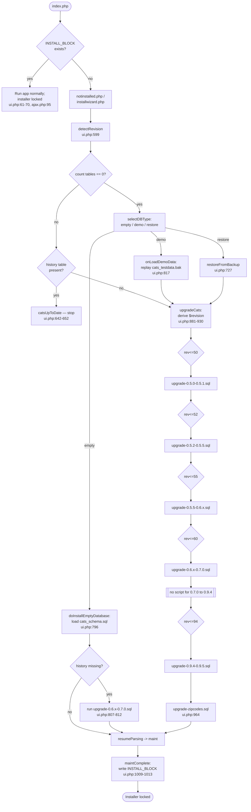

# 19 — Upgrade & Migration History

This document traces the actual SQL migration scripts shipped in `db/` and how the
install wizard applies them. Every schema change below is cited to a real file and
line. No migration steps are invented; gaps in the historical record are stated
honestly in the "0.7.0 → 0.9.x gap" section and the footer.

---

## Migration model

OpenCATS does **not** use a generic migration framework (no Phinx/Doctrine/Laravel
migrations). Instead it ships:

1. **A base schema** — `db/cats_schema.sql`, the current full DDL. It contains
   **55 `CREATE TABLE` statements** (verified by `grep -c "CREATE TABLE"`). A fresh
   install loads this file directly.
2. **An ordered set of `upgrade-*.sql` scripts** in `db/`, each moving an *older*
   database forward one named-version step. These are only run when an existing
   (older) database is detected.
3. **A bulk data loader** — `db/upgrade-zipcodes.sql` — applied at the end of every
   upgrade path to (re)populate the `zipcodes` reference table.

### How a deployment applies migrations

All install/upgrade logic lives in the AJAX handler
`modules/install/ajax/ui.php`, driven by the front-end wizard `installwizard.php`.

- **Version detection** — `case 'detectRevision':` (modules/install/ajax/ui.php:599)
  connects to the DB, lists tables, and then introspects the `candidate` table's
  columns plus the presence/absence of specific tables to classify the running
  version:
  - no `date_available` column on `candidate` → `'CATS 0.5.0.'` (ui.php:626-629)
  - no `candidate_joborder_status` table → `'CATS 0.5.1 or 0.5.2.'` (ui.php:630-633)
  - no `candidate_foreign` table → `'CATS 0.5.5.'` (ui.php:634-637)
  - no `history` table → `'CATS 0.6.x.'` (ui.php:638-641)
  - `history` table present → already current, shows `catsUpToDate` and stops
    (ui.php:642-652)

- **Upgrade application** — `case 'upgradeCats':` (modules/install/ajax/ui.php:881)
  re-derives a numeric `$revision` from the same fingerprints (ui.php:892-930):

  | Fingerprint (absent unless noted) | `$revision` | Source |
  |---|---|---|
  | no `candidate.date_available` | `50` | ui.php:901-905 |
  | no `candidate_joborder_status` table | `52` | ui.php:906-910 |
  | no `candidate_foreign` and no `extra_field` | `55` | ui.php:911-915 |
  | no `history` table | `60` | ui.php:916-920 |
  | no `candidate_duplicates` table | `94` | ui.php:921-925 |
  | `candidate_duplicates` present | `95` | ui.php:926-930 |

  It then runs every script whose threshold is `>= $revision`, in order, via
  `MySQLQueryMultiple(...)` (ui.php:932-965):

  - `$revision <= 50` → `db/upgrade-0.5.0-0.5.1.sql` (ui.php:935)
  - `$revision <= 52` → `db/upgrade-0.5.2-0.5.5.sql` (ui.php:941)
  - `$revision <= 55` → `db/upgrade-0.5.5-0.6.x.sql` (ui.php:947)
  - `$revision <= 60` → `db/upgrade-0.6.x-0.7.0.sql` (ui.php:953)
  - `$revision <= 94` → `db/upgrade-0.9.4-0.9.5.sql` (ui.php:959)
  - always → `db/upgrade-zipcodes.sql` (ui.php:964)

> Note the **chained cascade**: a 0.5.0 DB (`$revision = 50`) runs *every* script up
> through 0.9.5. **`db/upgrade-0.5.1-0.5.2.sql` is never referenced by ui.php** — the
> 0.5.1/0.5.2 step is folded into the `<= 52` branch which loads
> `db/upgrade-0.5.2-0.5.5.sql`. That standalone file therefore exists in `db/` but is
> dead in the wizard's apply path (see Unverified / open questions).

---

## Per-script changelog

### `db/upgrade-0.5.0-0.5.1.sql` — target 0.5.1

Tiny script (5 statements):

- Drops the `feedback` table (db/upgrade-0.5.0-0.5.1.sql:1).
- Adds `candidate.date_available datetime AFTER source` (line 2).
- Widens `user.user_name` to `varchar(64) NOT NULL` and `user.password` to
  `varchar(128) NOT NULL` (lines 3-4).
- Data: updates `access_level.long_description` for `access_level_id = 300` (line 5).

### `db/upgrade-0.5.1-0.5.2.sql` — target 0.5.2 (NOT wired into the wizard)

Two DDL statements only:

- `ALTER TABLE user DROP COLUMN is_beta_tester` (db/upgrade-0.5.1-0.5.2.sql:1).
- `DROP TABLE address_parser_failures` (line 3).

As noted above, `ui.php` does not load this file; its `<= 52` branch jumps straight to
`upgrade-0.5.2-0.5.5.sql`.

### `db/upgrade-0.5.2-0.5.5.sql` — target 0.5.5

The largest "index normalization" script. Highlights:

- **Drops dozens of old named indexes** (`IDX_*`) across `access_level`, `activity`,
  `attachment`, `calendar_event_type`, `candidate`, `candidate_joborder`, `client`,
  `contact`, `data_item_type`, `joborder`, `joborder_status`, `user`, `user_login`,
  `work_status_type` (db/upgrade-0.5.2-0.5.5.sql:1-67).
- Drops `candidate.email` (line 26).
- **Creates new tables** (lines 69-159): `admin_user`, `admin_user_login`,
  `candidate_joborder_status`, `candidate_status_type`, `feedback` (re-created),
  `mru`, `site`, `zipcodes`, `system`, `version`.
- **Adds `site_id`** columns (default `1`) to `activity`, `attachment`,
  `calendar_event`, `candidate`, `candidate_joborder`, `client`, `contact`, `user`,
  `user_login` (lines 161-183). This is the multi-tenant "site" rollout.
- Adds candidate fields: `can_relocate`, `current_employer`, `email1` (UNIQUE),
  `email2`, `web_site` (lines 167-171); client fields `is_hot`, `fax_number`
  (lines 174-175); contact `is_hot`, `left_company` (lines 177-178); joborder
  `client_job_id` (line 180); `user.email` (line 182).
- **Re-adds new-style indexes** across the same tables (lines 184-261).
- Data: `INSERT INTO site VALUES (1, 'default_site', ...)`,
  `INSERT INTO version VALUES ('0.5.5')`, and sets `access_level_id = -1` for
  `'Disabled'` (lines 263-265).

  ```sql
  ALTER TABLE `candidate` ADD COLUMN `site_id` INTEGER(11) NOT NULL DEFAULT '1' ;
  ALTER TABLE `candidate` ADD COLUMN `email1` VARCHAR(128) COLLATE utf8_general_ci DEFAULT NULL UNIQUE;
  ```
  (db/upgrade-0.5.2-0.5.5.sql:166, 169)

### `db/upgrade-0.5.5-0.6.x.sql` — target 0.6.x

A 681-line script structured as a series of revision blocks (`#r492` … `#r904`),
each beginning with `UPDATE system SET schema_version = N;`. Notable schema work:

- `ALTER IGNORE TABLE joborder ADD COLUMN public int(1) NOT NULL DEFAULT 0`
  (db/upgrade-0.5.5-0.6.x.sql:3).
- **Import subsystem** — creates `candidate_foreign`, `client_foreign`,
  `contact_foreign`, `import` tables; adds `import_id` to `candidate`/`contact`/
  `client` (lines 5-47). Later adds `candidate_foreign_settings`,
  `client_foreign_settings`, `contact_foreign_settings` (lines 376-405).
- **Calendar** — renames `calendar_event.description` → `title`, re-adds
  `description`, adds `duration`, `reminder_enabled`, `reminder_email`,
  `reminder_time` (lines 52-59); rebuilds `calendar_event_type` with seed rows
  (lines 62-75); adds `calendar_event.public` (line 215); creates
  `calendar_settings` (lines 365-372).
- `system.schema_version int(11)` added (line 78); thereafter every block bumps it.
- `joborder.rate_max` changed to `varchar(255)` (line 83); later collation fix
  (line 488).
- Creates `saved_search` (lines 87-97), `hot_list` (lines 101-107),
  `client_department` (lines 170-178), `candidate_source` (lines 183-190),
  `dashboard_module` / `dashboard_component` (created/recreated several times,
  lines 220-343), `email_template` (lines 468-474), `mailer_settings`
  (lines 643-650), `email_history` (lines 668-676), `hot_list_entries` (lines 411-415).
- **Status model rework** — drops & recreates `candidate_joborder_status` with seed
  rows (No Contact … Placed), creates `candidate_joborder_status_history`, drops
  `candidate_joborder_status_type`, adds `candidate_joborder.status` (lines 137-165);
  data migration sets `status = 400 WHERE submitted = 1`, backfills history, then
  drops `candidate_joborder.submitted` (lines 347-352).
- Department data migration: backfills `client_department` from distinct
  `contact.department`, maps `contact.department_id`, then drops `contact.department`
  (lines 199-209).
- `candidate.is_hot` / `hot_list_id` added (lines 108-109); `hot_list_id` later
  dropped and replaced by `hot_list_entries` join table (lines 410-415).
- `user_login.host` (line 419); `joborder.department_id` not here — that lands in the
  next script.
- Drops `candidate_status_type`, `candidate_joborder_status_type`, `quotation`,
  and `system.local_version` (lines 654-663).
- Much of this file is **data churn** — repeated `DELETE`/`INSERT` rebuilds of
  `email_template` and `dashboard_component`/`dashboard_module` rows
  (e.g. lines 232-343, 509-625) as the seed content was iterated.

### `db/upgrade-0.6.x-0.7.0.sql` — target 0.7.0

155 lines, revision blocks `#r949` … `#r1200`:

- Creates `history` table — the marker the wizard uses to detect "0.7.0+"
  (db/upgrade-0.6.x-0.7.0.sql:4-19).
- Adds `site.unix_name`, `site.client_id` and inserts a `CATS_ADMIN` site (180), an
  automated admin `user`, and foreign-settings seed rows (lines 23-29).
- Creates `word_verification` (lines 33-37) and `module_schema` (lines 145-150).
- Column adds: `user.categories` (line 41), `attachment.profile_image` (line 45),
  `client.default_client` (line 49), `user.session_cookie` (line 53),
  `site.is_trial`/`trial_expires` (lines 71-72), `site.account_active` (line 76),
  `site.account_deleted` (line 92), `site.reason_disabled` (line 100),
  `joborder.department_id` (line 134), `user_login.date_refreshed` (line 120).
- Adds `site_id` to `candidate_foreign`/`client_foreign`/`contact_foreign` and
  backfills it from the parent rows (lines 61-66).
- Renames `email_history.email_sent_id` → `email_history_id` (line 116).
- Indexes added on `user_login`, `email_history`, and the `_foreign` tables
  (lines 124-130, 138); `candidate_joborder` composite index `IDX_status_special`
  on `(site_id, status)` (line 154).
- Data: inserts the "Welcome to CATS" email template (line 104).

> This script is also run during a **fresh empty install** when `history` is missing
> after loading `cats_schema.sql` (ui.php:807-812), as a safety net.

### `db/upgrade-0.9.4-0.9.5.sql` — target 0.9.5

Smallest, cleanest script (15 lines):

```sql
ALTER TABLE `joborder`
ADD COLUMN `import_id` int(11) NOT NULL DEFAULT '0' AFTER `questionnaire_id`;
CREATE TABLE `candidate_duplicates` (
  `old_candidate_id` int(11) NOT NULL,
  `new_candidate_id` int(11) NOT NULL,
  `site_id` int(11) NOT NULL,
  PRIMARY KEY (`old_candidate_id`, `new_candidate_id`),
  ...
) ENGINE=MyISAM DEFAULT CHARSET=utf8 COLLATE=utf8_unicode_ci;
ALTER TABLE `candidate` MODIFY COLUMN `web_site` varchar(352);
```
(db/upgrade-0.9.4-0.9.5.sql:3-15)

- Adds `joborder.import_id int(11) NOT NULL DEFAULT '0' AFTER questionnaire_id`
  (lines 3-4).
- Creates `candidate_duplicates` (de-duplication) — the marker that distinguishes
  0.9.4 from 0.9.5 in `detectRevision`/`upgradeCats` (lines 6-13).
- Widens `candidate.web_site` to `varchar(352)` (lines 14-15).

---

## The 0.7.0 → 0.9.x gap

**There are no upgrade scripts between `upgrade-0.6.x-0.7.0.sql` and
`upgrade-0.9.4-0.9.5.sql`.** The `db/` directory jumps straight from a "to 0.7.0"
script to a "0.9.4 → 0.9.5" script. The wizard's revision ladder reflects this gap
directly: after detecting `$revision = 60` (no `history`) the *next* recognized state
is `$revision = 94` (no `candidate_duplicates`) — there is no `0.7.x`, `0.8.x`, or
`0.9.0–0.9.3` branch (ui.php:916-925).

Implications, stated honestly:

- A 0.6.x → 0.7.0 database upgraded by this wizard is then treated as `$revision = 94`
  on the next pass (because it lacks `candidate_duplicates`) and is taken **directly**
  to 0.9.5 by `upgrade-0.9.4-0.9.5.sql`. **The intermediate 0.7.x–0.9.4 schema
  evolution is not represented by any script in this repo.** It was presumably applied
  by upgrade tooling or scripts that are not present here (lost history, or rolled into
  `cats_schema.sql` as the new base).
- Practically: an old (pre-0.9.4) install whose schema already diverged from what the
  0.7.0 script produced cannot be reliably stepped forward — there is no migration
  describing those intermediate changes. A **fresh install from `cats_schema.sql`** (the
  current 55-table base) is the only path that yields a guaranteed-current schema.
- The standalone `upgrade-0.5.1-0.5.2.sql` is likewise orphaned from the apply path
  (see above).

---

## `db/upgrade-zipcodes.sql`

This file is **almost entirely data**, not schema evolution. It is 42,847 lines and
contains exactly **one** DDL pair followed by bulk inserts (verified: only lines 1-2
are DDL):

```sql
DROP TABLE IF EXISTS `zipcodes`;
CREATE TABLE `zipcodes` (
  `zipcode` varchar(9) NOT NULL default '0',
  `city` tinytext ... NOT NULL,
  `state` varchar(2) ... NOT NULL default '',
  `areacode` smallint(6) NOT NULL default '0',
  `lat` float(12) default NULL,
  `lng` float(12) default NULL,
  PRIMARY KEY  (`zipcode`)
) ENGINE=MyISAM DEFAULT CHARSET=utf8 COLLATE=utf8_unicode_ci;
```
(db/upgrade-zipcodes.sql:1-10)

- It **redefines** `zipcodes` with a wider `zipcode varchar(9)` key and adds `lat`/`lng`
  columns — replacing the older `zipcode mediumint(9)` definition created back in
  `upgrade-0.5.2-0.5.5.sql:140-146`.
- The rest of the file is multi-row `insert into zipcodes values (...)` covering US
  ZIP codes with city/state/areacode/lat/lng, e.g.
  `(99950, 'Ketchikan', 'AK', 907, '-131.432682', '+55.542007')`
  (last data row, db/upgrade-zipcodes.sql:42847).
- Because it begins with `DROP TABLE IF EXISTS`, it is **idempotent** and is run on
  every upgrade pass (ui.php:964, via `@file_get_contents` so a missing file is
  tolerated). It is also loaded for fresh installs via `OptionalComponents.php:33`
  and `Schema.php:857`.

---

## Install wizard's role

The wizard (`installwizard.php` UI + `modules/install/ajax/ui.php` logic) handles
three database paths, all reached after DB connectivity is confirmed:

1. **Fresh / empty install** — `case 'doInstallEmptyDatabase':`
   (modules/install/ajax/ui.php:791). Sets `ENABLE_DEMO_MODE = false`, loads
   `db/cats_schema.sql` via `MySQLQueryMultiple($schema, ";\n")` (ui.php:796-797),
   then if `history` is still absent runs `upgrade-0.6.x-0.7.0.sql` as a top-up
   (ui.php:807-812).

2. **Demo data install** — `case 'onLoadDemoData':` (ui.php:817). Sets
   `ENABLE_DEMO_MODE = true`, extracts and replays the SQL inside
   `./db/cats_testdata.bak`, then chains into `upgradeCats` to bring that snapshot
   current (ui.php:818-878).

3. **Upgrade existing DB** — `case 'upgradeCats':` (ui.php:881), the
   detect-and-cascade path documented above. Also reached after a backup restore
   (`restoreFromBackup`, ui.php:784).

### The INSTALL_BLOCK gate

A sentinel file named `INSTALL_BLOCK` in the OpenCATS root controls whether the
installer is allowed to run at all:

- `index.php:44` — `if (!file_exists('INSTALL_BLOCK') && !isset($_POST['performMaintenence']))`
  routes the app to `notinstalled.php` (the installer) when the file is **absent**.
- `modules/install/ajax/ui.php:61-70` — every install AJAX action refuses to run
  (`showTextBlock('installLocked')`) if `INSTALL_BLOCK` **exists**.
- `ajax.php:95` — `$installerActive = (!file_exists('INSTALL_BLOCK'));` and non-install
  AJAX modules are blocked while the installer is active.
- The block file is **created at the end of installation**, in `case 'maintComplete':`
  via `file_put_contents('INSTALL_BLOCK', 'This file prevents the installer ...')`
  (ui.php:1009-1013). The UI tells the admin to delete this file to re-run the
  installer (installwizard.php:105, 435, 451).

---

## A Mermaid flowchart



---

## Source evidence

- `db/cats_schema.sql` — base schema; `grep -c "CREATE TABLE"` returns **55**.
- `db/upgrade-0.5.0-0.5.1.sql` (5 lines) — read in full.
- `db/upgrade-0.5.1-0.5.2.sql` (3 lines) — read in full; not wired into ui.php.
- `db/upgrade-0.5.2-0.5.5.sql` (266 lines) — read in full.
- `db/upgrade-0.5.5-0.6.x.sql` (681 lines) — read in full.
- `db/upgrade-0.6.x-0.7.0.sql` (155 lines) — read in full.
- `db/upgrade-0.9.4-0.9.5.sql` (15 lines) — read in full.
- `db/upgrade-zipcodes.sql` (42,847 lines) — DDL at lines 1-10 read; body confirmed
  pure `insert into zipcodes values` data; only 2 DDL statements in file.
- `modules/install/ajax/ui.php` — `detectRevision` (599), `doInstallEmptyDatabase`
  (791), `onLoadDemoData` (817), `upgradeCats` (881, script ladder 932-965),
  `maintComplete` / INSTALL_BLOCK write (1006-1013), install lock (61-70).
- `index.php:44`, `ajax.php:95` — INSTALL_BLOCK gates.
- `modules/install/OptionalComponents.php:33`, `modules/install/Schema.php:857` —
  zipcodes load on fresh install.

---

## Unverified / open questions

- **`upgrade-0.5.1-0.5.2.sql` is orphaned.** `ui.php` never calls
  `file_get_contents('db/upgrade-0.5.1-0.5.2.sql')` (only the other five scripts are
  referenced). Its two changes (`DROP COLUMN is_beta_tester`, `DROP TABLE
  address_parser_failures`) are not applied by the wizard. Whether this is intentional
  (those objects assumed gone by other means) or a wiring bug is not determinable from
  the code alone.
- **The 0.7.0 → 0.9.4 schema history is absent from this repo.** No script documents
  how the schema evolved across the 0.7.x/0.8.x/0.9.0-0.9.3 line. Upgrading a database
  stuck at that exact intermediate state is not covered by any file here; this doc
  cannot describe those changes because no source exists for them.
- **`cats_schema.sql` was not diffed table-by-table** against the cumulative output of
  the upgrade scripts. The "55 tables" figure is a `grep` count of `CREATE TABLE`
  statements, not a verified reconciliation that the upgrade chain produces an
  identical schema to the fresh base.
- **`MySQLQueryMultiple` statement-splitting semantics** (e.g. how it tolerates the
  `#rNNN` comment lines, multi-line `CREATE TABLE`, and the `";\n"` vs default
  delimiter used for `cats_schema.sql` at ui.php:797) were not exhaustively traced;
  scripts are assumed to parse cleanly as the wizard intends.
- **`ALTER ... TYPE = MYISAM`** statements (e.g. upgrade-0.5.5-0.6.x.sql:113) use
  deprecated MySQL syntax removed in MySQL 5.5+; whether these still execute on the
  PHP 7.4 / modern-MySQL target is not verified here.
