# Module: candidates

## Overview

The candidates module manages candidate records (people in the ATS): listing, viewing, adding, editing, deleting, searching (full name / key skills / resume full‑text / city / phone), pipeline operations (consider for job order, add to pipeline, change status, remove from pipeline, log activity / schedule calendar event), attachments (resume / profile image), tagging, mass e‑mail, questionnaire result viewing, administrative hide/show, and duplicate detection / linking / merging.

The controller is declared as `class CandidatesUI extends UserInterface` (modules/candidates/CandidatesUI.php:53). Entry point is `public function handleRequest()` (modules/candidates/CandidatesUI.php:81), which begins with the global hook `if (!eval(Hooks::get('CANDIDATES_HANDLE_REQUEST'))) return;` (CandidatesUI.php:83) then dispatches on `$this->getAction()` (CandidatesUI.php:85) through a `switch` (CandidatesUI.php:86).

Constructor settings (modules/candidates/CandidatesUI.php:66-78):

```php
$this->_authenticationRequired = true;            // CandidatesUI.php:70
$this->_moduleDirectory = 'candidates';           // CandidatesUI.php:71
$this->_moduleName = 'candidates';                // CandidatesUI.php:72
$this->_moduleTabText = 'Candidates';             // CandidatesUI.php:73
$this->_subTabs = array(                          // CandidatesUI.php:74-77
    'Add Candidate'     => CATSUtility::getIndexName() . '?m=candidates&amp;a=add*al=' . ACCESS_LEVEL_EDIT . '@candidates.add',
    'Search Candidates' => CATSUtility::getIndexName() . '?m=candidates&amp;a=search'
);
```

Class constants: `const NOTES_MAXLEN = 500;` (CandidatesUI.php:58) and `const TRUNCATE_KEYSKILLS = 30;` (CandidatesUI.php:63).

## Action catalog

ACL guards are taken verbatim. All guards have the form `if ($this->getUserAccessLevel('<key>') < ACCESS_LEVEL_<X>) { CommonErrors::fatal(...) }` unless noted (`fatalModal`). The "Required level" column is the `ACCESS_LEVEL_*` the guard compares against.

| Action (`a=`) | ACL guard expression | Required level | Handler | lib calls | Template |
|---|---|---|---|---|---|
| `show` (CandidatesUI.php:88) | `getUserAccessLevel('candidates.show') < ACCESS_LEVEL_READ` (89) | ACCESS_LEVEL_READ | `show()` (576) | Candidates, Attachments, Pipelines, ActivityEntries, Questionnaire, Tags, EEOSettings | Show.tpl (856) |
| `add` (96) | `getUserAccessLevel('candidates.add') < ACCESS_LEVEL_EDIT` (97) | ACCESS_LEVEL_EDIT | `add()` / `onAdd()` (107/103) | Candidates, Attachments, AttachmentCreator, EEOSettings, ActivityEntries | Add.tpl (1008) |
| `edit` (112) | `getUserAccessLevel('candidates.edit') < ACCESS_LEVEL_EDIT` (113) | ACCESS_LEVEL_EDIT | `edit()` / `onEdit()` (123/119) | Candidates, Users, EmailTemplates, EEOSettings | Edit.tpl (1277) |
| `delete` (128) | `getUserAccessLevel('candidates.delete') < ACCESS_LEVEL_DELETE` (129) | ACCESS_LEVEL_DELETE | `onDelete()` (135; GET → BADFIELDS) | Candidates | (redirect) |
| `search` (143) | `getUserAccessLevel('candidates.search') < ACCESS_LEVEL_READ` (144) | ACCESS_LEVEL_READ | `search()` / `onSearch()` (156/152) | SavedSearches, SearchCandidates, SearchByResumePager, Candidates | Search.tpl (2117/2418) |
| `viewResume` (161) | `getUserAccessLevel('candidates.viewResume') < ACCESS_LEVEL_READ` (162) | ACCESS_LEVEL_READ | `viewResume()` (168) | Candidates | ResumeView.tpl (2451) |
| `considerForJobSearch` (175) | `getUserAccessLevel('candidates.search') < ACCESS_LEVEL_EDIT` (176) | ACCESS_LEVEL_EDIT | `considerForJobSearch()` (182) | SearchJobOrders, Pipelines | ConsiderSearchModal.tpl (1669) |
| `addToPipeline` (190) | `getUserAccessLevel('pipelines.addToPipeline') < ACCESS_LEVEL_EDIT` (191) | ACCESS_LEVEL_EDIT | `onAddToPipeline()` (197; GET → fatalModal BADFIELDS) | Pipelines, ActivityEntries | ConsiderSearchModal.tpl (1768) |
| `addCandidateTags` (205) | `getUserAccessLevel('candidates.addCandidateTags') < ACCESS_LEVEL_EDIT` (206) | ACCESS_LEVEL_EDIT | `addCandidateTags()` / `onAddCandidateTags()` (216/212) | Candidates, Tags | AssignCandidateTagModal.tpl (2030/1991) |
| `addActivity` (221) | `getUserAccessLevel('pipelines.addActivity') < ACCESS_LEVEL_EDIT` (222) | ACCESS_LEVEL_EDIT | `addActivity()` / `onAddActivity()` (232/228) | Candidates, Pipelines, Calendar, ActivityEntries | AddActivityScheduleEventModal.tpl (1836/3406) |
| `changeStatus` (238) | `getUserAccessLevel('pipelines.changeStatus') < ACCESS_LEVEL_EDIT` (239) | ACCESS_LEVEL_EDIT | `changeStatus()` / `onChangeStatus()` (249/245) | Candidates, Pipelines, MailerSettings, EmailTemplates, JobOrders, ActivityEntries | ChangeStatusModal.tpl (1964/3602) |
| `removeFromPipeline` (255) | `getUserAccessLevel('pipelines.removeFromPipeline') < ACCESS_LEVEL_DELETE` (256) | ACCESS_LEVEL_DELETE | `onRemoveFromPipeline()` (262; GET → BADFIELDS) | Pipelines | (redirect) |
| `addEditImage` (270) | `getUserAccessLevel('candidates.addEditImage') < ACCESS_LEVEL_EDIT` (271; **fatalModal**) | ACCESS_LEVEL_EDIT | `addEditImage()` / `onAddEditImage()` (281/277) | Attachments, AttachmentCreator | CreateImageAttachmentModal.tpl (2474/2510) |
| `createAttachment` (287) | `getUserAccessLevel('candidates.createAttachment') < ACCESS_LEVEL_EDIT` (288) | ACCESS_LEVEL_EDIT | `createAttachment()` / `onCreateAttachment()` (301/297) | AttachmentCreator | CreateAttachmentModal.tpl (2533/2597) |
| `administrativeHideShow` (307) | `getUserAccessLevel('candidates.hidden') < ACCESS_LEVEL_SA` (308) | ACCESS_LEVEL_SA | `administrativeHideShow()` (314; GET → BADFIELDS) | Candidates | (redirect) |
| `deleteAttachment` (323) | `getUserAccessLevel('candidates.deleteAttachment') < ACCESS_LEVEL_DELETE` (324) | ACCESS_LEVEL_DELETE | `onDeleteAttachment()` (330; GET → BADFIELDS) | Attachments | (redirect) |
| `emailCandidates` (349) | `getUserAccessLevel('candidates.emailCandidates') < ACCESS_LEVEL_READ` (350) **and** `< ACCESS_LEVEL_SA` (354) | ACCESS_LEVEL_SA (two-stage) | `onEmailCandidates()` (358) | Mailer, EmailTemplates, Candidates, DatabaseConnection | SendEmail.tpl (3682/3720) |
| `show_questionnaire` (361) | `getUserAccessLevel('candidates.show_questionnaire') < ACCESS_LEVEL_READ` (362) | ACCESS_LEVEL_READ | `onShowQuestionnaire()` (366) | Candidates, Questionnaire, Attachments | Questionnaire.tpl (3758) |
| `linkDuplicate` (369) | `getUserAccessLevel('candidates.duplicates') < ACCESS_LEVEL_SA` (370) | ACCESS_LEVEL_SA | `findDuplicateCandidateSearch()` (374) | SearchCandidates, Candidates | LinkDuplicity.tpl (3816) |
| `merge` (378) | `getUserAccessLevel('candidates.duplicates') < ACCESS_LEVEL_SA` (379) | ACCESS_LEVEL_SA | `mergeDuplicates()` (383) | Candidates | Merge.tpl (3842) |
| `mergeInfo` (386) | `getUserAccessLevel('candidates.duplicates') < ACCESS_LEVEL_SA` (387) | ACCESS_LEVEL_SA | `mergeDuplicatesInfo()` (393; GET → BADFIELDS) | Candidates | (redirect) |
| `removeDuplicity` (402) | `getUserAccessLevel('candidates.duplicates') < ACCESS_LEVEL_SA` (403) | ACCESS_LEVEL_SA | `removeDuplicity()` (409; GET → fatalModal BADFIELDS) | Candidates | (redirect) |
| `addDuplicates` (417) | `getUserAccessLevel('candidates.duplicates') < ACCESS_LEVEL_SA` (418) | ACCESS_LEVEL_SA | `addDuplicates()` (424; GET → fatalModal BADFIELDS) | Candidates | LinkDuplicity.tpl (3918) |
| `listByView` / *default* (433/434) | `getUserAccessLevel('candidates.list') < ACCESS_LEVEL_READ` (435) | ACCESS_LEVEL_READ | `listByView()` (439) | Tags, Candidates, DataGrid | Candidates.tpl (570) |

Note: the `savedLists` case (CandidatesUI.php:340-346) is commented out (`FIXME: function savedList() missing`) and is not dispatchable.

```mermaid
flowchart TD
    HR["handleRequest()<br/>switch(getAction())"] --> show
    HR --> add
    HR --> edit
    HR --> delete
    HR --> search
    HR --> viewResume
    HR --> considerForJobSearch
    HR --> addToPipeline
    HR --> addCandidateTags
    HR --> addActivity
    HR --> changeStatus
    HR --> removeFromPipeline
    HR --> addEditImage
    HR --> createAttachment
    HR --> administrativeHideShow
    HR --> deleteAttachment
    HR --> emailCandidates
    HR --> show_questionnaire
    HR --> dup["linkDuplicate / merge / mergeInfo<br/>removeDuplicity / addDuplicates"]
    HR --> def["listByView (default)"]
```



## Per-action detail

### show
`show()` (CandidatesUI.php:576) validates `candidateID` (or resolves it from `email` via `$candidates->getIDByEmail($_GET['email'])`, CandidatesUI.php:602), loads the record with `$candidates->getWithDuplicity($candidateID)` (CandidatesUI.php:605), and if `isAdminHidden == 1` and the user is below `ACCESS_LEVEL_SA` for `candidates.hidden` it diverts to `listByView('This candidate is hidden ...')` (CandidatesUI.php:614-618). It assembles attachments via `$attachments->getAll(DATA_ITEM_CANDIDATE, $candidateID)` (CandidatesUI.php:669), pipeline via `$pipelines->getCandidatePipeline($candidateID)` (CandidatesUI.php:705), activity via `$activityEntries->getAllByDataItem($candidateID, DATA_ITEM_CANDIDATE)` (CandidatesUI.php:746), upcoming events `$candidates->getUpcomingEvents($candidateID)` (CandidatesUI.php:772), adds an MRU entry (CandidatesUI.php:790-792), and renders Show.tpl (CandidatesUI.php:856); the `CANDIDATE_SHOW` hook is at line 858 (after display).

### add
On GET, `add()` (CandidatesUI.php:871) loads sources `$candidates->getPossibleSources()` (876), add‑mode extra fields `$candidates->extraFields->getValuesForAdd()` (880), an optional pre‑attached resume (888-919), parsing status from `LicenseUtility` (959/983), and renders Add.tpl (1008). On POST, `onAdd()` (CandidatesUI.php:1153) first calls `checkParsingFunctions()` (1011) — if that returns an array (a load/parse round‑trip) it re‑renders the add form (1155-1158); otherwise it calls private `_addCandidate(false)` (1160) which calls `$candidates->checkDuplicity(...)` (2875) then `$candidates->add(...)` (2877). On success it logs activity `$activityEntries->add($candidateID, DATA_ITEM_CANDIDATE, 400, 'Added a new candidate.', $this->_userID)` (1168-1174) and redirects to `m=candidates&a=show&candidateID=...` (1176-1178).

### edit
`edit()` (CandidatesUI.php:1184) loads `$candidates->getForEditing($candidateID)` (1195), enforces the same admin‑hidden check (1203-1207), loads users `$users->getSelectList()` (1210), edit extra fields (1218), sources (1221), the `EMAIL_TEMPLATE_OWNERSHIPASSIGNCANDIDATE` template (1246), and renders Edit.tpl (1277). `onEdit()` (CandidatesUI.php:1283) validates `candidateID`/`owner`, normalizes phone numbers with `StringUtility::extractPhoneNumber` (1320-1354), builds an optional ownership‑change e‑mail (1365-1418), then calls `$candidates->update(...)` (1461-1495) followed by `$candidates->extraFields->setValuesOnEdit($candidateID)` (1502) and `$candidates->updatePossibleSources(...)` (1510), then redirects to the show page (1514-1516).

### delete
`onDelete()` (CandidatesUI.php:1522) validates `candidateID` from `$_POST`, fires `CANDIDATE_DELETE` (1532), calls `$candidates->delete($candidateID)` (1535), removes the MRU entry (1538-1540), and redirects to `m=candidates&a=listByView` (1542). Non‑POST requests hit `CommonErrors::fatal(COMMONERROR_BADFIELDS, ...)` (139).

### search
`search()` (CandidatesUI.php:2098) renders the empty Search.tpl with saved searches `$savedSearches->get(DATA_ITEM_CANDIDATE)` (2101). `onSearch()` (CandidatesUI.php:2123) is reached when `isGetBack()` is true (150); it builds a `SearchPager(CANDIDATES_PER_PAGE, ...)` (2153) and a `SearchCandidates` (2186) and switches on `mode`: `searchByFullName` → `byFullName` (2190), `searchByKeySkills` → `byKeySkills` (2221), `searchByResume` → `SearchByResumePager` + `getPage()` (2253-2270), `searchByCity` → `byCity` (2320), `phoneNumber` → `byPhone` (2351); the default diverts to `listByView('Invalid search mode.')` (2382). It builds an export form via `ExportUtility::getForm(DATA_ITEM_CANDIDATE, ...)` (2388), persists the query with `$savedSearches->add(...)` (2396), and renders Search.tpl (2418).

### addToPipeline
`onAddToPipeline()` (CandidatesUI.php:1676) validates `jobOrderID`, accepts either a single `candidateID` or a stored `candidateIDArrayStored` (1684-1721), drops candidates already in the pipeline by inspecting `$pipelines->getJobOrderPipeline($jobOrderID)` (1732), then for each remaining candidate calls `$pipelines->add($candidateID, $jobOrderID, $this->_userID)` (1746) and logs `$activityEntries->add($candidateID, DATA_ITEM_CANDIDATE, 400, 'Added candidate to job order.', $this->_userID, $jobOrderID)` (1751-1758). It renders ConsiderSearchModal.tpl in finished mode (1765-1770). Hooks: `CANDIDATE_ADD_TO_PIPELINE_PRE` (1726), `CANDIDATE_ADD_TO_PIPELINE_POST_IND` (1760), `CANDIDATE_ADD_TO_PIPELINE_POST` (1763).

### changeStatus
GET `changeStatus()` (CandidatesUI.php:1841) loads the candidate pipeline (`getCandidatePipeline`, 1876) and the picking statuses `$pipelines->getStatusesForPicking()` (1883), overlays per‑status e‑mail triggers from `MailerSettings` (1906-1912), loads the `EMAIL_TEMPLATE_STATUSCHANGE` template (1916), and renders ChangeStatusModal.tpl (1964). POST routes through `onChangeStatus()` (2049) → private `_changeStatus(false, $regardingID)` (2059). `_changeStatus()` (3420) validates `statusID`/`regardingID`, blocks `PIPELINE_STATUS_PLACED` if `$jobOrders->checkOpenings($regardingID)` is false (3468-3478), calls `$pipelines->setStatus($candidateID, $regardingID, $statusID, $email, $customMessage)` (3541-3543), adjusts openings via `$jobOrders->updateOpeningsAvailable(...)` (3549/3556), and (by default) logs an `ACTIVITY_STATUS_CHANGE` activity entry (3573-3580). Renders ChangeStatusModal.tpl in finished mode (3602).

### addActivity
GET `addActivity()` (CandidatesUI.php:1773) loads the candidate, the non‑closed pipeline `$pipelines->getNonClosedCandidatePipeline($candidateID)` (1808), and calendar event types `$calendar->getAllEventTypes()` (1814), then renders AddActivityScheduleEventModal.tpl (1836). POST routes through `onAddActivity()` (2036) → private `_addActivity(false, $regardingID)` (2046). `_addActivity()` (3112): when `addActivity` is checked it validates the type against `$activityEntries->getTypes()` (3144) and calls `$activityEntries->add($candidateID, DATA_ITEM_CANDIDATE, $activityTypeID, $activityNote, $this->_userID, $regardingID, $activityDateCreated)` (3194-3202); when `scheduleEvent` is checked it calls `$calendar->addEvent(...)` (3336-3341). Renders the modal in finished mode (3406).

### createAttachment
GET `createAttachment()` (CandidatesUI.php:2519) validates `candidateID` and renders CreateAttachmentModal.tpl (2533). POST `onCreateAttachment()` (2541) validates `candidateID` and a `resume` flag (0/1), instantiates `$attachmentCreator = new AttachmentCreator($this->_siteID)` and calls `$attachmentCreator->createFromUpload(DATA_ITEM_CANDIDATE, $candidateID, 'file', false, $isResume)` (2569-2572), checks `isError()` (2574) and `duplicatesOccurred()` (2581), pulls extracted text via `getExtractedText()` (2590), and re‑renders the modal in finished mode (2597). Hooks `CANDIDATE_ON_CREATE_ATTACHMENT_PRE`/`_POST` (2567/2592).

### viewResume
`viewResume()` (CandidatesUI.php:2424) validates `attachmentID`, gets resume text with `$candidates->getResume($attachmentID)` (2439), applies keyword highlighting via `SearchUtility::makePreview($query, $data['text'])` (2444), and renders ResumeView.tpl (2451). Opened in a popup window from Show.tpl / Add.tpl preview links built in `show()`/`add()` (694, 910).

### merge / duplicates
- `findDuplicateCandidateSearch()` (CandidatesUI.php:3761, action `linkDuplicate`) runs `SearchCandidates` (`byFullName` for `searchByCandidateName`, else `all`), flags each row with `$candidates->checkIfLinked(...)` (3791), and renders LinkDuplicity.tpl (3816).
- `addDuplicates()` (3903, action `addDuplicates`) validates `candidateID`+`duplicateCandidateID` and calls `$candidates->addDuplicates($newCandidateID, $oldCandidateID)` (3916), rendering LinkDuplicity.tpl finished (3918).
- `mergeDuplicates()` (3819, action `merge`) loads both records via `getWithDuplicity` (3834-3835) and renders Merge.tpl (3842).
- `mergeDuplicatesInfo()` (3845, action `mergeInfo`) gathers POSTed merged field values and calls `$candidates->mergeDuplicates($params, $candidates->getWithDuplicity($params['newCandidateID']))` (3877), then redirects to the show page (3878-3880).
- `removeDuplicity()` (3883, action `removeDuplicity`) calls `$candidates->removeDuplicity($oldCandidateID, $newCandidateID)` (3896) then `header("Location: ...")` to `m=candidates` (3897-3899).

## Templates

| Template | Role |
|---|---|
| Candidates.tpl | Main list (`listByView`); heading "Candidates: Home"; renders the `candidatesListByViewDataGrid` datagrid (CandidatesUI.php:570). |
| Show.tpl | Candidate detail page "Candidates: Candidate Details" — profile, pipeline, activity, calendar, attachments, EEO, tags, questionnaires, lists (CandidatesUI.php:856). |
| Add.tpl | "Candidates: Add Candidate" form, incl. resume upload/parse fields (CandidatesUI.php:1008). |
| Edit.tpl | "Candidates: Edit" form (CandidatesUI.php:1277). |
| Search.tpl | "Candidates: Search Candidates" form and results (CandidatesUI.php:2117, 2418). |
| ResumeView.tpl | Resume text preview popup (CandidatesUI.php:2451). |
| ConsiderSearchModal.tpl | Modal: search a job order to add candidate(s) to, and the "added" confirmation (CandidatesUI.php:1669, 1768). |
| AddActivityScheduleEventModal.tpl | Modal: log activity / schedule calendar event (CandidatesUI.php:1836, 3406). |
| ChangeStatusModal.tpl | Modal: change candidate‑joborder pipeline status (CandidatesUI.php:1964, 3602). |
| AssignCandidateTagModal.tpl | Modal: assign tags to a candidate (CandidatesUI.php:2030, 1991). |
| CreateAttachmentModal.tpl | Modal: upload an attachment / resume (CandidatesUI.php:2533, 2597). |
| CreateImageAttachmentModal.tpl | Modal: upload/replace profile image (CandidatesUI.php:2474, 2510). |
| SendEmail.tpl | "Candidates: Send E-mail" mass‑mail form / confirmation (CandidatesUI.php:3682, 3720). |
| Questionnaire.tpl | "Candidates: Questionnaire Results" view (CandidatesUI.php:3758). |
| LinkDuplicity.tpl | Duplicate‑candidate search/link modal (CandidatesUI.php:3816, 3918). |
| Merge.tpl | Merge two duplicate candidates form (CandidatesUI.php:3842). |
| Duplicates.tpl | Present in the module dir ("Duplicates: Home") but **not** referenced by any `display()` in CandidatesUI.php. |
| HotList.tpl | Present ("Candidates: Hot Lists") but **not** referenced by any `display()` in CandidatesUI.php. |
| Error.tpl / ErrorModal.tpl | Present ("Candidates: Error") but **not** referenced directly by CandidatesUI.php (used via CommonErrors). |

## JavaScript

| File | Role |
|---|---|
| validator.js | Client‑side validation for add/edit/attachment/search/email forms: `checkAddForm` (line 11), `checkEditForm` (27), `checkCreateAttachmentForm` (44), `checkSearchByFullNameForm` (59), `checkSearchPhoneNumberForm` (74), `checkSearchByKeySkillsForm` (89), `checkSearchResumeForm` (104), `checkEmailForm` (119); field checks `checkFirstName`/`checkLastName`/`checkOwner` etc. (137-338). |
| activityvalidator.js | Validation for the add‑activity/schedule‑event modal: `checkActivityForm` (line 6), `checkActivityType` (22, only when `addActivity` checkbox checked), `checkEventTitle` (48, only when `scheduleEvent` checked). |
| quickAction-candidates.js | Defines `quickAction.CandidateMenu` extending `quickAction.DefaultMenu` (lines 1-6); `getOptions` adds an "Add To Job Order" option calling `showQuickActionAddToPipeline(...)` when `permissions.pipelines_addToPipeline` is set (8-17). |
| quickAction-duplicates.js | Defines `quickAction.CandidateDuplicateMenu` (1-8); when `permissions.candidates_merge` is set, `getOptions` returns "Merge" (LinkMenuOption) and "Remove duplicity warning" options (10-23). |

## lib/ dependencies

(All `include_once`d at CandidatesUI.php:30-51.)

- **Candidates** (lib/Candidates.php) — `add(...)` (95), `update(...)` (254), `delete($candidateID)` (370), `get($candidateID)` (465), `getWithDuplicity($candidateID)` (568), `getForEditing($candidateID)` (602), `getIDByEmail($email)` (703), `getCount(...)` (769), `getResumes($candidateID)` (857), `getResume($attachmentID)` (890), `getUpcomingEvents($candidateID)` (984), `getPossibleSources()` (998), `updatePossibleSources($updates)` (1023), `administrativeHideShow($candidateID, $state)` (1126), `checkDuplicity(...)` (1145), `removeDuplicity($oldCandidateID, $newCandidateID)` (1249), `addDuplicates($candidateID, $duplicates)` (1272), `mergeDuplicates($params, $rs)` (1319), `checkIfLinked($oldCandidateID, $newCandidateID)` (1862), `getListsForCandidate($candidateID)` (1900); plus `extraFields->getValuesForAdd/Edit/Show()` and `setValuesOnEdit()`.
- **Pipelines** (lib/Pipelines.php) — `add($candidateID, $jobOrderID, $userID = 0)` (61), `remove($candidateID, $jobOrderID)` (140), `get($candidateID, $jobOrderID)` (198), `setStatus($candidateID, $jobOrderID, $statusID, ...)` (295), `getStatusesForPicking()` (405), `getCandidatePipeline($candidateID)` (470), `getNonClosedCandidatePipeline($candidateID)` (538), `getJobOrderPipeline($jobOrderID, $orderBy = '')` (609).
- **ActivityEntries** (lib/ActivityEntries.php) — `add($dataItemID, $dataItemType, $activityType, ...)` (88), `getAllByDataItem($dataItemID, $dataItemType)` (470), `getTypes()` (590).
- **Attachments / AttachmentCreator** (lib/Attachments.php) — `Attachments::getAll($dataItemType, $dataItemID)` (513), `get($attachmentID, ...)` (579), `delete($attachmentID, ...)` (304), `setDataItemID($attachmentID, $dataItemID, $dataItemType)` (275), `forceAttachmentLocal($attachmentID)` (173); `AttachmentCreator` (class at 793) — `createFromUpload(...)` (931), `createFromFile(...)` (1005), `createFromText(...)` (1031), `isError()` (822), `getError()` (834), `duplicatesOccurred()` (882).
- Other libs called: **JobOrders** (`checkOpenings`, `updateOpeningsAvailable`), **Calendar** (`getAllEventTypes`, `addEvent`), **EmailTemplates** (`getByTag`), **MailerSettings** (`getAll`), **Mailer** (`send`, `sendToOne`), **Tags** (`getAll`, `getCandidateTagsTitle/ID`, `AddTagsToCandidate`), **Questionnaire** (`getCandidateQuestionnaires`, `getCandidateQuestionnaire`), **SavedSearches** (`get`, `add`), **Search** (`SearchCandidates`, `SearchJobOrders`, `SearchByResumePager`), **EEOSettings**, **Users**, **DataGrid**, **ExportUtility**, **CommonErrors**, **DocumentToText**, **ParseUtility**, **LicenseUtility**.

## Hooks fired

All via `eval(Hooks::get('...'))`:

- `CANDIDATES_HANDLE_REQUEST` (CandidatesUI.php:83)
- `CANDIDATE_LIST_BY_VIEW` (568)
- `CANDIDATE_SHOW` (858)
- `CANDIDATE_ADD` (956)
- `CANDIDATE_EDIT` (1261)
- `CANDIDATE_ON_EDIT_PRE` (1458), `CANDIDATE_ON_EDIT_POST` (1512)
- `CANDIDATE_DELETE` (1532)
- `CANDIDATE_ON_CONSIDER_FOR_JOB_SEARCH` (1662)
- `CANDIDATE_ADD_TO_PIPELINE_PRE` (1726), `CANDIDATE_ADD_TO_PIPELINE_POST_IND` (1760), `CANDIDATE_ADD_TO_PIPELINE_POST` (1763)
- `CANDIDATE_ADD_ACTIVITY_CHANGE_STATUS` (1816, 1952)
- `CANDIDATE_REMOVE_FROM_PIPELINE_PRE` (2083), `CANDIDATE_REMOVE_FROM_PIPELINE_POST` (2088)
- `CANDIDATE_SEARCH` (2103), `CANDIDATE_ON_SEARCH` (2392)
- `CANDIDATE_VIEW_RESUME` (2447)
- `CANDIDATE_ADD_EDIT_IMAGE` (2469), `CANDIDATE_ON_ADD_EDIT_IMAGE_PRE` (2492), `CANDIDATE_ON_ADD_EDIT_IMAGE_POST` (2506)
- `CANDIDATE_CREATE_ATTACHMENT` (2529), `CANDIDATE_ON_CREATE_ATTACHMENT_PRE` (2567, 2943, 3018, 3054), `CANDIDATE_ON_CREATE_ATTACHMENT_POST` (2592, 2969, 3042, 3074)
- `CANDIDATE_ON_DELETE_ATTACHMENT_PRE` (2622), `CANDIDATE_ON_DELETE_ATTACHMENT_POST` (2627)
- `CANDIDATE_ON_ADD_PRE` (2871), `CANDIDATE_ON_ADD_POST` (3098)
- `CANDIDATE_ON_ADD_ACTIVITY_CHANGE_STATUS_PRE` (3133, 3482), `CANDIDATE_ON_ADD_ACTIVITY_CHANGE_STATUS_POST` (3393, 3588)
- `DUPLICATE_ON_LINK_DUPLICATES` (3810)

## Source evidence

- modules/candidates/CandidatesUI.php — read in full (lines 1-3922): constructor (66-78), `handleRequest()` switch (81-442), all handler methods (`show` 576, `add`/`onAdd` 871/1153, `edit`/`onEdit` 1184/1283, `onDelete` 1522, `considerForJobSearch` 1550, `onAddToPipeline` 1676, `addActivity` 1773, `changeStatus` 1841, `onAddCandidateTags` 1969, `addCandidateTags` 1998, `onAddActivity` 2036, `onChangeStatus` 2049, `onRemoveFromPipeline` 2066, `search`/`onSearch` 2098/2123, `viewResume` 2424, `addEditImage`/`onAddEditImage` 2454/2482, `createAttachment`/`onCreateAttachment` 2519/2541, `onDeleteAttachment` 2605, `administrativeHideShow` 2636, `_addCandidate` 2751, `_addActivity` 3112, `_changeStatus` 3420, `onEmailCandidates` 3610, `onShowQuestionnaire` 3724, `findDuplicateCandidateSearch` 3761, `mergeDuplicates` 3819, `mergeDuplicatesInfo` 3845, `removeDuplicity` 3883, `addDuplicates` 3903).
- modules/candidates/dataGrids.php — read in full (1-137): `candidatesListByViewDataGrid` (8-73), `candidatesSavedListByViewDataGrid` (75-133).
- modules/candidates/validator.js — read in full (1-339).
- modules/candidates/activityvalidator.js — read in full (1-73).
- modules/candidates/quickAction-candidates.js — read in full (1-18).
- modules/candidates/quickAction-duplicates.js — read in full (1-29).
- lib/Candidates.php — method index via grep (signatures of `add` 95, `update` 254 read directly).
- lib/Pipelines.php, lib/ActivityEntries.php, lib/Attachments.php — method signatures via grep.
- .tpl headings confirmed via grep (titles/h2) for all 21 templates in the module dir.

## Unverified / open questions

- The exact bodies of lib methods (e.g. what `Candidates::mergeDuplicates`, `Pipelines::setStatus`, `AttachmentCreator::createFromUpload` actually do internally) were not read line‑by‑line; only their signatures and call sites are cited.
- The literal activity type code `400` used in `onAdd()` (1171) and `onAddToPipeline()` (1754) is a magic number in this file; the named constants `ACTIVITY_STATUS_CHANGE` (3576) and `PIPELINE_STATUS_PLACED` (3468) are referenced but their definitions live outside this module and were not opened.
- `emailCandidates` guard is two‑stage: first `< ACCESS_LEVEL_READ` (350) then `< ACCESS_LEVEL_SA` (354). The effective requirement is ACCESS_LEVEL_SA; the datagrid action‑area links also gate "Send E-Mail" on `MAIL_MAILER != 0 && getAccessLevel('candidates.emailCandidates') >= ACCESS_LEVEL_SA` (dataGrids.php:63, 123).
- Whether Duplicates.tpl / HotList.tpl are rendered by any other module (they are not by CandidatesUI.php) was not investigated.
