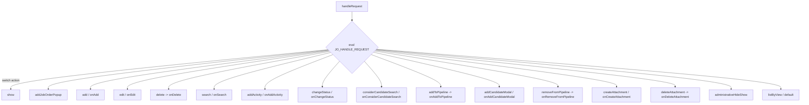

# Module: joborders

Source-derived design doc for the OpenCATS **joborders** module. Every claim below is anchored to a file + line range that was opened. Controller is `modules/joborders/JobOrdersUI.php`; DataGrid subclasses live in `modules/joborders/dataGrids.php`; the DataGrid base class `JobOrdersDataGrid` lives in `lib/JobOrders.php`.

## Overview

Controller class declaration:

```php
class JobOrdersUI extends UserInterface
```
(modules/joborders/JobOrdersUI.php:52)

Class constants (truncation / display limits) (modules/joborders/JobOrdersUI.php:58-73):
- `const DESCRIPTION_MAXLEN = 500;` (:58)
- `const NOTES_MAXLEN = 500;` (:63)
- `const TRUNCATE_JOBORDER_TITLE = 35;` (:68)
- `const TRUNCATE_CLIENT_NAME = 28;` (:73)

Constructor (modules/joborders/JobOrdersUI.php:76-89):
```php
public function __construct()
{
    parent::__construct();
    $this->_authenticationRequired = true;
    $this->_moduleDirectory = 'joborders';
    $this->_moduleName = 'joborders';
    $this->_moduleTabText = 'Job Orders';
    $this->_subTabs = array(
        'Add Job Order' => 'javascript:void(0);*js=showPopWin(\''.CATSUtility::getIndexName().'?m=joborders&amp;a=addJobOrderPopup\', 400, 250, null);*al=' . ACCESS_LEVEL_EDIT . '@joborders.add',
        'Search Job Orders' => CATSUtility::getIndexName() . '?m=joborders&amp;a=search'
    );
}
```
- `_authenticationRequired = true` (:80), `_moduleDirectory = 'joborders'` (:81), `_moduleName = 'joborders'` (:82), `_moduleTabText = 'Job Orders'` (:83).
- `_subTabs`: "Add Job Order" opens the `addJobOrderPopup` action via `showPopWin` and is gated `*al=ACCESS_LEVEL_EDIT@joborders.add` (:86); "Search Job Orders" links to `a=search` (:87). A commented-out direct-add variant precedes it (:85).

Extra DataGrid classes are NOT defined in `JobOrdersUI.php` (the file ends at line 2089 with only `class JobOrdersUI`). They are defined in `modules/joborders/dataGrids.php`:
- `class JobOrdersListByViewDataGrid extends JobOrdersDataGrid` (modules/joborders/dataGrids.php:38) — used by the main list page; calls `parent::__construct("joborders:JobOrdersListByViewDataGrid", ...)` (:71-73); overrides `getInnerActionArea()` to add "Add To List" and "Export" items (:83-94).
- `class joborderSavedListByViewDataGrid extends JobOrdersDataGrid` (modules/joborders/dataGrids.php:97) — saved-list variant; overrides `getInnerActionArea()` to add "Remove From This List" and "Export" (:142-153).
- Base class `class JobOrdersDataGrid extends DataGrid` is in `lib/JobOrders.php:878`, constructor `public function __construct($instanceName, $siteID, $parameters, $misc)` (lib/JobOrders.php:884) and `public function getSQL($selectSQL, $joinSQL, $whereSQL, $havingSQL, $orderSQL, $limitSQL, $distinct = '')` (lib/JobOrders.php:1234).

Both subgrids share identical `_defaultColumns` (Attachments, ID, Title, Company, Type, Status, Created, Age, Submitted, Pipeline, Recruiter, Owner) and `defaultSortBy = 'dateCreatedSort'` / `defaultSortDirection = 'DESC'` (modules/joborders/dataGrids.php:51-67, 110-126).

### Dispatch flowchart


(modules/joborders/JobOrdersUI.php:92-362)

## Action catalog

Dispatch is a single `switch ($action)` in `handleRequest()` (modules/joborders/JobOrdersUI.php:98). Each row is one case; ACL guards use `$this->getUserAccessLevel('<key>')`. POST-only handlers branch on `$this->isPostBack()`; `search` branches on `$this->isGetBack()`.

| Action (`a=`) | ACL guard expression | Required level | Handler method | Key lib/UI calls | Template |
|---|---|---|---|---|---|
| `show` | `getUserAccessLevel('joborders.show') < ACCESS_LEVEL_READ` (:101) | READ | `show()` (:403) | `JobOrders::get`, `Attachments::getAll`, `JobOrders::typeCodeToString`, `Graphs::miniJobOrderPipeline`, `extraFields->getValuesForShow` | `Show.tpl` (:580) |
| `addJobOrderPopup` | `getUserAccessLevel('joborders.add') < ACCESS_LEVEL_EDIT` (:109) | EDIT | `addJobOrderPopup()` (:586) | `JobOrders::getAll(JOBORDERS_STATUS_ALL)` | `AddModalPopup.tpl` (:597) |
| `add` (GET) | `getUserAccessLevel('joborders.add') < ACCESS_LEVEL_EDIT` (:117) | EDIT | `add()` (:603) | `Users::getSelectList`, `Companies::getSelectList/getContactsArray/getDepartments`, `JobOrderTypes::getAll`, `extraFields->getValuesForAdd` | `Add.tpl` (:729) |
| `add` (POST) | same (:117) | EDIT | `onAdd()` (:735) | `JobOrders::add(...)` (:836), `extraFields->setValuesOnEdit` | redirect `m=joborders&a=show` (:853) |
| `edit` (GET) | `getUserAccessLevel('joborders.edit') < ACCESS_LEVEL_EDIT` (:133) | EDIT | `edit()` (:861) | `JobOrders::getForEditing`, `JobOrderTypes::getAll`, `JobOrderStatuses::getAll`, `EmailTemplates::getByTag` | `Edit.tpl` (:989) |
| `edit` (POST) | same (:133) | EDIT | `onEdit()` (:995) | `JobOrders::update(...)` (:1173), `extraFields->setValuesOnEdit` | redirect `m=joborders&a=show` (:1186) |
| `delete` (POST only) | `getUserAccessLevel('joborders.delete') < ACCESS_LEVEL_DELETE` (:149) | DELETE | `onDelete()` (:1194) | `JobOrders::delete`, MRU `removeEntry` | redirect `m=joborders&a=listByView` (:1216) |
| `search` (GET form) | `getUserAccessLevel('joborders.search') < ACCESS_LEVEL_READ` (:164) | READ | `search()` (:1710) | `SavedSearches::get` | `Search.tpl` (:1726) |
| `search` (getback) | same (:164) | READ | `onSearch()` (:1732) | `SearchJobOrders::byTitle/byCompanyName`, `SavedSearches::add`, `ExportUtility::getForm` | `Search.tpl` (:1872) |
| `addActivity` (GET) | `getUserAccessLevel('pipelines.addActivity') < ACCESS_LEVEL_EDIT` (:183) | EDIT | `addActivity()` (:1468) | `Candidates::get`, `Pipelines::get`, `Calendar::getAllEventTypes` | `modules/candidates/AddActivityScheduleEventModal.tpl` (:1527) |
| `addActivity` (POST) | same (:183) | EDIT | `onAddActivity()` (:1635) | `CandidatesUI::publicAddActivity` | (delegated) |
| `changeStatus` (GET) | `getUserAccessLevel('pipelines.changeStatus') < ACCESS_LEVEL_EDIT` (:200) | EDIT | `changeStatus()` (:1532) | `Pipelines::get/getStatusesForPicking`, `MailerSettings::getAll`, `EmailTemplates::getByTag` | `modules/candidates/ChangeStatusModal.tpl` (:1630) |
| `changeStatus` (POST) | same (:200) | EDIT | `onChangeStatus()` (:1654) | `CandidatesUI::publicChangeStatus` | (delegated) |
| `considerCandidateSearch` (GET) | `getUserAccessLevel('joborders.considerCandidateSearch') < ACCESS_LEVEL_EDIT` (:220) | EDIT | `considerCandidateSearch()` (:1223) | (none; assigns IDs) | `ConsiderSearchModal.tpl` (:1238) |
| `considerCandidateSearch` (POST) | same (:220) | EDIT | `onConsiderCandidateSearch()` (:1246) | `SearchCandidates::byFullName`, `Pipelines::getJobOrderPipeline` | `ConsiderSearchModal.tpl` (:1313) |
| `addToPipeline` (POST only) | `getUserAccessLevel('pipelines.addToPipeline') < ACCESS_LEVEL_EDIT` (:242) | EDIT | `onAddToPipeline()` (:1320) | `Pipelines::add`, `ActivityEntries::add` | `ConsiderSearchModal.tpl` (:1361) |
| `addCandidateModal` (GET) | `getUserAccessLevel('candidates.add') < ACCESS_LEVEL_EDIT` (:260) | EDIT | `addCandidateModal()` (:1370) | `Candidates::getPossibleSources`, `extraFields->getValuesForAdd`, `EEOSettings::getAll` | `modules/candidates/Add.tpl` (:1429) |
| `addCandidateModal` (POST) | same (:260) | EDIT | `onAddCandidateModal()` (:1436) | `CandidatesUI::checkParsingFunctions/publicAddCandidate` | (delegated) |
| `removeFromPipeline` (POST only) | `getUserAccessLevel('pipelines.removeFromPipeline') < ACCESS_LEVEL_DELETE` (:277) | DELETE | `onRemoveFromPipeline()` (:1677) | `Pipelines::remove` | redirect `m=joborders&a=show` (:1702) |
| `createAttachment` (GET) | `getUserAccessLevel('joborders.createAttachment') < ACCESS_LEVEL_EDIT` (:293) | EDIT | `createAttachment()` (:1879) | (none; assigns ID) | `CreateAttachmentModal.tpl` (:1894) |
| `createAttachment` (POST) | same (:293) | EDIT | `onCreateAttachment()` (:1902) | `AttachmentCreator::createFromUpload` | `CreateAttachmentModal.tpl` (:1929) |
| `deleteAttachment` (POST only) | `getUserAccessLevel('joborders.deleteAttachment') < ACCESS_LEVEL_DELETE` (:313) | DELETE | `onDeleteAttachment()` (:1937) | `Attachments::delete` | redirect `m=joborders&a=show` (:1961) |
| `administrativeHideShow` (POST only) | `getUserAccessLevel('joborders.administrativeHideShow') < ACCESS_LEVEL_SA` (:338) | SA | `administrativeHideShow()` (:1968) | `JobOrders::administrativeHideShow` | redirect `m=joborders&a=show` (:1990) |
| `listByView` / `default` | `getUserAccessLevel('joborders.list') < ACCESS_LEVEL_READ` (:355) | READ | `listByView()` (:368) | `JobOrderStatuses::getFilters`, `DataGrid::get`, `JobOrders::getCount` | `JobOrders.tpl` (:397) |

Note: a `setCandidateJobOrder` case is commented out as dead code with `/* FIXME: function setCandidateJobOrder() does not exist` (:327-335).

The `delete`, `addToPipeline`, `removeFromPipeline`, `deleteAttachment`, and `administrativeHideShow` cases call `CommonErrors::fatal*` on non-POST requests instead of rendering a form (:159, :252, :287, :323, :348).

## Per-action detail

### add — `add()` (:603) / `onAdd()` (:735)
GET form (`add()`): builds user select list (`Users::getSelectList`, :606), company select list (`Companies::getSelectList`, :609), resolves a `selected_company_id` (:623-674), optionally prepopulates from an existing job order when `typeOfAdd == 'existing'` via `$jobOrders->get($jobOrderID)` and `extraFields->getValuesForEdit` (:677-689), loads add-mode extra fields `extraFields->getValuesForAdd()` (:697), questionnaires `Questionnaire::getAll(false)` (:701), career-portal enabled flag (:703-705), and `jobTypes => (new JobOrderTypes())->getAll()` (:725). Renders `Add.tpl` (:729).

POST (`onAdd()`): validates `companyID`, `recruiter`, `owner`, `openings` as required IDs, `contactID` as optional ID (:738-765); `openings` must be `ctype_digit` (:767-771); validates/converts `startDate` via `DateUtility::validate`/`convert` (:776-791); reads `isHot`/`public` checkboxes (:794-797); computes `questionnaireID` only when public and not 'none' (:800-807); requires `title`, `type`, `city` non-empty (:828-831). Inserts via:
```php
$jobOrderID = $jobOrders->add(
    $title, $companyID, $contactID, $description, $notes, $duration,
    $maxRate, $type, $isHot, $isPublic, $openings, $companyJobID,
    $salary, $city, $state, $startDate, $this->_userID, $recruiter,
    $owner, $department, $questionnaireID
);
```
(:836-841). `lib/JobOrders.php`: `public function add($title, $companyId, $contactId, $description, $notes, $duration, $maxRate, $type, $isHot, $public, $openings, $companyJobId, $salary, $city, $state, $startDate, $enteredBy, $recruiter, $owner, $department, $questionnaire = false)` (lib/JobOrders.php:94-97); it resolves the department via `Contacts::getDepartmentIDByName`, builds a `JobOrder` entity and persists through `JobOrderRepository::persist`, returning `-1` on `JobOrderRepositoryException` (lib/JobOrders.php:103-136). On `$jobOrderID <= 0` the controller raises `COMMONERROR_RECORDERROR` (:843-846). Then `extraFields->setValuesOnEdit($jobOrderID)` (:849) and redirect to show (:853).

### edit — `edit()` (:861) / `onEdit()` (:995)
GET form (`edit()`): loads `JobOrders::getForEditing($jobOrderID)` (:873) — `public function getForEditing($jobOrderID)` (lib/JobOrders.php:501), a single LEFT JOIN to `company`/`company_department` returning all editable columns (lib/JobOrders.php:503-548). Adds MRU entry (:889), checks the `EMAIL_TEMPLATE_OWNERSHIPASSIGNJOBORDER` template (:893-904), sets `canEmail` from `getUserAccessLevel('joborders.email') == ACCESS_LEVEL_DEMO` (:906-913), loads departments, extra fields (`getValuesForEdit`), questionnaires, and assigns `jobTypes => (new JobOrderTypes())->getAll()` (:984) and `jobOrderStatuses => (JobOrderStatuses::getAll())` (:985). Renders `Edit.tpl` (:989).

POST (`onEdit()`): validates `jobOrderID`/`companyID`/`recruiter` required, `contactID`/`owner` optional (:1000-1029); start date conversion (:1034-1050); requires non-empty `status` (:1054-1057); `openings` digit check (:1059-1063); when `ownershipChange` checked and `owner > 0`, builds an ownership-assignment email from `EMAIL_TEMPLATE_OWNERSHIPASSIGNJOBORDER` with `%JBODOWNER%`/`%JBODTITLE%`/`%JBODCLIENT%`/`%JBODID%`/`%JBODCATSURL%` substitutions (:1089-1145). Persists via:
```php
$jobOrders->update($jobOrderID, $title, $companyJobID, $companyID, $contactID,
    $description, $notes, $duration, $maxRate, $type, $isHot,
    $openings, $openingsAvailable, $salary, $city, $state, $startDate, $status, $recruiter,
    $owner, $public, $email, $emailAddress, $department, $questionnaireID)
```
(:1173-1176). `lib/JobOrders.php`: `public function update($jobOrderID, $title, $companyJobID, $companyID, $contactID, $description, $notes, $duration, $maxRate, $type, $isHot, $openings, $openingsAvailable, $salary, $city, $state, $startDate, $status, $recruiter, $owner, $public, $email, $emailAddress, $department, $questionnaire = false)` (lib/JobOrders.php:163-166) issues an `UPDATE joborder SET ... date_modified = NOW()` (lib/JobOrders.php:177-203). On failure raises `COMMONERROR_RECORDERROR` (:1178); then `extraFields->setValuesOnEdit` (:1182) and redirect to show (:1186).

### delete — `onDelete()` (:1194)
POST-only. Validates `jobOrderID` (:1197), calls `$joborders->delete($jobOrderID)` (:1207), removes the MRU entry (:1210-1212), redirects to `m=joborders&a=listByView` (:1216). `lib/JobOrders.php`: `public function delete($jobOrderID)` (lib/JobOrders.php:272) runs `DELETE FROM joborder WHERE joborder_id=... AND site_id=...` (lib/JobOrders.php:275-285), records `storeHistoryDeleted` (lib/JobOrders.php:288-289), nulls `calendar_event.joborder_id` (lib/JobOrders.php:292-301), and deletes extra-field values (lib/JobOrders.php:360).

### show — `show()` (:403)
Detects popup via `$_GET['display'] == 'popup'` (:406-413); validates `jobOrderID` (:416); `$data = $jobOrders->get($jobOrderID)` — `public function get($jobOrderID)` (lib/JobOrders.php:389). If `isAdminHidden == 1` and user `< ACCESS_LEVEL_SA` for `joborders.hidden`, it re-renders the list with a lock message (:434-438). Formats city/state, sanitizes description/notes via `CATSUtility::sanitizeHtmlAllowlist` (:447-448), resolves `typeDescription` via `typeCodeToString` (:451), sets hot/public title styling (:459-476). Loads attachments via `Attachments::getAll(DATA_ITEM_JOBORDER, $jobOrderID)` (:478-493), career-portal settings (:495-505), adds MRU entry (:508-510), sets `privledgedUser` from `getUserAccessLevel('joborders.show') < ACCESS_LEVEL_DEMO` (:512-519), loads extra fields (:522), the mini pipeline graph `Graphs::miniJobOrderPipeline(450, 250, array($jobOrderID))` (:529-530), and questionnaire data when public (:540-560). Renders `Show.tpl` (:580). `typeCodeToString` is `public static function typeCodeToString($typeCode)` resolving against `JobOrderTypes::getAll()` and returning `'(Unknown)'` if absent (lib/JobOrders.php:804-812).

### search — `search()` (:1710) / `onSearch()` (:1732)
`handleRequest` includes `lib/Search.php` and branches on `isGetBack()` (:168-178). `search()` loads saved searches `SavedSearches::get(DATA_ITEM_JOBORDER)` and renders `Search.tpl` in non-results mode (:1712-1726). `onSearch()` requires `wildCardString` (:1740-1744), sets up a `SearchPager` (CANDIDATES_PER_PAGE) with default sort `title`/`ASC` (:1758-1783), and dispatches on `mode`: `searchByJobTitle` → `SearchJobOrders::byTitle($query, $sortBy, $sortDirection, false)` (:1794); `searchByCompanyName` → `SearchJobOrders::byCompanyName(...)` (:1799); any other mode falls back to `listByView('Invalid search mode.')` (:1802-1805). Per-row it fixes zero dates, sets hot link class, and builds recruiter/owner initials (:1808-1837). Saves the search via `SavedSearches::add(DATA_ITEM_JOBORDER, ...)` (:1841-1846), builds an export form `ExportUtility::getForm(DATA_ITEM_JOBORDER, $jobOderIDs, 29, 5)` (:1853-1855), and renders `Search.tpl` in results mode (:1872).

### addToPipeline / considerCandidateSearch
`considerCandidateSearch()` (:1223): validates `jobOrderID` (modal error on failure, :1228), renders `ConsiderSearchModal.tpl` with `isResultsMode=false` (:1235-1238). `onConsiderCandidateSearch()` (:1246): validates `jobOrderID` + `wildCardString` (:1249-1260), runs `SearchCandidates::byFullName($query, 'lastName', 'ASC')` for `mode == 'searchByFullName'` (:1273-1274), fetches `Pipelines::getJobOrderPipeline($jobOrderID)` (:1283-1284) and flags each result row `inPipeline` (:1286-1304), renders `ConsiderSearchModal.tpl` in results mode (:1313).

`onAddToPipeline()` (:1320): POST-only (case raises `fatalModal` on GET, :252). Validates `jobOrderID`/`candidateID` (:1323-1332), then:
```php
$pipelines = new Pipelines($this->_siteID);
if (!$pipelines->add($candidateID, $jobOrderID, $this->_userID))
{ CommonErrors::fatal(COMMONERROR_RECORDERROR, $this, 'Failed to add candidate to job order.'); }
```
(:1339-1343). `lib/Pipelines.php`: `public function add($candidateID, $jobOrderID, $userID = 0)` (lib/Pipelines.php:61). Then logs an activity via `ActivityEntries::add($candidateID, DATA_ITEM_CANDIDATE, 400, 'Added candidate to job order.', $this->_userID, $jobOrderID)` (:1346-1353) and renders `ConsiderSearchModal.tpl` in finished mode (:1361).

### changeStatus — `changeStatus()` (:1532) / `onChangeStatus()` (:1654)
Note the guard key is `pipelines.changeStatus`, not `joborders.*` (:200). `changeStatus()` validates `candidateID`/`jobOrderID` (:1535-1544), loads `Candidates::get` (:1550) and `Pipelines::get($candidateID, $jobOrderID)` — `public function get($candidateID, $jobOrderID)` (lib/Pipelines.php:198) — (:1559), pulls pickable statuses via `getStatusesForPicking()` (lib/Pipelines.php:405) (:1567), overlays per-status `triggersEmail` from `MailerSettings`' serialized `candidateJoborderStatusSendsMessage` (:1572-1580), and prepares the `EMAIL_TEMPLATE_STATUSCHANGE` body with `%CANDOWNER%`/`%CANDFIRSTNAME%`/`%CANDFULLNAME%` substitutions (:1582-1616). Renders `modules/candidates/ChangeStatusModal.tpl` with `isJobOrdersMode = true` (:1626-1630). POST `onChangeStatus()` validates `regardingID` (:1657) and delegates to `CandidatesUI::publicChangeStatus(true, $regardingID, $this->_moduleDirectory)` (:1666-1670).

### createAttachment — `createAttachment()` (:1879) / `onCreateAttachment()` (:1902)
`handleRequest` includes `lib/DocumentToText.php` (:298). GET `createAttachment()` validates `jobOrderID` (modal, :1882) and renders `CreateAttachmentModal.tpl` non-finished (:1889-1894). POST `onCreateAttachment()` validates `jobOrderID` (:1905), runs `AttachmentCreator::createFromUpload(DATA_ITEM_JOBORDER, $jobOrderID, 'file', false, false)` (:1914-1917), raises `COMMONERROR_FILEERROR` on `isError()` (:1919-1922), then renders `CreateAttachmentModal.tpl` in finished mode (:1929).

### listByView — `listByView($errMessage = '')` (:368)
Main list page (also the `default` case). Gets `JobOrderStatuses::getFilters()` (:370) — `public static function getFilters()` returns `JOB_ORDER_STATUS_FILTERING` if defined else `$_defaultFilters` (lib/JobOrderStatuses.php:79-88). Recovers prior grid params via `DataGrid::getRecentParamaters("joborders:JobOrdersListByViewDataGrid")` (:372); on first visit defaults `rangeStart=0`, `maxResults=50`, `filter='Status=='.$jobOrderFilters[0]`, `filterVisible=false` (:376-382). Instantiates the grid via `DataGrid::get("joborders:JobOrdersListByViewDataGrid", $dataGridProperties)` (:384), assigns `jobOrderFilters`/`userID`/`errMessage`, and assigns `totalJobOrders => $jl->getCount()` (:394-395). `public function getCount()` runs `SELECT COUNT(*) AS totalJobOrders FROM joborder WHERE joborder.site_id=...` (lib/JobOrders.php:368-381). Renders `JobOrders.tpl` (:397). Row formatting for the grid is in `_formatListByViewResults()` (:2000-2085): info strings, title/company truncation, zero-date fix, hot link class, recruiter/owner initials, and the paperclip attachment icon.

### administrativeHideShow — `administrativeHideShow()` (:1968)
SA-only, POST-only. Validates `jobOrderID` and `state` (:1971-1980), then `$joborders->administrativeHideShow($jobOrderID, (boolean)$_POST['state'])` (:1985-1988), redirect to show (:1990). `public function administrativeHideShow($jobOrderID, $state)` runs `UPDATE joborder SET is_admin_hidden=... WHERE joborder_id=... AND site_id=...` (lib/JobOrders.php:823-840).

## Templates

| Template | Rendered by | Notes |
|---|---|---|
| `JobOrders.tpl` | `listByView()` (:397) | Header JS: `js/highlightrows.js, js/sweetTitles.js, js/export.js, js/dataGrid.js, js/dataGridFilters.js` (JobOrders.tpl:2). View selector form posts `m=joborders&a=list` (JobOrders.tpl:24-26); status dropdown / "Only My Job Orders" / "Only Hot Job Orders" drive grid filters via `getJSAddFilter`/`getJSAddRemoveFilterFromCheckbox` (JobOrders.tpl:31-52); empty state shows the "Add a job order" button gated by `getUserAccessLevel('joborders.add') >= ACCESS_LEVEL_EDIT` (JobOrders.tpl:111-128). |
| `Show.tpl` | `show()` (:580) | Header JS: `js/sorttable.js, js/match.js, js/pipeline.js, js/attachment.js` (Show.tpl:6/8). Edit link `m=joborders&a=edit` (Show.tpl:45,335); delete form posts `m=joborders&a=delete` with confirm (Show.tpl:341); attachment delete form posts `m=joborders&a=deleteAttachment` (Show.tpl:263); create-attachment popup `m=joborders&a=createAttachment` (Show.tpl:280); admin hide/show forms post `m=joborders&a=administrativeHideShow` (Show.tpl:30,352,361); "consider candidate" popup `m=joborders&a=considerCandidateSearch` (Show.tpl:444). |
| `Add.tpl` | `add()` (:729) | Header JS includes `modules/joborders/validator.js`, `js/joborder.js`, CKEditor (Add.tpl:2). Form `addJobOrderForm` posts `m=joborders&a=add`, `onsubmit="return checkAddForm(...)"` (Add.tpl:34). |
| `Edit.tpl` | `edit()` (:989) | Header JS same set + validator (Edit.tpl:2). Form `editJobOrderForm` posts `m=joborders&a=edit`, `onsubmit="return checkEditForm(...)"` (Edit.tpl:23). |
| `Search.tpl` | `search()` / `onSearch()` (:1726, :1872) | Header JS includes `modules/joborders/validator.js`, `js/searchAdvanced.js`, `js/searchSaved.js` (Search.tpl:2). GET `searchForm` (Search.tpl:23); result links `m=joborders&a=show` (Search.tpl:87,92). |
| `ConsiderSearchModal.tpl` | `considerCandidateSearch()` / `onConsiderCandidateSearch()` / `onAddToPipeline()` (:1238,:1313,:1361) | Search form posts `m=joborders&a=considerCandidateSearch` (ConsiderSearchModal.tpl:10); quick-add link `m=joborders&a=addCandidateModal` (:29); add-to-pipeline forms post `m=joborders&a=addToPipeline&getback=getback` (:73,84); candidate popup `m=candidates&a=show&display=popup` (:102); Close returns to `m=joborders&a=show` (:117). |
| `CreateAttachmentModal.tpl` | `createAttachment()` / `onCreateAttachment()` (:1894,:1929) | `printModalHeader` with `modules/joborders/validator.js` (CreateAttachmentModal.tpl:2). `createAttachmentForm` multipart posts `m=joborders&a=createAttachment`, `onsubmit="return checkAttachmentForm(...)"` (CreateAttachmentModal.tpl:5). |
| `AddModalPopup.tpl` | `addJobOrderPopup()` (:597) | `printModalHeader` with `modules/joborders/validator.js` (AddModalPopup.tpl:2). "Create Job Order" button calls `parentGoToURL('...m=joborders&a=add&jobOrderID='+copyFrom+'&typeOfAdd='+typeOfAdd)` (AddModalPopup.tpl:35). |
| `modules/candidates/AddActivityScheduleEventModal.tpl` | `addActivity()` (:1527) | Cross-module reuse (candidates). |
| `modules/candidates/ChangeStatusModal.tpl` | `changeStatus()` (:1630) | Cross-module reuse. |
| `modules/candidates/Add.tpl` | `addCandidateModal()` (:1429) | Quick-add candidate reuses CandidatesUI's Add template. |
| `Error.tpl`, `ErrorModal.tpl` | (not referenced directly in `JobOrdersUI.php`) | Present in module dir; used by `CommonErrors` infrastructure. |

## JavaScript

`modules/joborders/validator.js` — client-side form validation (loaded by Add/Edit/Search/CreateAttachment/AddModalPopup templates):
- `checkAddForm(form)` (validator.js:11) → `checkTitle, checkCompany, checkRecruiter, checkCity, checkOpenings` (validator.js:15-19).
- `checkEditForm(form)` (validator.js:30) → adds `checkOpeningsAvailable, checkOwner` (validator.js:39-40).
- `checkSearchByJobTitleForm` (validator.js:51), `checkSearchByCompanyNameForm` (validator.js:66), `checkAttachmentForm` (validator.js:81).
- Field checks: `checkTitle` (:96), `checkCity` (:116), `checkCompany` (:136), `checkRecruiter` (:156), `checkOwner` (:176), `checkOpenings` (:196, requires `stringIsNumeric`), `checkOpeningsAvailable` (:222, enforces remaining ≤ total openings, :245-252), `checkSearchJobTitle` (:258), `checkSearchCompanyName` (:278), `checkFilename` (:298).

There is no other `.js` file in the module directory (only `validator.js`). Other JS (`js/joborder.js`, `js/dataGrid.js`, `js/pipeline.js`, etc.) referenced by the templates lives in the global `js/` directory, outside this module.

## lib/ dependencies (methods cited)

**lib/JobOrders.php** (`class JobOrders` at :56):
- `public function add($title, $companyId, $contactId, $description, $notes, $duration, $maxRate, $type, $isHot, $public, $openings, $companyJobId, $salary, $city, $state, $startDate, $enteredBy, $recruiter, $owner, $department, $questionnaire = false)` (lib/JobOrders.php:94-97) — called by `onAdd()` (:836).
- `public function update($jobOrderID, $title, $companyJobID, $companyID, $contactID, $description, $notes, $duration, $maxRate, $type, $isHot, $openings, $openingsAvailable, $salary, $city, $state, $startDate, $status, $recruiter, $owner, $public, $email, $emailAddress, $department, $questionnaire = false)` (lib/JobOrders.php:163-166) — called by `onEdit()` (:1173).
- `public function delete($jobOrderID)` (lib/JobOrders.php:272) — called by `onDelete()` (:1207).
- `public function getCount()` (lib/JobOrders.php:368) — called by `listByView()` (:395).
- `public function get($jobOrderID)` (lib/JobOrders.php:389) — called by `show()` (:426), `add()` (:683), `onEdit()` (:1091).
- `public function getForEditing($jobOrderID)` (lib/JobOrders.php:501) — called by `edit()` (:873).
- `public function getAll($status, $userID = -1, $companyID = -1, $contactID = -1, $onlyHot = false, $onlyPublic = false, $allowAdministrativeHidden = false)` (lib/JobOrders.php:563-564) — called by `addJobOrderPopup()` (:590, `JOBORDERS_STATUS_ALL`).
- `public static function typeCodeToString($typeCode)` (lib/JobOrders.php:804) — called by `show()` (:451).
- `public function administrativeHideShow($jobOrderID, $state)` (lib/JobOrders.php:823) — called by `administrativeHideShow()` (:1988).
- `class JobOrdersDataGrid extends DataGrid` (lib/JobOrders.php:878); ctor `public function __construct($instanceName, $siteID, $parameters, $misc)` (lib/JobOrders.php:884); `public function getSQL($selectSQL, $joinSQL, $whereSQL, $havingSQL, $orderSQL, $limitSQL, $distinct = '')` (lib/JobOrders.php:1234).
- (`extraFields` member is used for `getValuesForShow`/`getValuesForAdd`/`getValuesForEdit`/`setValuesOnEdit`, e.g. :522, :697, :934, :849.)

**lib/Pipelines.php** (`class Pipelines` at :41):
- `public function add($candidateID, $jobOrderID, $userID = 0)` (lib/Pipelines.php:61) — `onAddToPipeline()` (:1340).
- `public function remove($candidateID, $jobOrderID)` (lib/Pipelines.php:140) — `onRemoveFromPipeline()` (:1698).
- `public function get($candidateID, $jobOrderID)` (lib/Pipelines.php:198) — `addActivity()` (:1495), `changeStatus()` (:1559).
- `public function getStatusesForPicking()` (lib/Pipelines.php:405) — `changeStatus()` (:1567).
- `public function getJobOrderPipeline($jobOrderID, $orderBy = '')` (lib/Pipelines.php:609) — `onConsiderCandidateSearch()` (:1284).

**lib/JobOrderStatuses.php** (`class JobOrderStatuses` at :40):
- `public static function getFilters()` (lib/JobOrderStatuses.php:79) — `listByView()` (:370).
- `public static function getAll()` (lib/JobOrderStatuses.php:63) — `edit()` (:985).

**lib/JobOrderTypes.php** (`class JobOrderTypes` at :10):
- `public function __construct()` defaults `C/C2H/FL/H` (lib/JobOrderTypes.php:15-22).
- `public function getAll()` returns `JOB_TYPES::$LIST` if defined else defaults (lib/JobOrderTypes.php:29-39) — `add()` (:725), `edit()` (:984), and `JobOrders::typeCodeToString` (lib/JobOrders.php:806).

## Hooks fired

Every `Hooks::get(...)` key in the module, each guarded by `if (!eval(Hooks::get('KEY'))) return;` unless noted:

| Hook key | Location |
|---|---|
| `JO_HANDLE_REQUEST` | modules/joborders/JobOrdersUI.php:96 (top of `handleRequest`) |
| `JO_LIST_BY_VIEW` | :392 |
| `JO_SHOW` | :578 |
| `JO_ADD_MODAL` | :595 |
| `JO_ADD` | :727 |
| `JO_ON_ADD` | :833 |
| `JO_ON_ADD_POST` | :851 |
| `JO_EDIT` | :987 |
| `JO_ON_EDIT_PRE` | :1171 |
| `JO_ON_EDIT_POST` | :1184 |
| `JO_ON_DELETE_PRE` | :1204 |
| `JO_ON_DELETE_POST` | :1214 |
| `JO_CONSIDER_CANDIDATE_SEARCH` | :1233 |
| `JO_ON_CONSIDER_CANDIDATE_SEARCH` | :1311 |
| `JO_ON_ADD_PIPELINE` | :1337 |
| `JO_ON_ADD_PIPELINE_POST` | :1359 |
| `JO_ADD_CANDIDATE_MODAL` | :1426 |
| `JO_ON_ADD_CANDIDATE_MODAL` | :1453 |
| `JO_ADD_ACTIVITY_CHANGE_STATUS` | :1525 (`addActivity`) and :1628 (`changeStatus`) |
| `JO_ON_ADD_ACTIVITY_CHANGE_STATUS` | :1645 (`onAddActivity`) and :1664 (`onChangeStatus`) |
| `JO_ON_REMOVE_PIPELINE` | :1695 |
| `JO_ON_REMOVE_PIPELINE_POST` | :1700 |
| `JO_SEARCH` | :1724 |
| `JO_ON_SEARCH` | :1870 |
| `JO_CREATE_ATTACHMENT` | :1892 |
| `JO_ON_CREATE_ATTACHMENT_PRE` | :1912 |
| `JO_ON_CREATE_ATTACHMENT_POST` | :1924 |
| `JO_ON_DELETE_ATTACHMENT_PRE` | :1954 |
| `JO_ON_DELETE_ATTACHMENT_POST` | :1959 |
| `JO_FORMAT_LIST_BY_VIEW_RESULTS` | :2082 |
| `JOBORDERS_DATAGRID_DEFAULTS` | modules/joborders/dataGrids.php:69 and :128 |

## Source evidence

- `modules/joborders/JobOrdersUI.php` (read lines 1-2089 in full): includes (:30-49), class/constants/constructor (:52-89), `handleRequest` switch (:92-362), all handler methods (:368-2085).
- `modules/joborders/dataGrids.php` (read 1-157): two `JobOrdersDataGrid` subclasses.
- `modules/joborders/validator.js` (read 1-317).
- `modules/joborders/JobOrders.tpl` (read 1-135).
- Templates grepped for forms/actions/JS: `Add.tpl`, `Edit.tpl`, `Search.tpl`, `Show.tpl`, `ConsiderSearchModal.tpl`, `CreateAttachmentModal.tpl`, `AddModalPopup.tpl`.
- `lib/JobOrders.php` (read 94-203, 272-301, 360-389, 501-571, 804-878): `add`/`update`/`delete`/`getCount`/`get`/`getForEditing`/`getAll`/`typeCodeToString`/`administrativeHideShow` + DataGrid class.
- `lib/Pipelines.php` (method index + `add` body 61-70).
- `lib/JobOrderStatuses.php` (read 40-134), `lib/JobOrderTypes.php` (read 1-42).

## Unverified / open questions

- The prompt stated the DataGrid subclasses are defined inside `JobOrdersUI.php` and that it defines them; **verified false** — `JobOrdersUI.php` contains only `class JobOrdersUI` (ends at :2086). The subclasses are in `modules/joborders/dataGrids.php`; their base is in `lib/JobOrders.php:878`.
- `joborderSavedListByViewDataGrid` (dataGrids.php:97) is never instantiated by `JobOrdersUI.php`; its consumer (likely the `lists`/saved-list module) was not opened.
- ACL keys `joborders.email` (:906) and `joborders.hidden` (:434) are read inside handlers (`edit`/`show`) but are not standalone switch-case guards; their defined access levels were not traced to the access-level config.
- Exact bodies of `Pipelines::remove/get/getStatusesForPicking/getJobOrderPipeline`, `SearchJobOrders::byTitle/byCompanyName`, `SearchCandidates::byFullName`, `AttachmentCreator::createFromUpload`, `Attachments::getAll/delete`, and `CandidatesUI::publicAddActivity/publicChangeStatus/publicAddCandidate/checkParsingFunctions` were not opened beyond their call sites (signatures cited from the index where available).
- `getInnerActionAreaItemPopup`/`getInnerActionAreaItem`/`getInnerActionAreaItemPost` are inherited DataGrid methods (base `lib/DataGrid.php` not opened).
- The literal `400` passed to `ActivityEntries::add` (:1349) corresponds to `DATA_ITEM_JOBORDER` per usage elsewhere but is hardcoded as an integer here; not cross-checked against the constant definition.
```
ACL-SUMMARY
joborders.show => ACCESS_LEVEL_READ
joborders.addJobOrderPopup => ACCESS_LEVEL_EDIT   (guard key: joborders.add)
joborders.add => ACCESS_LEVEL_EDIT
joborders.edit => ACCESS_LEVEL_EDIT
joborders.delete => ACCESS_LEVEL_DELETE
joborders.search => ACCESS_LEVEL_READ
joborders.addActivity => ACCESS_LEVEL_EDIT        (guard key: pipelines.addActivity)
joborders.changeStatus => ACCESS_LEVEL_EDIT       (guard key: pipelines.changeStatus)
joborders.considerCandidateSearch => ACCESS_LEVEL_EDIT
joborders.addToPipeline => ACCESS_LEVEL_EDIT      (guard key: pipelines.addToPipeline)
joborders.addCandidateModal => ACCESS_LEVEL_EDIT  (guard key: candidates.add)
joborders.removeFromPipeline => ACCESS_LEVEL_DELETE (guard key: pipelines.removeFromPipeline)
joborders.createAttachment => ACCESS_LEVEL_EDIT
joborders.deleteAttachment => ACCESS_LEVEL_DELETE
joborders.administrativeHideShow => ACCESS_LEVEL_SA
joborders.listByView => ACCESS_LEVEL_READ         (guard key: joborders.list)
```
